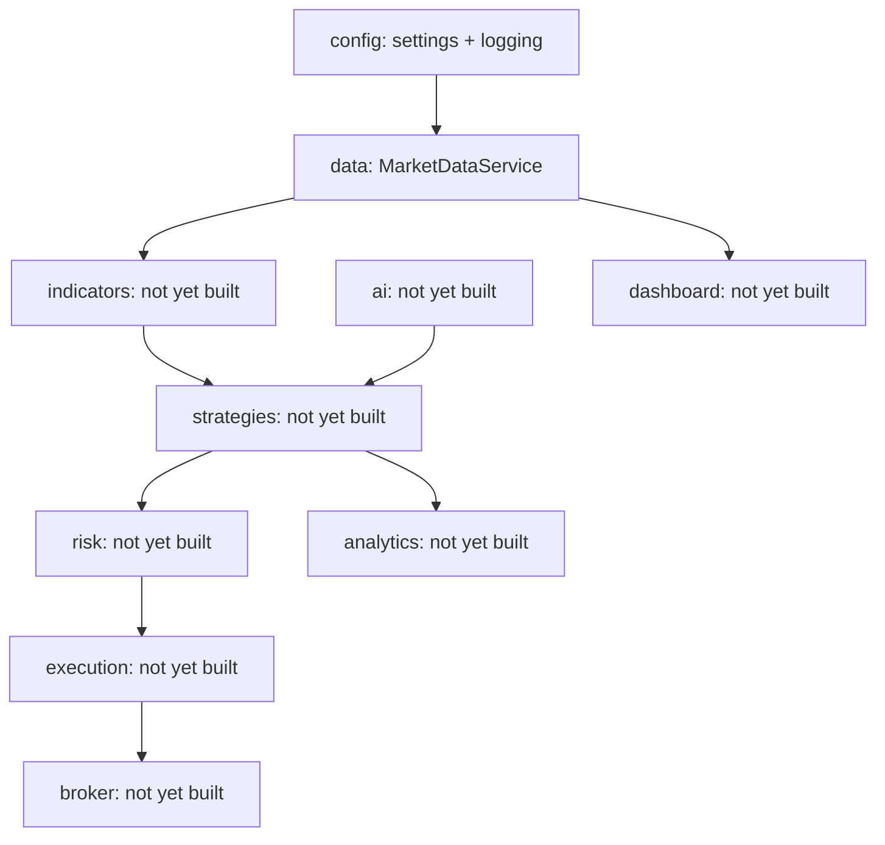

# Architecture

## Organizing principle

This codebase is organized by **capability**, not by strategy. A
strategy-first layout (`strategies/mean_reversion/`, `strategies/momentum/`,
each with its own copy of data-fetching, risk, and execution code) tends
to rot: every strategy reinvents its own version of "get data," "size a
position," and "place an order," and the copies drift apart.

Instead, each capability is a module with one job, and strategies (once
they exist) sit on top of all of them:

`ai` feeds into `strategies` as one input among several -- it is not a
parent of the whole system. That's deliberate: an AI-generated signal
should be swappable for a rule-based one without touching risk,
execution, or the dashboard.

## Module reference

Modules are documented in the order they were built. Each entry lists
purpose, inputs, outputs, and what it deliberately does NOT do (the
boundary is as important as the function).

### `src/config`

**Purpose:** the single source of truth for paths and constants. Every
other module reads configuration from here instead of hardcoding paths,
symbols, or defaults.

- **Inputs:** none (reads its own source, will later read `.env` /
  YAML overrides -- not implemented yet).
- **Outputs:**
  - `settings.py`: `PROJECT_ROOT`, `DATA_DIR`, `LOG_DIR`, `CONFIG_DIR`,
    `WATCHLIST`, `DEFAULT_PERIOD`, `DEFAULT_INTERVAL`.
  - `logging.py`: a configured `loguru.logger` (file sink at
    `logs/trading.log`, rotating at 10 MB / retained 30 days; console
    sink at INFO).
- **Does not:** validate business logic, know about market data, or
  import from any other `src/` package (it's the foundation; nothing
  should depend on it depending on them).

### `src/data`

**Purpose:** "give me candles for a symbol" -- the one abstraction every
downstream component (backtests, live trading, dashboards, AI research)
depends on for historical price data.

- **Inputs:** a ticker symbol, a date range or period string, a candle
  interval.
- **Outputs:** a `pandas.DataFrame` indexed by a `timestamp`
  `DatetimeIndex`, with columns `open, high, low, close, volume` --
  sorted ascending, no duplicate rows. Guaranteed shape regardless of
  which provider is behind it.
- **Key files:**
  - `base.py` -- the `DataProvider` abstract interface and `Interval`
    enum. This is the seam: new data vendors implement this interface
    and nothing else in the codebase needs to change.
  - `yfinance_provider.py` -- the only concrete `DataProvider` today,
    backed by Yahoo Finance via the `yfinance` package.
  - `service.py` -- `MarketDataService`, the public facade. Two entry
    points: `get_candles(symbol, start, end, interval)` for explicit
    date ranges, and `get_history(symbol, period, interval)` for
    yfinance-style relative periods (defaults come from
    `config.settings`). Handles CSV caching under `data/cache/`.
  - `exceptions.py` -- `DataProviderError` (the provider failed) vs.
    `NoDataError` (the request was valid but empty) as distinct cases,
    since callers usually want to handle them differently (retry vs.
    treat as "no signal").
- **Does not:** know about indicators, strategies, or any specific
  vendor beyond what's behind the `DataProvider` it's given. Does not
  make trading decisions or hold any market opinion.
- **Depends on:** `src/config` (for default period/interval).

### `src/indicators`, `src/strategies`, `src/broker`, `src/execution`, `src/risk`, `src/analytics`, `src/ai`, `src/dashboard`, `src/utils`

Not yet implemented -- each currently exists only as an empty package
with a docstring stating its intended purpose (see `src/__init__.py`
and each package's `__init__.py`). They'll get their own sections here
as they're built, following the same purpose/inputs/outputs format.

## Testing philosophy

Unit tests never touch the network. `tests/test_market_data.py` uses a
`FakeProvider` (a `DataProvider` double) so the whole `MarketDataService`
contract -- caching, validation, error propagation, period parsing -- is
verified without depending on Yahoo Finance being up. A separate,
explicitly-marked integration suite (not written yet) will cover the
real `YFinanceProvider` against the live API.
