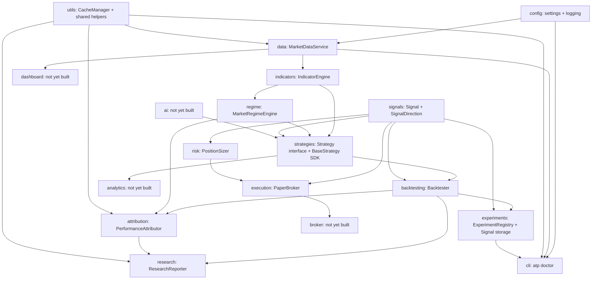

# Architecture

## Organizing principle

This codebase is organized by **capability**, not by strategy. A
strategy-first layout (`strategies/mean_reversion/`, `strategies/momentum/`,
each with its own copy of data-fetching, risk, and execution code) tends
to rot: every strategy reinvents its own version of "get data," "size a
position," and "place an order," and the copies drift apart.

Instead, each capability is a module with one job, and strategies (once
they exist) sit on top of all of them:

`attribution` is not the same thing as the planned `analytics` (Sprint 6,
still not built): `attribution` explains a single completed backtest
(which regime/session it did well or badly in), while `analytics` is
scoped for cross-experiment and live P&L tracking. If that boundary
ever gets blurry when `analytics` is actually built, revisit here
rather than letting the two quietly duplicate each other.

`research` is also distinct from the Sprint 7+ `ai` module: `research`
turns one completed backtest's evidence into a human-readable summary
and recommendation (a research artifact for a person to read), while
`ai` (not yet built) will generate trading *signals* consumed by
`strategies` like any other signal source. Neither module makes a
trading decision on its own behalf (ADR-0017) -- `research` explicitly
never will, since its output is prose for a person, not a `Signal`.

`risk --> execution` now reflects a real dependency: `PaperBroker`
consumes `PositionSizer`'s `SizingDecision` directly to size an opening
order (`DECISIONS.md`, ADR-0022), closing the loop ADR-0021 left open.
Neither `risk` nor `execution` depend on, or get called by,
`backtesting` -- `Backtester` still sizes every trade as a single unit
(ADR-0011), unchanged; `PositionSizer` and `PaperBroker` are so far
verified against each other directly, not through a real backtest or
strategy run. `execution --> broker` is still aspirational: it
documents where a live fill would come from once Sprint 5 exists, not
a dependency `PaperBroker` has today -- it simulates fills itself.

`cli` is drawn separately from the main pipeline on purpose: it's a
diagnostic tool that reaches into several capabilities to check their
health, not a capability anything else depends on.

`utils` sits alongside `config` as foundational: `CacheManager` is
generic key/DataFrame persistence with no idea what a "candle" or
"symbol" is, so any future capability that fetches from an external
source (news, options chains, VIX, macro data, earnings, forex) can
depend on it the same way `data` does, without depending on `data`
itself.

`ai` feeds into `strategies` as one input among several -- it is not a
parent of the whole system. That's deliberate: an AI-generated signal
should be swappable for a rule-based one without touching risk,
execution, or the dashboard.

## Module reference

Modules are documented in the order they were built. Each entry lists
purpose, inputs, outputs, and what it deliberately does NOT do (the
boundary is as important as the function).

### `src/config`

**Purpose:** the single source of truth for paths and constants. Every
other module reads configuration from here instead of hardcoding paths,
symbols, or defaults.

- **Inputs:** none (reads its own source, will later read `.env` /
  YAML overrides -- not implemented yet).
- **Outputs:**
  - `settings.py`: `PROJECT_ROOT`, `DATA_DIR`, `LOG_DIR`, `CONFIG_DIR`,
    `WATCHLIST`, `DEFAULT_PERIOD`, `DEFAULT_INTERVAL`.
  - `logging.py`: a configured `loguru.logger` (file sink at
    `logs/trading.log`, rotating at 10 MB / retained 30 days; console
    sink at INFO).
- **Does not:** validate business logic, know about market data, or
  import from any other `src/` package (it's the foundation; nothing
  should depend on it depending on them).

### `src/data`

**Purpose:** "give me candles for a symbol" -- the one abstraction every
downstream component (backtests, live trading, dashboards, AI research)
depends on for historical price data.

- **Inputs:** a ticker symbol, a date range or period string, a candle
  interval.
- **Outputs:** a `pandas.DataFrame` indexed by a `timestamp`
  `DatetimeIndex`, with columns `open, high, low, close, volume` --
  sorted ascending, no duplicate rows. Guaranteed shape regardless of
  which provider is behind it.
- **Key files:**
  - `base.py` -- the `DataProvider` abstract interface and `Interval`
    enum. This is the seam: new data vendors implement this interface
    and nothing else in the codebase needs to change.
  - `yfinance_provider.py` -- the only concrete `DataProvider` today,
    backed by Yahoo Finance via the `yfinance` package.
  - `service.py` -- `MarketDataService`, the public facade. Two entry
    points: `get_candles(symbol, start, end, interval)` for explicit
    date ranges, and `get_history(symbol, period, interval)` for
    yfinance-style relative periods (defaults come from
    `config.settings`). Owns only the domain logic (what to fetch, when
    to consult the cache); actual caching is delegated to
    `CacheManager` (see `src/utils` below and `DECISIONS.md`, ADR-0008).
  - `exceptions.py` -- `DataProviderError` (the provider failed) vs.
    `NoDataError` (the request was valid but empty) as distinct cases,
    since callers usually want to handle them differently (retry vs.
    treat as "no signal").
- **Does not:** know about indicators, strategies, or any specific
  vendor beyond what's behind the `DataProvider` it's given. Does not
  read or write cache files directly -- that's `CacheManager`'s job.
  Does not make trading decisions or hold any market opinion.
- **Depends on:** `src/config` (for default period/interval),
  `src/utils` (for `CacheManager`).

### `src/utils`

**Purpose:** shared infrastructure used across capabilities -- not
owned by any single one. Today: `CacheManager`. Will eventually also
hold logging/config helpers that don't belong to a specific capability.

- **Inputs:** `CacheManager.get(key)` takes a string key;
  `CacheManager.set(key, data)` takes a string key and a
  `pandas.DataFrame`.
- **Outputs:** `CacheManager.get(key)` returns a `DataFrame` or `None`
  if nothing is cached under that key. Persists to CSV under a
  configurable directory.
- **Key files:**
  - `cache.py` -- `CacheManager`, a generic key -> DataFrame on-disk
    cache. Has no concept of symbols, intervals, or market data at all
    -- that's precisely the point, since news, options chains, VIX,
    macro data, and earnings are all expected to reuse it later
    (`DECISIONS.md`, ADR-0008).
- **Does not:** know what it's caching or why. Does not decide *when*
  to use the cache -- that's each capability's own call (e.g.
  `MarketDataService` decides whether a given request should hit the
  cache; `CacheManager` just serves the read/write).
- **Depends on:** nothing else in `src/` -- it's foundational, same
  tier as `src/config`.

### `src/indicators`

**Purpose:** the only place indicators are calculated. Strategies ask
for an indicator by name instead of computing one themselves, so every
strategy sees the exact same RSI, ATR, etc., computed the same way.
Part of the Sprint 2 research engine (`DECISIONS.md`, ADR-0009).

- **Inputs:** an OHLCV candles DataFrame (the `MarketDataService`
  contract) bound at construction, plus an indicator name and keyword
  parameters per `calculate()` call (e.g. `calculate("RSI", period=14)`).
- **Outputs:** a `pandas.Series` (most indicators) or `DataFrame` (MACD's
  `macd`/`signal`/`histogram` columns), aligned to the input candles'
  index.
- **Key files:**
  - `registry.py` -- the `@register_indicator("NAME")` decorator and
    lookup (`get_indicator`, `available_indicators`). The only
    mechanism for adding a new indicator; nothing else needs to change.
  - `formulas.py` -- the actual pure functions: SMA, EMA, RSI, ATR,
    MACD, VWAP today. MACD calls `exponential_moving_average` directly
    (an implementation detail of MACD), not through the engine.
  - `engine.py` -- `IndicatorEngine`, the public facade. Validates the
    candles DataFrame has the required OHLCV columns at construction,
    then dispatches `calculate(name, **params)` to the registry.
- **Does not:** know about strategies, regimes, or backtesting. Does
  not fetch data itself -- it's handed candles, it doesn't go get them.
  Does not cache results (each `calculate()` call recomputes; caching
  indicator output, if ever needed, is a future concern, not this
  module's job today).
- **Depends on:** `src/data` (only for `REQUIRED_COLUMNS`, to validate
  input shape -- does not depend on `MarketDataService` or any
  provider).

### `src/regime`

**Purpose:** pure rule-based classification of current market
conditions -- not AI. Every strategy will be able to ask "what regime
are we in right now." Part of the Sprint 2 research engine
(`DECISIONS.md`, ADR-0009, ADR-0010).

- **Inputs:** an OHLCV candles DataFrame, plus optional tuning
  parameters per `score()` call (SMA periods, ATR period, lookback).
- **Outputs:** `MarketRegimeEngine.score()` returns a DataFrame aligned
  to the candles' index with six columns -- `trending`, `ranging`,
  `volatile`, `low_volatility`, `risk_on`, `risk_off` -- each a
  continuous score in `[0, 1]` (`risk_on`/`risk_off` are `NaN` today,
  see ADR-0010). `dominant()` collapses each axis to a single label.
- **Key files:**
  - `engine.py` -- `MarketRegimeEngine`. Computes the trend axis from
    two SMAs (via `IndicatorEngine`) and the volatility axis from a
    rolling percentile rank of ATR%; the risk axis is a placeholder.
- **Does not:** use AI/ML of any kind. Does not compute its own
  indicators -- asks `IndicatorEngine` for SMA/ATR like any other
  consumer. Does not know about strategies or backtesting.
- **Depends on:** `src/indicators` (for `IndicatorEngine`).

### `src/signals`

**Purpose:** the Signal Framework -- one of the platform's foundational
contracts (`DECISIONS.md`, ADR-0015). Standardizes what a strategy
actually produces: not an order, not a market event, a decision.

- **Inputs:** none -- `Signal` is a plain data model, constructed
  directly by whatever produces one (a `Strategy`, today; possibly
  other sources later).
- **Outputs:** `Signal` (frozen dataclass: `timestamp`, `direction`,
  `confidence`, `metadata`, `id`) and `SignalDirection` (`LONG` /
  `SHORT` / `FLAT`).
- **Key files:**
  - `models.py` -- `Signal`, `SignalDirection`. `confidence` is
    validated to `[0.0, 1.0]` at construction; `id` is a `UUID`
    assigned client-side (`uuid4()`), not by a database, so a signal
    can be referenced before it's ever persisted.
- **Does not:** carry a price -- a Signal says what position the
  portfolio should move toward, not at what price to transact (that's
  execution's job, later). Does not know it will eventually be stored
  in `ExperimentRegistry` (ADR-0016) -- persistence is that module's
  concern, not this one's.
- **Depends on:** nothing else in `src/` -- like `src/utils`, it's
  foundational infrastructure other capabilities build on.

### `src/strategies`

**Purpose:** the seam strategies plug into. No concrete strategy exists
yet -- Sprint 3's first is deliberately simple (an EMA-cross or
opening-range-breakout, chosen for how easy it is to reason about, not
for profitability) -- only the interface is defined here.

- **Inputs/outputs:** see `DECISIONS.md`, ADR-0015 for the full
  `Strategy` contract (supersedes ADR-0011).
- **Key files:**
  - `base.py` -- `Strategy` (a `typing.Protocol`: `name`, `prepare()`,
    `generate_signals() -> list[Signal]`).
  - `sdk.py` -- `BaseStrategy` (ADR-0018), an optional `ABC` strategies
    may subclass for `self.indicator(...)`, `self.log`,
    `self.require_columns(...)`, and `self.emit_signal(...)`.
    `prepare()`/`generate_signals()` stay abstract -- the SDK never
    decides when or how often to emit a signal, only removes setup
    boilerplate. A strategy can still implement `Strategy` directly,
    with no base class, exactly as before.
- **Does not:** contain any concrete strategy yet. Does not compute
  indicators or regimes itself -- a conforming strategy's `prepare()`
  is expected to call `IndicatorEngine`/`MarketRegimeEngine`. Does not
  emit one `Signal` per candle -- only at genuine decision points.
  `BaseStrategy` does not own the signal-emission loop or pick a
  direction/confidence on a strategy's behalf.
- **Depends on:** `src/signals` (for the `Signal` return type);
  `sdk.py` also depends on `src/indicators` (for `IndicatorEngine`) and
  `src/data` (for `REQUIRED_COLUMNS`).

### `src/backtesting`

**Purpose:** the framework, not a strategy. Runs any `Strategy` against
candles: run strategy -> collect trades -> calculate metrics ->
generate report. Part of the Sprint 2 research engine (`DECISIONS.md`,
ADR-0009), updated for the Signal Framework in Sprint 3 (ADR-0015).

- **Inputs:** a `Strategy` and an OHLCV candles DataFrame.
- **Outputs:** a `BacktestResult` (`strategy_name`, `trades: list[Trade]`,
  `equity_curve: pd.Series`, `metrics: dict`, `signals: list[Signal]`,
  plus a `.report()` method for a human-readable summary).
- **Key files:**
  - `engine.py` -- `Backtester.run()`. Consumes the sparse `list[Signal]`
    from `strategy.generate_signals()`, holds each signal's direction
    from its own bar forward until the next signal, then applies the
    no-lookahead shift once when computing the equity curve. Simplified
    execution model unchanged from ADR-0011: one unit of position size,
    entries/exits at candle close, no costs/slippage.
  - `models.py` -- `Trade` (references its opening/closing signals by
    `entry_signal_id`/`exit_signal_id: UUID`, not by embedding the
    `Signal` objects -- see ADR-0015/ADR-0016), `BacktestResult`.
  - `metrics.py` -- `calculate_metrics()`, `sharpe_ratio()`,
    `max_drawdown()`, each independently testable.
- **Does not:** model realistic execution (partial fills, slippage,
  transaction costs) -- that's `src/execution`'s job later, deliberately
  out of scope here. Does not decide position sizing beyond a single
  unit, regardless of a signal's `confidence` -- that's `src/risk`'s
  job later. Does not persist results, and does not store `Signal`
  objects itself -- `ExperimentRegistry` owns that (ADR-0016).
- **Depends on:** `src/strategies` (for the `Strategy` contract),
  `src/signals` (for `Signal`/`SignalDirection`).

### `src/attribution`

**Purpose:** explain a completed backtest, not just report its win
rate -- trade counts, average hold time, and which market regime
trades did best/worst in. Sprint 3 Module 3 (`DECISIONS.md`, ADR-0019).
Not the same thing as the planned `src/analytics` (Sprint 6) -- see the
note under the dependency diagram above.

- **Inputs:** a `BacktestResult` and the same candles it was produced
  from (regime is looked up by each trade's `entry_time` against them).
- **Outputs:** an `AttributionReport` (`total_trades`, `winning_trades`,
  `win_rate`, `average_hold`, `regime_breakdown: dict[str, RegimeStats]`,
  `best_regime`, `worst_regime`, plus a `.report()` method).
- **Key files:**
  - `engine.py` -- `PerformanceAttributor.run(result, candles,
    **regime_kwargs)`. Independently recomputes regime via
    `MarketRegimeEngine(candles)` rather than trusting a strategy to
    have tagged `Signal.metadata` with it, so attribution works for
    every backtest regardless of what a given strategy recorded. Buckets
    each trade by the regime at its `entry_time` (joining
    `trend_regime` + `volatility_regime` only -- `risk_regime` is
    excluded since it's always `"unknown"` per ADR-0010). A trade
    entering during the regime engine's indicator warmup period is
    bucketed `"unknown"` and excluded from "Best"/"Worst Regime" rather
    than trusting a misleading NaN-comparison default.
  - `models.py` -- `AttributionReport`, `RegimeStats` dataclasses.
- **Does not:** include a session-of-day breakdown (morning/lunch/
  power hour) yet -- deferred until `DECISIONS.md` ADR-0006 (timezone
  consistency) actually lands, since session buckets are only
  meaningful if candle timestamps are reliably in market-local time,
  which isn't yet guaranteed. Does not persist its output -- an
  `AttributionReport` is in-memory only today; wiring it into
  `ExperimentRegistry` is a natural future step, not built here.
- **Depends on:** `src/backtesting` (for `BacktestResult`/`Trade`),
  `src/regime` (for `MarketRegimeEngine`), `src/utils` (for the shared
  `format_timedelta`, promoted here as of ADR-0020 once `src/research`
  became a second consumer). Zero existing files changed to add this
  module originally -- Extension Cost (ADR-0014) of 0; the later
  `format_timedelta` extraction is accounted for under `src/research`'s
  own Extension Cost instead.

### `src/research`

**Purpose:** turn a completed backtest + attribution report into an
evidence-grounded research summary -- a recommendation for a person to
weigh, never a trading decision (ADR-0017). Sprint 3 Module 4
(`DECISIONS.md`, ADR-0020). Distinct from the Sprint 7+ `src/ai`
scope -- see the note under the dependency diagram above.

- **Inputs:** a `BacktestResult` and the `AttributionReport` produced
  from it (`PerformanceAttributor.run(result, candles)`).
- **Outputs:** a `ResearchReport` (`findings: ResearchFindings`,
  `narrative: str`, `rendered_by: "fallback" | "claude"`).
- **Key files:**
  - `compiler.py` -- `compile_findings(result, attribution) ->
    ResearchFindings`. Fully deterministic: extracts only what the
    platform already computes (trade count, win rate, Sharpe, max
    drawdown, average hold, best/worst regime) as `Finding(label,
    value)` pairs. Produces a single `recommendation` string only when
    the worst regime bucket's average return is actually negative --
    stays silent rather than guessing otherwise. Never mentions
    session-of-day timing, since that axis doesn't exist yet
    (ADR-0006/ADR-0019).
  - `renderers.py` -- `NarrativeRenderer` protocol,
    `FallbackNarrativeRenderer` (template-based, no network, no API
    key), `ClaudeNarrativeRenderer` (calls the Claude API under a
    system prompt that forbids stating any fact not already present in
    `ResearchFindings` -- rephrasing only).
  - `reporter.py` -- `ResearchReporter.run(result, attribution)`. Picks
    `ClaudeNarrativeRenderer` when `ANTHROPIC_API_KEY` is set and
    `anthropic` is importable, `FallbackNarrativeRenderer` otherwise;
    catches any renderer exception and falls back to the deterministic
    renderer rather than losing the report.
  - `models.py` -- `Finding`, `ResearchFindings`, `ResearchReport`.
- **Does not:** reason about session-of-day timing (deferred pending
  ADR-0006). Does not persist its output -- a `ResearchReport` is
  produced on demand, not saved into `ExperimentRegistry`; a natural
  future step, not built here. Does not require `anthropic` or
  `ANTHROPIC_API_KEY` -- both are optional, and the platform's research
  reports work identically (just with template prose) without either.
- **Depends on:** `src/backtesting` (for `BacktestResult`), `src/attribution`
  (for `AttributionReport`), `src/utils` (for `format_timedelta`).
  Extension Cost (ADR-0014): 4 files changed outside the new package
  itself -- `src/attribution/models.py`, `src/utils/__init__.py`,
  `src/utils/formatting.py` (new), `src/cli/checks.py`. See ADR-0020 for
  why this is proportionate rather than a violation.

### `src/risk`

**Purpose:** decide how large a position to take for a signal -- and
whether to take one at all -- given the account's current state.
Sprint 4 (`DECISIONS.md`, ADR-0021).

- **Inputs:** a `Signal` (must be `LONG` or `SHORT`), an `AccountState`
  (`equity`, `open_exposure`), and the instrument's current `price`.
- **Outputs:** a `SizingDecision` (`approved`, `position_size`,
  `capital_allocated`, `reason`).
- **Key files:**
  - `engine.py` -- `PositionSizer.size(signal, account, price)`. Sizes
    at a **fixed** fraction of equity (`RiskLimits.risk_per_trade_pct`,
    default 10%) regardless of `Signal.confidence`. Sizes down to
    whatever portfolio exposure headroom remains
    (`RiskLimits.max_portfolio_exposure_pct`, default 50% of equity)
    rather than rejecting outright when the full allocation doesn't
    fit; only rejects (`approved=False`) when there's no headroom left
    at all. `LONG` and `SHORT` sized identically.
  - `models.py` -- `RiskLimits` (validated percentages, `(0, 1]`),
    `AccountState` (validated `equity > 0`, `open_exposure >= 0`),
    `SizingDecision`.
- **Does not:** scale size by `Signal.confidence` -- deliberately
  deferred, since there's no validated relationship yet between a
  confidence score and how much capital it should be trusted with.
  Does not cap the number of concurrent open positions -- only a
  percentage-of-equity portfolio cap exists today. Does not enforce
  whole-share/lot rounding -- fractional `position_size` is allowed;
  rounding to a tradable lot is an execution-layer concern, deferred
  the same way ADR-0011 deferred realistic execution mechanics out of
  `Backtester`. Is not wired into `Backtester` or a real strategy loop
  -- `src/execution` (below) consumes its output directly, but only in
  tests that construct a `SizingDecision` and hand it to `PaperBroker`,
  not a real end-to-end run yet.
- **Depends on:** `src/signals` (for `Signal`/`SignalDirection`).
  Extension Cost (ADR-0014): 0 -- purely additive, nothing in
  `src/backtesting`, `src/strategies`, or `src/signals` was changed.

### `src/execution`

**Purpose:** translate a signal (and, for `LONG`/`SHORT`, a
`SizingDecision`) into an `Order`, simulate filling it, and track the
resulting portfolio -- paper execution, before any real broker exists.
Sprint 4 (`DECISIONS.md`, ADR-0022).

- **Inputs:** a `Signal`, a `symbol`, a `fill_price`, and (for
  `LONG`/`SHORT`) an approved `SizingDecision` from `src/risk`.
- **Outputs:** a `Fill` per call to `submit_signal()`; an
  `account_state` property returning a real `src.risk.AccountState`.
- **Key files:**
  - `engine.py` -- `PaperBroker.submit_signal(signal, symbol,
    fill_price, sizing_decision=None)`. `LONG`/`SHORT` -> `BUY`/`SELL`
    to open (requires an approved `SizingDecision`); `FLAT` -> whichever
    side closes the existing position (no `SizingDecision` needed,
    since `PositionSizer` refuses to size `FLAT` anyway). Fills
    instantly and completely at the given price. Cash accounting is
    uniform by order side (`BUY` pays cash out, `SELL` brings cash in)
    regardless of long/short, which is what makes both directions work
    through the same code path. `account_state` computes `equity` as
    cash plus each position's *signed* value at its own entry price
    (correctly netting a short's liability) and `open_exposure` as the
    sum of *unsigned* cost basis, matching what
    `RiskLimits.max_portfolio_exposure_pct` caps.
  - `models.py` -- `OrderSide` (`BUY`/`SELL`), `Order` (validated
    `quantity > 0`, carries `signal_id`/`timestamp` for traceability),
    `Fill` (`order`, `fill_price`, `cash_delta`), `Position` (signed
    `quantity`, `entry_price`, `entry_signal_id`).
- **Does not:** mark positions to market -- an open position's
  contribution to `equity` is frozen at its entry price until closed;
  there is no ongoing price feed to mark against (like `PositionSizer`,
  every price is supplied by the caller). Does not support more than
  one open position per symbol at a time -- opening a second raises
  rather than averaging into it. Does not model limit orders, partial
  fills, slippage, or commission. Is not wired into `Backtester` or a
  real strategy loop yet.
- **Depends on:** `src/signals` (for `Signal`/`SignalDirection`),
  `src/risk` (for `AccountState`/`SizingDecision`). Extension Cost
  (ADR-0014): 0 -- purely additive, nothing in `src/risk`,
  `src/signals`, `src/backtesting`, or `src/strategies` was changed.

### `src/experiments`

**Purpose:** every backtest run becomes a permanent, queryable record --
what changed, what happened to the metrics, what was decided. The
payoff compounds: hundreds of experiments after a year of use, all
queryable. Part of the Sprint 2 research engine (`DECISIONS.md`,
ADR-0009, ADR-0012); also owns `Signal` storage as of Sprint 3
(ADR-0016).

- **Inputs:** `log_experiment(changed, metrics_before, metrics_after,
  decision, strategy_name=None, notes="")` -- plain dicts, not
  `BacktestResult` objects (see "Does not," below).
  `save_signals(experiment_id, signals)` separately persists a
  `list[Signal]` under an experiment.
- **Outputs:** `get_experiment(id)` / `list_experiments(decision=...,
  strategy_name=...)` return `Experiment` records (with a
  `.summary()` method for the human-readable "Experiment #18" view).
  `get_signals(experiment_id)` / `get_signal(signal_id)` return
  `Signal` objects.
- **Key files:**
  - `registry.py` -- `ExperimentRegistry`, backed by SQLite (stdlib
    `sqlite3`). `changed`/`metrics_before`/`metrics_after` stored as
    JSON text columns; a second `signals` table stores `Signal` rows,
    keyed by their own `id` (UUID) and looked up by `experiment_id`.
  - `models.py` -- `Experiment` dataclass.
- **Does not:** know about `BacktestResult` or `Trade` -- it stores
  whatever metric dicts it's given, and `Signal`s are saved as a
  separate, deliberate call (`save_signals()`), not a parameter on
  `log_experiment()`, so that method's signature stays untouched. Does
  not run backtests itself.
- **Depends on:** `src/signals` (for `Signal`/`SignalDirection` -- see
  ADR-0016 for why this narrows, but doesn't eliminate, this module's
  previous independence from backtesting internals).

### `src/cli`

**Purpose:** `atp doctor` -- a full system health check, so a failure
six months from now names which subsystem broke instead of requiring a
guess. See `DECISIONS.md`, ADR-0013.

- **Inputs:** none from the caller -- run as `python -m src.cli doctor`.
- **Outputs:** one printed line per registered check (`✓`/`✗`/`—`) plus
  a summary line, and a process exit code (`0` healthy, `1` if anything
  failed).
- **Key files:**
  - `registry.py` -- `@register_check("Name")` decorator and
    `registered_checks()` lookup, the same pattern as
    `src/indicators/registry.py`. `CheckResult` carries a `CheckStatus`
    of `OK`, `FAIL`, or `NOT_IMPLEMENTED`.
  - `checks.py` -- the individual checks: Python Version, Configuration,
    Market Data (a real, cache-bypassing fetch -- a cache hit shouldn't
    be able to hide a dead provider), Cache (round-trips a throwaway
    key through the real cache directory), Experiments DB (opens the
    real SQLite file and queries it), API Keys (reports whether
    `ANTHROPIC_API_KEY` is set, for `src/research`'s optional
    `ClaudeNarrativeRenderer` -- always `OK` either way, since its
    absence doesn't degrade the platform; see ADR-0020). Broker
    Connection reports `NOT_IMPLEMENTED` -- `src/broker` doesn't exist
    yet (Sprint 5) -- rather than being omitted or faked as passing.
  - `doctor.py` -- runs every registered check, formats the report,
    computes the exit code. A check that raises is treated as that
    check failing, not as `atp doctor` crashing.
  - `__main__.py` -- command dispatch (`python -m src.cli <command>`).
- **Does not:** wire up a real global `atp` shell command yet -- that
  needs the packaging work tracked in `DECISIONS.md` ADR-0004, still
  deferred to pre-1.0. Does not attempt to fix anything it finds broken.
- **Depends on:** `src/config`, `src/data`, `src/utils`, `src/experiments`
  -- it reaches into each capability's public API to check it, the same
  way any other consumer would.

### `src/broker`, `src/analytics`, `src/ai`, `src/dashboard`

(`src/research`, `src/risk`, and `src/execution` are now built -- see
above -- and no longer belong in this "not yet implemented" list.)

Not yet implemented -- each currently exists only as an empty package
with a docstring stating its intended purpose (see `src/__init__.py`
and each package's `__init__.py`). They'll get their own sections here
as they're built, following the same purpose/inputs/outputs format.

## Testing philosophy

Unit tests never touch the network. `tests/test_market_data.py` uses a
`FakeProvider` (a `DataProvider` double) so the whole `MarketDataService`
contract -- caching, validation, error propagation, period parsing -- is
verified without depending on Yahoo Finance being up. A separate,
explicitly-marked integration suite (not written yet) will cover the
real `YFinanceProvider` against the live API.
