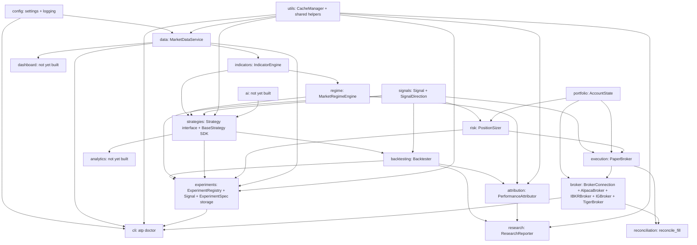

# Architecture

## Organizing principle

This codebase is organized by **capability**, not by strategy. A
strategy-first layout (`strategies/mean_reversion/`, `strategies/momentum/`,
each with its own copy of data-fetching, risk, and execution code) tends
to rot: every strategy reinvents its own version of "get data," "size a
position," and "place an order," and the copies drift apart.

Instead, each capability is a module with one job, and strategies (once
they exist) sit on top of all of them:

`attribution` is not the same thing as the planned `analytics` (Sprint 7,
still not built): `attribution` explains a single completed backtest
(which regime/session it did well or badly in), while `analytics` is
scoped for cross-experiment and live P&L tracking. If that boundary
ever gets blurry when `analytics` is actually built, revisit here
rather than letting the two quietly duplicate each other.

`research` is also distinct from the Sprint 8+ `ai` module: `research`
turns one completed backtest's evidence into a human-readable summary
and recommendation (a research artifact for a person to read), while
`ai` (not yet built) will generate trading *signals* consumed by
`strategies` like any other signal source. Neither module makes a
trading decision on its own behalf (ADR-0017) -- `research` explicitly
never will, since its output is prose for a person, not a `Signal`.

`portfolio` holds the neutral `AccountState` domain model and depends
on nothing else in this codebase (`DECISIONS.md`, ADR-0031) --
`broker`, `risk`, and `execution` all depend on it instead of on each
other for account state. This corrected an original dependency-
direction mistake: `AccountState` used to live in `src/risk`, which
meant `src/broker` (foundational connectivity infrastructure) had to
import from `src/risk` (a downstream consumer of account state) just
to describe an account. There is no `broker --> risk` edge, and there
never should be one again -- `tests/test_architecture.py` enforces
this with a static source check, not just a docstring promise.

`risk --> execution` reflects a real dependency: `PaperBroker` consumes
`PositionSizer`'s `SizingDecision` directly to size an opening order
(`DECISIONS.md`, ADR-0022), closing the loop ADR-0021 left open.
Neither `risk` nor `execution` depend on, or get called by,
`backtesting` -- `Backtester` still sizes every trade as a single unit
(ADR-0011), unchanged. `AlpacaBroker` (and every other concrete broker)
returns `src.portfolio.AccountState` directly from `get_account()`, the
same currency `PaperBroker.account_state` already produces
(`DECISIONS.md`, ADR-0023, ADR-0031) -- a live broker and the paper
broker are interchangeable account-state sources from
`PositionSizer`'s point of view. `execution --> broker` is still
aspirational, though: `broker` doesn't call `execution` or vice versa
today -- they're sibling account-state sources, not a dependency chain,
until a future orchestration layer picks one and drives `PositionSizer`
from it. `broker --> cli` reflects `atp doctor`'s Broker Connection
check calling `AlpacaBroker` directly, the same way it already calls
into `data`/`utils`/`experiments`.

`cli` is drawn separately from the main pipeline on purpose: it's a
diagnostic tool that reaches into several capabilities to check their
health, not a capability anything else depends on.

`utils` sits alongside `config` as foundational: `CacheManager` is
generic key/DataFrame persistence with no idea what a "candle" or
"symbol" is, so any future capability that fetches from an external
source (news, options chains, VIX, macro data, earnings, forex) can
depend on it the same way `data` does, without depending on `data`
itself. `utils --> strategies` and `utils --> experiments` (Sprint 6)
follow the same shape: `hashing.py`'s `sha256_hex()`/
`dataframe_fingerprint()` don't know what a "strategy" or a "dataset"
is either, so both `src/strategies` (for `strategy_version`) and
`src/experiments` (for `ExperimentSpec.dataset_fingerprint`) depend on
`utils` for hashing without depending on each other for it.

`strategies --> experiments` and `risk --> experiments` are both new in
Sprint 6, and both exist for exactly one reason: `ExperimentSpec`
(`src/experiments/spec.py`) needs `Strategy`'s type, `strategy_version`,
`get_strategy_class` from `src/strategies`, and `RiskLimits`'s type
from `src/risk`, to describe what an experiment's strategy and risk
configuration actually were. Both edges point the same direction as
every other edge into `experiments` (`backtesting --> experiments`,
`signals --> experiments`) -- `experiments` consumes from upstream
capabilities to build its records, and neither `src/strategies` nor
`src/risk` gained any dependency on `src/experiments` in return
(verified by `tests/test_pipeline_contract.py` composing all of them
together without a cycle).

`ai` feeds into `strategies` as one input among several -- it is not a
parent of the whole system. That's deliberate: an AI-generated signal
should be swappable for a rule-based one without touching risk,
execution, or the dashboard.

`data --> experiments` is new in Pre-Sprint 7 (`DECISIONS.md`,
ADR-0038): `ExperimentSpec.interval` is now typed as `src.data.base
.Interval` rather than a bare string, so `src/experiments` depends on
`src/data` for that one type the same way it already depends on
`src/strategies`/`src/risk` for theirs. `src/data` gained no dependency
on `src/experiments` in return.

**Timeframe-agnostic by design (`DECISIONS.md`, ADR-0038):** the
research and strategy layers -- `data`, `signals`, `strategies`,
`backtesting`, `experiments`, `attribution` -- do not assume daily
bars. The same `Strategy`/`Backtester`/`ExperimentSpec` interfaces
support `SPY/1d`, `SPY/1m`, and anything in between, using full
`pd.Timestamp` precision throughout (no candle timestamp is ever
truncated to a calendar date) and a `Signal`/`Trade` model with no
one-decision-per-day limit. This is architectural readiness for
daily/swing, intraday, and minute-scale research today, with room for a
future advanced execution/data layer to support second-scale strategies
without a rewrite -- **it is not** an implemented live-trading
capability at any of those timescales: there is no tick feed,
order-book simulation, exchange co-location, or sub-millisecond
execution infrastructure, and none is planned as part of this
correction. See ADR-0038 for exactly what was found already correct,
what was fixed, and what remains explicitly future work.

**Explicit capability statement, so this is never overstated:**
minute-level intraday research/trading is the current architectural
target. Tick-level and second-level execution infrastructure is not
implemented. High-frequency trading (HFT) remains explicit future
work, not a supported capability today.

## Module reference

Modules are documented in the order they were built. Each entry lists
purpose, inputs, outputs, and what it deliberately does NOT do (the
boundary is as important as the function).

### `src/config`

**Purpose:** the single source of truth for paths and constants. Every
other module reads configuration from here instead of hardcoding paths,
symbols, or defaults.

- **Inputs:** none (reads its own source, will later read `.env` /
  YAML overrides -- not implemented yet).
- **Outputs:**
  - `settings.py`: `PROJECT_ROOT`, `DATA_DIR`, `LOG_DIR`, `CONFIG_DIR`,
    `WATCHLIST`, `DEFAULT_PERIOD`, `DEFAULT_INTERVAL`.
  - `logging.py`: a configured `loguru.logger` (file sink at
    `logs/trading.log`, rotating at 10 MB / retained 30 days; console
    sink at INFO).
- **Does not:** validate business logic, know about market data, or
  import from any other `src/` package (it's the foundation; nothing
  should depend on it depending on them).

### `src/data`

**Purpose:** "give me candles for a symbol" -- the one abstraction every
downstream component (backtests, live trading, dashboards, AI research)
depends on for historical price data.

- **Inputs:** a ticker symbol, a date range or period string, a candle
  interval.
- **Outputs:** a `pandas.DataFrame` indexed by a `timestamp`
  `DatetimeIndex`, with columns `open, high, low, close, volume` --
  sorted ascending, no duplicate rows. Guaranteed shape regardless of
  which provider is behind it.
- **Key files:**
  - `base.py` -- the `DataProvider` abstract interface and `Interval`
    enum. This is the seam: new data vendors implement this interface
    and nothing else in the codebase needs to change.
  - `yfinance_provider.py` -- the only concrete `DataProvider` today,
    backed by Yahoo Finance via the `yfinance` package.
  - `service.py` -- `MarketDataService`, the public facade. Two entry
    points: `get_candles(symbol, start, end, interval)` for explicit
    date ranges, and `get_history(symbol, period, interval)` for
    yfinance-style relative periods (defaults come from
    `config.settings`). Owns only the domain logic (what to fetch, when
    to consult the cache); actual caching is delegated to
    `CacheManager` (see `src/utils` below and `DECISIONS.md`, ADR-0008).
  - `exceptions.py` -- `DataProviderError` (the provider failed) vs.
    `NoDataError` (the request was valid but empty) as distinct cases,
    since callers usually want to handle them differently (retry vs.
    treat as "no signal").
- **Does not:** know about indicators, strategies, or any specific
  vendor beyond what's behind the `DataProvider` it's given. Does not
  read or write cache files directly -- that's `CacheManager`'s job.
  Does not make trading decisions or hold any market opinion.
- **Depends on:** `src/config` (for default period/interval),
  `src/utils` (for `CacheManager`).

### `src/utils`

**Purpose:** shared infrastructure used across capabilities -- not
owned by any single one. Today: `CacheManager` and generic content
hashing (`DECISIONS.md`, ADR-0035). Will eventually also hold logging/
config helpers that don't belong to a specific capability.

- **Inputs:** `CacheManager.get(key)` takes a string key;
  `CacheManager.set(key, data)` takes a string key and a
  `pandas.DataFrame`. `hashing.sha256_hex(data)` takes raw `bytes`;
  `hashing.dataframe_fingerprint(df)` takes a `pandas.DataFrame`.
- **Outputs:** `CacheManager.get(key)` returns a `DataFrame` or `None`
  if nothing is cached under that key. Persists to CSV under a
  configurable directory. `dataframe_fingerprint()` returns a
  deterministic hex digest of a DataFrame's actual values, index, and
  column names -- a content identity, not a descriptive one.
- **Key files:**
  - `cache.py` -- `CacheManager`, a generic key -> DataFrame on-disk
    cache. Has no concept of symbols, intervals, or market data at all
    -- that's precisely the point, since news, options chains, VIX,
    macro data, and earnings are all expected to reuse it later
    (`DECISIONS.md`, ADR-0008).
  - `hashing.py` (Sprint 6) -- `sha256_hex()` and
    `dataframe_fingerprint()`. The shared basis for both identity seams
    established in `DECISIONS.md` ADR-0035: strategy version
    (`src/strategies/identity.py`, hashes source code) and dataset
    identity (this module, hashes candle values) both reduce to "hash
    these bytes, deterministically" -- kept here once rather than
    duplicated, the same reasoning `CacheManager` lives here instead of
    inside `src/data`.
- **Does not:** know what it's caching, hashing, or why. Does not
  decide *when* to use the cache -- that's each capability's own call
  (e.g. `MarketDataService` decides whether a given request should hit
  the cache; `CacheManager` just serves the read/write). `hashing.py`
  has no idea what a "strategy" or a "candle" is -- exactly what lets
  both `src/strategies` and `src/experiments` depend on it without
  depending on each other.
- **Depends on:** nothing else in `src/` -- it's foundational, same
  tier as `src/config`.

### `src/indicators`

**Purpose:** the only place indicators are calculated. Strategies ask
for an indicator by name instead of computing one themselves, so every
strategy sees the exact same RSI, ATR, etc., computed the same way.
Part of the Sprint 2 research engine (`DECISIONS.md`, ADR-0009).

- **Inputs:** an OHLCV candles DataFrame (the `MarketDataService`
  contract) bound at construction, plus an indicator name and keyword
  parameters per `calculate()` call (e.g. `calculate("RSI", period=14)`).
- **Outputs:** a `pandas.Series` (most indicators) or `DataFrame` (MACD's
  `macd`/`signal`/`histogram` columns), aligned to the input candles'
  index.
- **Key files:**
  - `registry.py` -- the `@register_indicator("NAME")` decorator and
    lookup (`get_indicator`, `available_indicators`). The only
    mechanism for adding a new indicator; nothing else needs to change.
  - `formulas.py` -- the actual pure functions: SMA, EMA, RSI, ATR,
    MACD, VWAP today. MACD calls `exponential_moving_average` directly
    (an implementation detail of MACD), not through the engine.
  - `engine.py` -- `IndicatorEngine`, the public facade. Validates the
    candles DataFrame has the required OHLCV columns at construction,
    then dispatches `calculate(name, **params)` to the registry.
- **Does not:** know about strategies, regimes, or backtesting. Does
  not fetch data itself -- it's handed candles, it doesn't go get them.
  Does not cache results (each `calculate()` call recomputes; caching
  indicator output, if ever needed, is a future concern, not this
  module's job today).
- **Depends on:** `src/data` (only for `REQUIRED_COLUMNS`, to validate
  input shape -- does not depend on `MarketDataService` or any
  provider).

### `src/regime`

**Purpose:** pure rule-based classification of current market
conditions -- not AI. Every strategy will be able to ask "what regime
are we in right now." Part of the Sprint 2 research engine
(`DECISIONS.md`, ADR-0009, ADR-0010).

- **Inputs:** an OHLCV candles DataFrame, plus optional tuning
  parameters per `score()` call (SMA periods, ATR period, lookback).
- **Outputs:** `MarketRegimeEngine.score()` returns a DataFrame aligned
  to the candles' index with six columns -- `trending`, `ranging`,
  `volatile`, `low_volatility`, `risk_on`, `risk_off` -- each a
  continuous score in `[0, 1]` (`risk_on`/`risk_off` are `NaN` today,
  see ADR-0010). `dominant()` collapses each axis to a single label.
- **Key files:**
  - `engine.py` -- `MarketRegimeEngine`. Computes the trend axis from
    two SMAs (via `IndicatorEngine`) and the volatility axis from a
    rolling percentile rank of ATR%; the risk axis is a placeholder.
- **Does not:** use AI/ML of any kind. Does not compute its own
  indicators -- asks `IndicatorEngine` for SMA/ATR like any other
  consumer. Does not know about strategies or backtesting.
- **Depends on:** `src/indicators` (for `IndicatorEngine`).

### `src/signals`

**Purpose:** the Signal Framework -- one of the platform's foundational
contracts (`DECISIONS.md`, ADR-0015). Standardizes what a strategy
actually produces: not an order, not a market event, a decision.

- **Inputs:** none -- `Signal` is a plain data model, constructed
  directly by whatever produces one (a `Strategy`, today; possibly
  other sources later).
- **Outputs:** `Signal` (frozen dataclass: `timestamp`, `symbol`,
  `direction`, `confidence`, `metadata`, `id`) and `SignalDirection`
  (`LONG` / `SHORT` / `FLAT`).
- **Key files:**
  - `models.py` -- `Signal`, `SignalDirection`. `symbol` is a required,
    first-class field (`DECISIONS.md`, ADR-0033) -- not a `metadata`
    workaround -- so a `Signal` is always independently identifiable
    without inspecting an untyped dict. `confidence` is validated to
    `[0.0, 1.0]` at construction; `id` is a `UUID` assigned client-side
    (`uuid4()`), not by a database, so a signal can be referenced before
    it's ever persisted.
- **Does not:** carry a price -- a Signal says what position the
  portfolio should move toward, not at what price to transact (that's
  execution's job, later). Does not know it will eventually be stored
  in `ExperimentRegistry` (ADR-0016) -- persistence is that module's
  concern, not this one's.
- **Depends on:** nothing else in `src/` -- like `src/utils`, it's
  foundational infrastructure other capabilities build on.

### `src/strategies`

**Purpose:** the seam strategies plug into, plus the platform's two
permanent strategies. `EMACrossStrategy` (Sprint 4) and
`RSIMeanReversionStrategy` (Sprint 6, `DECISIONS.md` ADR-0037) are
deliberately opposite trading ideas -- trend following vs. mean
reversion -- chosen specifically to prove the interface below
generalizes rather than having been quietly shaped around one
strategy's needs. Neither is tuned for profitability; both exist to
exercise the platform end to end on a real (if minimal) trading idea.

- **Inputs/outputs:** see `DECISIONS.md`, ADR-0015 for the full
  `Strategy` contract (supersedes ADR-0011).
- **Key files:**
  - `base.py` -- `Strategy` (a `typing.Protocol`: `name`, `prepare()`,
    `generate_signals() -> list[Signal]`).
  - `sdk.py` -- `BaseStrategy` (ADR-0018), an optional `ABC` strategies
    may subclass for `self.indicator(...)`, `self.log`,
    `self.require_columns(...)`, and `self.emit_signal(...)`.
    `__init__(name, symbol)` takes a required `symbol` alongside `name`
    (`DECISIONS.md`, ADR-0033) -- one strategy instance trades one
    instrument at a time, matching `Backtester.run()`'s existing
    single-instrument assumption -- and `emit_signal()` attaches it to
    every `Signal` it constructs, so a strategy author never has to pass
    `symbol` by hand at every call site. `prepare()`/`generate_signals()`
    stay abstract -- the SDK never decides when or how often to emit a
    signal, only removes setup boilerplate. `params` (Sprint 6,
    `DECISIONS.md` ADR-0035) is a new optional property, defaulting to
    `{}`, that a subclass overrides to expose its own tunable
    constructor arguments -- read by `ExperimentSpec.capture()`
    (`src/experiments/spec.py`) to record what an experiment actually
    ran with. A strategy can still implement `Strategy` directly, with
    no base class, exactly as before (`Strategy` the Protocol was not
    changed by either ADR-0033 or ADR-0035).
  - `identity.py` (Sprint 6) -- `strategy_version(cls)`: a SHA-256 hash
    of a strategy class's own Python source
    (`src.utils.hashing.sha256_hex`), used by `ExperimentSpec` as the
    strategy-identity seam (`DECISIONS.md`, ADR-0035). Automatic --
    changing a strategy's implementation changes its version with no
    action from the author -- at the cost of also changing on a purely
    cosmetic edit (a comment, a docstring): a source-identity hash, not
    a semantic-identity one.
  - `registry.py` (Sprint 6) -- `@register_strategy("name")` /
    `get_strategy_class(name)` / `available_strategies()`, the same
    `@register_x` pattern `src/indicators/registry.py` and
    `src/cli/registry.py` already use. `EMACrossStrategy` registers
    itself as `"ema_cross"`, `RSIMeanReversionStrategy` as
    `"rsi_mean_reversion"`. This is what makes
    `ExperimentSpec.reconstruct_strategy()` possible -- look a class up
    by name, rather than every caller needing to import every strategy
    module by hand.
  - `ema_cross.py` (Sprint 4) -- `EMACrossStrategy`, the platform's
    first permanent strategy. Long-only: long while EMA(fast) >
    EMA(slow), flat otherwise (`fast=12, slow=26` default).
  - `rsi_mean_reversion.py` (Sprint 6, ADR-0037) --
    `RSIMeanReversionStrategy`, the platform's second permanent
    strategy. Long-only: enters `LONG` at or below an `oversold` RSI
    threshold (default 30), exits to `FLAT` at or above an
    `overbought` threshold (default 70). The deliberately opposite
    trading idea from `EMACrossStrategy` -- proof the registry/
    `ExperimentSpec` seam genuinely generalizes, not a relabeled
    variant of the first strategy.
- **Does not:** compute indicators or regimes itself -- a conforming strategy's `prepare()`
  is expected to call `IndicatorEngine`/`MarketRegimeEngine`. Does not
  emit one `Signal` per candle -- only at genuine decision points.
  `BaseStrategy` does not own the signal-emission loop or pick a
  direction/confidence on a strategy's behalf. Registration
  (`registry.py`) is optional, not required -- an unregistered strategy
  still works everywhere it always did, it just can't be looked up by
  name for `ExperimentSpec` reconstruction until it registers.
- **Depends on:** `src/signals` (for the `Signal` return type);
  `sdk.py` also depends on `src/indicators` (for `IndicatorEngine`) and
  `src/data` (for `REQUIRED_COLUMNS`); `identity.py` depends on
  `src/utils` (for `sha256_hex`).

### `src/backtesting`

**Purpose:** the framework, not a strategy. Runs any `Strategy` against
candles: run strategy -> collect trades -> calculate metrics ->
generate report. Part of the Sprint 2 research engine (`DECISIONS.md`,
ADR-0009), updated for the Signal Framework in Sprint 3 (ADR-0015).

- **Inputs:** a `Strategy` and an OHLCV candles DataFrame.
- **Outputs:** a `BacktestResult` (`strategy_name`, `trades: list[Trade]`,
  `equity_curve: pd.Series`, `metrics: dict`, `signals: list[Signal]`,
  plus a `.report()` method for a human-readable summary).
- **Key files:**
  - `engine.py` -- `Backtester.run()`. Consumes the sparse `list[Signal]`
    from `strategy.generate_signals()`, holds each signal's direction
    from its own bar forward until the next signal, then applies the
    no-lookahead shift once when computing the equity curve. Simplified
    execution model unchanged from ADR-0011: one unit of position size,
    entries/exits at candle close, no costs/slippage.
  - `models.py` -- `Trade` (references its opening/closing signals by
    `entry_signal_id`/`exit_signal_id: UUID`, not by embedding the
    `Signal` objects -- see ADR-0015/ADR-0016), `BacktestResult`.
  - `metrics.py` -- `calculate_metrics()`, `sharpe_ratio()`,
    `max_drawdown()`, `infer_periods_per_year()` (Pre-Sprint 7,
    `DECISIONS.md` ADR-0038), each independently testable.
    `infer_periods_per_year(index)` estimates a Sharpe annualization
    factor from a `DatetimeIndex`'s own median timestamp spacing --
    daily bars infer to the historical `252` default unchanged;
    intraday bars scale up accordingly, correcting what used to be a
    flat, unconditional `252` regardless of actual bar size.
    `calculate_metrics()`/`sharpe_ratio()`'s `periods_per_year` defaults
    to `None` (infer) with an explicit override still accepted.

  Timeframe-agnostic by construction (ADR-0038): nothing in `engine.py`
  or `metrics.py` treats a row as "one trading day" -- trade extraction,
  the position series, the equity curve, and now Sharpe annualization
  all derive from `candles`' own timestamps, so the identical
  `Backtester` runs daily, hourly, or 1-minute candles unmodified.
  `Backtester.__init__` accepts an optional `periods_per_year` override
  for callers that want to bypass inference.

  `Signal` gaining a required `symbol` field (`DECISIONS.md`, ADR-0033)
  required zero changes here -- `Backtester` passes `Signal` objects
  through into `BacktestResult.signals` untouched, so the new field
  survives automatically; `tests/test_architecture.py` proves the
  symbol (and the signal's UUID identity) survives strategy -> backtest
  -> registry end to end.
- **Does not:** model realistic execution (partial fills, slippage,
  transaction costs) -- that's `src/execution`'s job later, deliberately
  out of scope here. Does not decide position sizing beyond a single
  unit, regardless of a signal's `confidence` -- that's `src/risk`'s
  job later. Does not persist results, and does not store `Signal`
  objects itself -- `ExperimentRegistry` owns that (ADR-0016).
- **Depends on:** `src/strategies` (for the `Strategy` contract),
  `src/signals` (for `Signal`/`SignalDirection`).

### `src/attribution`

**Purpose:** explain a completed backtest, not just report its win
rate -- trade counts, average hold time, and which market regime
trades did best/worst in. Sprint 3 Module 3 (`DECISIONS.md`, ADR-0019).
Not the same thing as the planned `src/analytics` (Sprint 7) -- see the
note under the dependency diagram above.

- **Inputs:** a `BacktestResult` and the same candles it was produced
  from (regime is looked up by each trade's `entry_time` against them).
- **Outputs:** an `AttributionReport` (`total_trades`, `winning_trades`,
  `win_rate`, `average_hold`, `regime_breakdown: dict[str, RegimeStats]`,
  `best_regime`, `worst_regime`, plus a `.report()` method).
- **Key files:**
  - `engine.py` -- `PerformanceAttributor.run(result, candles,
    **regime_kwargs)`. Independently recomputes regime via
    `MarketRegimeEngine(candles)` rather than trusting a strategy to
    have tagged `Signal.metadata` with it, so attribution works for
    every backtest regardless of what a given strategy recorded. Buckets
    each trade by the regime at its `entry_time` (joining
    `trend_regime` + `volatility_regime` only -- `risk_regime` is
    excluded since it's always `"unknown"` per ADR-0010). A trade
    entering during the regime engine's indicator warmup period is
    bucketed `"unknown"` and excluded from "Best"/"Worst Regime" rather
    than trusting a misleading NaN-comparison default.
  - `models.py` -- `AttributionReport`, `RegimeStats` dataclasses.
- **Does not:** include a session-of-day breakdown (morning/lunch/
  power hour) yet -- deferred until `DECISIONS.md` ADR-0006 (timezone
  consistency) actually lands, since session buckets are only
  meaningful if candle timestamps are reliably in market-local time,
  which isn't yet guaranteed. Does not persist its output -- an
  `AttributionReport` is in-memory only today; wiring it into
  `ExperimentRegistry` is a natural future step, not built here.
- **Depends on:** `src/backtesting` (for `BacktestResult`/`Trade`),
  `src/regime` (for `MarketRegimeEngine`), `src/utils` (for the shared
  `format_timedelta`, promoted here as of ADR-0020 once `src/research`
  became a second consumer). Zero existing files changed to add this
  module originally -- Extension Cost (ADR-0014) of 0; the later
  `format_timedelta` extraction is accounted for under `src/research`'s
  own Extension Cost instead.

### `src/research`

**Purpose:** turn a completed backtest + attribution report into an
evidence-grounded research summary -- a recommendation for a person to
weigh, never a trading decision (ADR-0017). Sprint 3 Module 4
(`DECISIONS.md`, ADR-0020; renderer-failure transparency added by
ADR-0034). Distinct from the Sprint 8+ `src/ai`
scope -- see the note under the dependency diagram above.

- **Inputs:** a `BacktestResult` and the `AttributionReport` produced
  from it (`PerformanceAttributor.run(result, candles)`).
- **Outputs:** a `ResearchReport` (`findings: ResearchFindings`,
  `narrative: str`, `rendered_by: "fallback" | "claude"`,
  `renderer_error: str | None` -- `None` on the normal fallback path
  (no `ANTHROPIC_API_KEY`/`anthropic` configured), the stringified
  exception when `ClaudeNarrativeRenderer` was attempted and actually
  failed (`DECISIONS.md`, ADR-0034); the deterministic `findings` are
  identical either way).
- **Key files:**
  - `compiler.py` -- `compile_findings(result, attribution) ->
    ResearchFindings`. Fully deterministic: extracts only what the
    platform already computes (trade count, win rate, Sharpe, max
    drawdown, average hold, best/worst regime) as `Finding(label,
    value)` pairs. Produces a single `recommendation` string only when
    the worst regime bucket's average return is actually negative --
    stays silent rather than guessing otherwise. Never mentions
    session-of-day timing, since that axis doesn't exist yet
    (ADR-0006/ADR-0019).
  - `renderers.py` -- `NarrativeRenderer` protocol,
    `FallbackNarrativeRenderer` (template-based, no network, no API
    key), `ClaudeNarrativeRenderer` (calls the Claude API under a
    system prompt that forbids stating any fact not already present in
    `ResearchFindings` -- rephrasing only).
  - `reporter.py` -- `ResearchReporter.run(result, attribution)`. Picks
    `ClaudeNarrativeRenderer` when `ANTHROPIC_API_KEY` is set and
    `anthropic` is importable, `FallbackNarrativeRenderer` otherwise;
    catches any renderer exception (missing dependency, bad
    credentials, network/API failure, malformed response, timeout) and
    falls back to the deterministic renderer rather than losing the
    report or raising -- but now records `str(exc)` into
    `renderer_error` when that happens, so the failure is observable
    rather than silently indistinguishable from "Claude wasn't
    configured" (`DECISIONS.md`, ADR-0034). `run()` never raises merely
    because the optional AI prose failed.
  - `models.py` -- `Finding`, `ResearchFindings`, `ResearchReport`.
- **Does not:** reason about session-of-day timing (deferred pending
  ADR-0006). Does not persist its output -- a `ResearchReport` is
  produced on demand, not saved into `ExperimentRegistry`; a natural
  future step, not built here. Does not require `anthropic` or
  `ANTHROPIC_API_KEY` -- both are optional, and the platform's research
  reports work identically (just with template prose) without either.
- **Depends on:** `src/backtesting` (for `BacktestResult`), `src/attribution`
  (for `AttributionReport`), `src/utils` (for `format_timedelta`).
  Extension Cost (ADR-0014): 4 files changed outside the new package
  itself -- `src/attribution/models.py`, `src/utils/__init__.py`,
  `src/utils/formatting.py` (new), `src/cli/checks.py`. See ADR-0020 for
  why this is proportionate rather than a violation.

### `src/portfolio`

**Purpose:** the neutral account/domain model every capability that
needs to know "how much equity does this account have, how much is
already committed" depends on -- without any of them depending on each
other to get it. Extracted from `src/risk` during the Pre-Sprint 6
architecture review cleanup (`DECISIONS.md`, ADR-0031), the same way
`src/data`'s `DataProvider` interface keeps every data vendor
interchangeable.

- **Inputs:** none -- `AccountState` is a plain data model, constructed
  directly by whatever needs to describe an account (a broker's
  `get_account()`, `PaperBroker.account_state`, a test).
- **Outputs:** `AccountState` (`equity: float` validated `> 0`,
  `open_exposure: float` validated `>= 0`, defaults to `0.0`).
- **Key files:**
  - `models.py` -- `AccountState`, moved here verbatim from
    `src/risk/models.py` -- same fields, same `__post_init__`
    validation, no behavior change.
- **Does not:** know anything about brokers, risk limits, position
  sizing, or execution -- it is a value object, nothing more. Does not
  import from `src/broker`, `src/risk`, or `src/execution` -- if it
  ever did, the whole point of extracting it would be defeated;
  `tests/test_architecture.py` enforces this with a static source
  check, not just this docstring.
- **Depends on:** nothing else in `src/` -- like `src/signals` and
  `src/utils`, it's foundational infrastructure other capabilities
  build on, not the other way around. Extension Cost (ADR-0014): the
  move itself touched `src/risk/models.py`, `src/risk/engine.py`,
  `src/risk/__init__.py`, `src/broker/base.py` and all four concrete
  brokers, and `src/execution/engine.py` (7 files, all import-path
  updates only, no behavior change) -- proportionate for a
  dependency-direction correction that fixes an actual architectural
  mistake, not routine churn.

### `src/risk`

**Purpose:** decide how large a position to take for a signal -- and
whether to take one at all -- given the account's current state.
Sprint 4 (`DECISIONS.md`, ADR-0021).

- **Inputs:** a `Signal` (must be `LONG` or `SHORT`), an
  `src.portfolio.AccountState` (`equity`, `open_exposure`), and the
  instrument's current `price`.
- **Outputs:** a `SizingDecision` (`approved`, `position_size`,
  `capital_allocated`, `reason`).
- **Key files:**
  - `engine.py` -- `PositionSizer.size(signal, account, price)`. Sizes
    at a **fixed** fraction of equity
    (`RiskLimits.allocation_per_trade_pct`, default 10% -- renamed from
    `risk_per_trade_pct` by ADR-0032, since it is capital allocation,
    not a maximum-loss guarantee) regardless of `Signal.confidence`.
    Sizes down to whatever portfolio exposure headroom remains
    (`RiskLimits.max_portfolio_exposure_pct`, default 50% of equity)
    rather than rejecting outright when the full allocation doesn't
    fit; only rejects (`approved=False`) when there's no headroom left
    at all. `LONG` and `SHORT` sized identically.
  - `models.py` -- `RiskLimits` (validated percentages, `(0, 1]`;
    `allocation_per_trade_pct`'s docstring states explicitly this is
    capital allocation/exposure, not maximum loss -- true stop-based
    risk sizing is a distinct, unbuilt capability), `SizingDecision`.
    `AccountState` no longer lives here -- see `src/portfolio` above
    (`DECISIONS.md`, ADR-0031); `src/risk/__init__.py` still re-exports
    it from `src.portfolio.models` so existing external imports of
    `src.risk.AccountState` keep working.
- **Does not:** scale size by `Signal.confidence` -- deliberately
  deferred, since there's no validated relationship yet between a
  confidence score and how much capital it should be trusted with.
  Does not cap the number of concurrent open positions -- only a
  percentage-of-equity portfolio cap exists today. Does not enforce
  whole-share/lot rounding -- fractional `position_size` is allowed;
  rounding to a tradable lot is an execution-layer concern, deferred
  the same way ADR-0011 deferred realistic execution mechanics out of
  `Backtester`. Does not implement true risk-based (stop-distance)
  position sizing -- `allocation_per_trade_pct` was renamed to describe
  what it actually does, not redefined to do something new (ADR-0032).
  Is not wired into `Backtester` or a real strategy loop -- `src/execution`
  (below) consumes its output directly, but only in tests that
  construct a `SizingDecision` and hand it to `PaperBroker`, not a real
  end-to-end run yet.
- **Depends on:** `src/signals` (for `Signal`/`SignalDirection`),
  `src/portfolio` (for `AccountState`, since ADR-0031). Extension Cost
  (ADR-0014): 0 originally -- purely additive, nothing in
  `src/backtesting`, `src/strategies`, or `src/signals` was changed.

### `src/execution`

**Purpose:** translate a signal (and, for `LONG`/`SHORT`, a
`SizingDecision`) into an `Order`, simulate filling it, and track the
resulting portfolio -- paper execution, before any real broker exists.
Sprint 4 (`DECISIONS.md`, ADR-0022).

- **Inputs:** a `Signal`, a `symbol`, a `fill_price`, and (for
  `LONG`/`SHORT`) an approved `SizingDecision` from `src/risk`.
- **Outputs:** a `Fill` per call to `submit_signal()`; an
  `account_state` property returning a real
  `src.portfolio.AccountState`.
- **Key files:**
  - `engine.py` -- `PaperBroker.submit_signal(signal, symbol,
    fill_price, sizing_decision=None)`. `LONG`/`SHORT` -> `BUY`/`SELL`
    to open (requires an approved `SizingDecision`); `FLAT` -> whichever
    side closes the existing position (no `SizingDecision` needed,
    since `PositionSizer` refuses to size `FLAT` anyway). Fills
    instantly and completely at the given price. Cash accounting is
    uniform by order side (`BUY` pays cash out, `SELL` brings cash in)
    regardless of long/short, which is what makes both directions work
    through the same code path. `account_state` computes `equity` as
    cash plus each position's *signed* value at its own **entry**
    price (correctly netting a short's liability) and `open_exposure`
    as the sum of *unsigned* cost basis, matching what
    `RiskLimits.max_portfolio_exposure_pct` caps -- the module
    docstring and this property's own docstring both now state
    explicitly, in multiple places, that this is entry-price valuation,
    not a realistic live mark-to-market of the portfolio
    (`DECISIONS.md`, ADR-0022, reaffirmed by ADR-0031's cleanup; pinned
    by `tests/test_architecture.py`'s structural tripwire test).
    `submit_signal()` now raises `ValueError` immediately if its
    `symbol` argument disagrees with `signal.symbol` -- checked first,
    before `fill_price` validation or any side effect (Sprint 6,
    `DECISIONS.md` ADR-0036). The separate `symbol` parameter is kept,
    not removed -- this validates agreement between the two rather than
    collapsing them into one, avoiding an interface change to a public
    method with many existing call sites.
  - `models.py` -- `OrderSide` (`BUY`/`SELL`), `Order` (validated
    `quantity > 0`, carries `signal_id`/`timestamp` for traceability),
    `Fill` (`order`, `fill_price`, `cash_delta`), `Position` (signed
    `quantity`, `entry_price`, `entry_signal_id`).
- **Does not:** mark positions to market -- an open position's
  contribution to `equity` is frozen at its entry price until closed;
  there is no ongoing price feed to mark against (like `PositionSizer`,
  every price is supplied by the caller), and no method exists on
  `PaperBroker` that would let one be supplied (no `mark_to_market`,
  `update_price`, `set_price`, or `revalue`) -- this absence is itself
  asserted by a test, not just described in prose. Does not support
  more than one open position per symbol at a time -- opening a second
  raises rather than averaging into it. Does not model limit orders,
  partial fills, slippage, or commission. Is not wired into
  `Backtester` -- `tests/test_integration_paper_trading.py` and
  `tests/test_pipeline_contract.py` prove it composes with a real
  strategy's signals, but only as tests, not as production wiring.
- **Depends on:** `src/signals` (for `Signal`/`SignalDirection`),
  `src/portfolio` (for `AccountState`, since ADR-0031), `src/risk` (for
  `SizingDecision`). Extension Cost (ADR-0014): 0 originally -- purely
  additive, nothing in `src/risk`, `src/signals`, `src/backtesting`, or
  `src/strategies` was changed.

### `src/broker`

**Purpose:** connect to a real broker/exchange -- authenticate, read
account state, and submit market orders (Alpaca: submit/check/cancel;
IG: submit only, resolved synchronously). Sprint 5 (`DECISIONS.md`,
ADR-0023 connectivity/account state, ADR-0024 order submission, ADR-0025
order cancellation, ADR-0026 second broker, ADR-0028 third broker,
ADR-0029 IG order submission, ADR-0030 fourth broker, ADR-0031
dependency-direction correction moving `AccountState` to
`src/portfolio`).

- **Inputs:** API credentials -- three different shapes across the
  three concrete brokers: `ALPACA_API_KEY`/`ALPACA_API_SECRET` for
  `AlpacaBroker`; none for `IBKRBroker` (an already-established browser
  gateway session); `IG_API_KEY`/`IG_USERNAME`/`IG_PASSWORD` for
  `IGBroker` (exchanged once for session tokens). `OrderRequest`
  (`symbol`, `side`, `quantity`) for order submission; a
  `broker_order_id` for status checks and cancellation.
- **Outputs:** `get_account() -> src.portfolio.AccountState`,
  `submit_order(request) -> BrokerOrder`, `get_order(id) -> BrokerOrder`,
  `cancel_order(id) -> None`.
- **Key files:**
  - `models.py` -- `OrderSide`, `OrderStatus`, `OrderRequest`,
    `BrokerOrder`. Deliberately independent of
    `src.execution.models` -- duplicates the two-value `OrderSide` enum
    rather than importing across the `execution --> broker` dependency
    direction (see the dependency diagram below).
  - `base.py` -- `BrokerConnection(ABC)`, analogous to `src/data`'s
    `DataProvider`: `get_account()`, `submit_order()`, `get_order()`,
    `cancel_order()`. Nothing outside `src/broker` should import a
    specific broker directly -- depend on this interface so swapping
    brokers never touches strategies, risk, or execution. Imports
    `AccountState` from `src.portfolio`, not `src.risk` (`DECISIONS.md`,
    ADR-0031) -- broker is foundational connectivity infrastructure and
    must not depend on risk to describe an account.
    `BrokerConnection`'s docstring now names three distinct reasons a
    concrete broker's method can raise `NotImplementedError`, so a
    reader can tell which applies without guessing: (1) genuinely not
    yet implemented, a real gap pending its own design pass (e.g.
    `IBKRBroker.submit_order`, `TigerBroker.submit_order`); (2)
    intentionally impossible given that broker's own API model, not a
    gap to fill later (e.g. `IGBroker.get_order`/`cancel_order` -- IG
    has no live status endpoint to poll on a resolved market order); (3)
    genuinely unsupported by this interface's shape entirely (no current
    example, but a broker whose model doesn't fit `OrderRequest`/
    `BrokerOrder` at all would land here rather than being forced into
    one of the other two categories). No interface redesign was made to
    accommodate this distinction -- it is a documentation clarification
    of behavior that already existed.
  - `alpaca.py` -- `AlpacaBroker(BrokerConnection)`. Raises
    `BrokerAuthenticationError` immediately in `__init__` if
    credentials are missing, before any network call. Defaults to
    Alpaca's **paper** endpoint (`ALPACA_PAPER_BASE_URL`) -- the live
    endpoint (`ALPACA_LIVE_BASE_URL`) requires an explicit override,
    never a default. All four methods share a `_request()` helper that
    calls Alpaca through an injectable HTTP session (defaults to
    `requests`), maps 401/403 to `BrokerAuthenticationError` and any
    other failure to `BrokerConnectionError`. `get_account()` parses a
    successful response into an `AccountState` (`open_exposure` =
    absolute long + short market value); `submit_order()`/`get_order()`
    parse into a `BrokerOrder`, mapping Alpaca's raw status strings onto
    `OrderStatus` via an explicit table -- an unrecognized status raises
    `BrokerConnectionError` rather than guessing. `cancel_order()` calls
    `DELETE /v2/orders/{id}` (`204 No Content` -- `_request()` accepts a
    `parse_json=False` option for this) and returns `None`, confirming
    only that the broker accepted the cancellation, not that the order
    actually ended up canceled -- callers call `get_order()` afterward
    for the real outcome.
  - `ibkr.py` -- `IBKRBroker(BrokerConnection)`, the platform's second
    concrete broker (`DECISIONS.md`, ADR-0026), against IB's **Client
    Portal Web API** (REST-based -- reuses the same injectable
    `_Session` pattern, not the socket-based TWS API). Takes no
    credential arguments: IB's individual/retail auth is a browser
    session against a locally running Client Portal Gateway, not a
    header-based key/secret pair, so there's nothing to validate at
    construction time -- a call raises `BrokerAuthenticationError` if
    the gateway reports the session isn't authenticated. No separate
    paper/live endpoint the way Alpaca has -- for IB that's determined
    by which account is logged into the gateway, not a URL this code
    picks. `get_account()` resolves the account via `GET
    /iserver/accounts` (`selectedAccount`, or the first listed account)
    then reads `netliquidation`/`grosspositionvalue` from `GET
    /portfolio/{accountId}/summary`. `submit_order`/`get_order`/
    `cancel_order` all raise `NotImplementedError` -- deliberately not a
    `BrokerError`, since this is a known gap in what this module
    supports today, not a broker-side failure.
  - `exceptions.py` -- `BrokerError`, `BrokerAuthenticationError`,
    `BrokerConnectionError`.
  - `ig.py` -- `IGBroker(BrokerConnection)`, the platform's third
    concrete broker (`DECISIONS.md`, ADR-0028), against IG's plain REST
    Trading API (no local gateway process, unlike IB). A third distinct
    credential shape: `IG_API_KEY`/`IG_USERNAME`/`IG_PASSWORD` (env-var
    fallback like Alpaca), exchanged once via `POST /session` for
    `CST`/`X-SECURITY-TOKEN` session tokens, cached for the instance's
    lifetime (no refresh logic yet). `IG_DEMO_BASE_URL`/
    `IG_LIVE_BASE_URL` select environment explicitly, like Alpaca's pair
    (unlike IB). `get_account()` resolves the account (explicit
    `account_id`, IG's own "preferred" account, or the first listed)
    via `GET /accounts`, then maps `balance.balance` -> equity,
    `balance.deposit` (margin committed to open positions) -> open
    exposure -- a documented approximation, since IG's CFD/spread-bet
    products are margined rather than fully paid the way Alpaca's
    equities are. `submit_order()` (`DECISIONS.md`, ADR-0029) places a
    market order and resolves it **synchronously**: `POST
    /positions/otc` returns a `dealReference`, immediately confirmed via
    `GET /confirms/{dealReference}` into a final `BrokerOrder` --
    `FILLED` on `dealStatus == "ACCEPTED"`, `REJECTED` on `"REJECTED"`,
    an unrecognized status raises `BrokerConnectionError`. Order
    `currencyCode` is read from the selected account's own `currency`
    field (via a shared `_get_selected_account()` helper also used by
    `get_account()`), never guessed or hardcoded. `get_order`/
    `cancel_order` still raise `NotImplementedError` -- there is no live
    endpoint to re-query a resolved market order's status, and nothing
    left to cancel once `submit_order()` has returned.
  - `tiger.py` -- `TigerBroker(BrokerConnection)`, the platform's fourth
    concrete broker (`DECISIONS.md`, ADR-0030), the first built by
    wrapping an official vendor SDK (`tigeropen`) instead of talking
    `requests` directly -- Tiger's auth requires RSA-signing every
    request (PKCS#1 private key). The injectable seam is the SDK's
    `TradeClient` object (`_TradeClient` Protocol), not an HTTP session
    the way `alpaca.py`/`ibkr.py`/`ig.py` all use. `tigeropen` is
    imported lazily, only inside `_build_client()`, and is deliberately
    not added to `requirements.txt` (mirrors the `anthropic` precedent
    in `src/research`, ADR-0020). A fourth distinct credential shape:
    `TIGER_ID`/`TIGER_PRIVATE_KEY_PATH`/`TIGER_ACCOUNT` (env-var fallback
    like every other broker). No separate paper/live endpoint -- like
    IB, determined by which `account` value is configured, not a URL.
    `get_account()` calls `get_assets(segment=False, market_value=True)`,
    maps `summary.net_liquidation` -> equity, `summary.gross_position_value`
    (defaulting to `0.0`) -> open exposure, and wraps any client
    exception into `BrokerConnectionError` (a documented, provisional
    limitation -- Tiger's own exception taxonomy wasn't verified in
    depth this round). `submit_order`/`get_order`/`cancel_order` all
    raise `NotImplementedError` -- connectivity and account state only
    this round.
- **Does not:** support limit/stop order types on Alpaca or IG -- market
  orders only. Doesn't support order submission/status/cancellation on
  Interactive Brokers or Tiger Trade at all yet -- IB's needs its own
  design round (contract id lookup, reply/confirmation) and is on hold
  regardless since IB geo-restricts account access for this deployment;
  Tiger's is deliberately deferred pending its own design round, even
  though Tiger's API looks better suited to a real order lifecycle than
  IG's does. IG has no `get_order`/`cancel_order` by design (see
  `ig.py`, above) -- not a gap to be filled later, but a structural
  consequence of IG's order model. `AlpacaBroker.get_account()` is
  confirmed against Alpaca's real paper API; everything else across all
  four brokers remains tested only against a fake HTTP session or fake
  SDK client, the same posture `src/data` already takes toward
  `YFinanceProvider` (there's no `test_yfinance_provider.py` either).
- **Depends on:** `src/portfolio` (for `AccountState`, since ADR-0031
  -- not `src/risk`; broker is foundational infrastructure and must not
  depend on the risk capability that consumes account state). Extension
  Cost (ADR-0014): connectivity slice was 1 (`src/cli/checks.py`); order
  submission and order cancellation were each 0; the second broker
  (`IBKRBroker`) was 1 (`src/broker/__init__.py`, exports); the third
  broker (`IGBroker`) was also 1 (same file); IG order submission was 0;
  the fourth broker (`TigerBroker`) was also 1 (same file, exports +
  docstring) -- all contained within or immediately around `src/broker`
  itself.

### `src/reconciliation`

**Purpose:** compare `PaperBroker`'s simulated fills (`src/execution`)
against what a real broker order actually did (`src/broker`) -- price
slippage, partial fills, dollar cost impact. Sprint 5 (`DECISIONS.md`,
ADR-0027).

- **Inputs:** a `BrokerOrder` (`src.broker.models`, already `FILLED` or
  `PARTIALLY_FILLED`) and a `Fill` (`src.execution.models`) for the
  same logical trade.
- **Outputs:** `reconcile_fill(real_order, simulated_fill) ->
  FillReconciliation`.
- **Key files:**
  - `models.py` -- `FillReconciliation`: side-normalized
    `price_slippage_per_share`/`price_slippage_pct` (positive always
    means the real execution was worse than simulated, regardless of
    `BUY`/`SELL`), `quantity_shortfall` (`simulated_quantity -
    real_filled_quantity`), `cost_impact` (`price_slippage_per_share *
    real_filled_quantity`).
  - `engine.py` -- `reconcile_fill()`. Validates matching symbol and
    side (`OrderSide` is two separate enums between `src.broker` and
    `src.execution` per ADR-0024, so sides are compared by `.value`)
    and that `real_order` has actually filled, raising `ValueError`
    otherwise.
- **Does not:** aggregate reconciliations across multiple trades into a
  summary report -- single-order comparison only this round. Isn't
  wired into any live trading loop -- a caller assembles the
  `Fill`/`BrokerOrder` pair by hand today.
- **Depends on:** both `src/execution` (for `Fill`/`Order`) and
  `src/broker` (for `BrokerOrder`) -- a deliberate, documented exception
  to ADR-0024's rule keeping those two independent of each other, since
  this is a comparison/analysis layer neither of them depends back on
  (the same shape `src/attribution` already has toward `src/backtesting`
  + `src/regime`). Extension Cost (ADR-0014): 0 -- reads existing public
  fields off both, touches neither.

### `src/experiments`

**Purpose:** every backtest run becomes a permanent, queryable record --
what changed, what happened to the metrics, what was decided, and (as
of Sprint 6) what specification actually produced it. The payoff
compounds: hundreds of experiments after a year of use, all queryable.
Part of the Sprint 2 research engine (`DECISIONS.md`, ADR-0009,
ADR-0012); also owns `Signal` storage as of Sprint 3 (ADR-0016) and
`ExperimentSpec` storage as of Sprint 6 (ADR-0035) -- the platform's
reproducibility seam.

- **Inputs:** `log_experiment(changed, metrics_before, metrics_after,
  decision, strategy_name=None, notes="")` -- plain dicts, not
  `BacktestResult` objects (see "Does not," below).
  `save_signals(experiment_id, signals)` separately persists a
  `list[Signal]` under an experiment. `save_spec(experiment_id, spec)`
  separately persists one `ExperimentSpec` under an experiment.
- **Outputs:** `get_experiment(id)` / `list_experiments(decision=...,
  strategy_name=...)` return `Experiment` records (with a
  `.summary()` method for the human-readable "Experiment #18" view).
  `get_signals(experiment_id)` / `get_signal(signal_id)` return
  `Signal` objects. `get_spec(experiment_id)` returns the
  `ExperimentSpec` saved for that experiment, or `None`.
- **Key files:**
  - `registry.py` -- `ExperimentRegistry`, backed by SQLite (stdlib
    `sqlite3`). `changed`/`metrics_before`/`metrics_after` stored as
    JSON text columns; a `signals` table stores `Signal` rows, keyed by
    their own `id` (UUID) and looked up by `experiment_id`, including a
    `symbol` column (`DECISIONS.md`, ADR-0033); a new `experiment_specs`
    table (Sprint 6, ADR-0035) stores one `ExperimentSpec` per
    experiment, `experiment_id` itself as the primary key -- unlike
    `signals`, there's exactly one spec per experiment. Both new-column/
    new-table additions share the same accepted gap: `CREATE TABLE IF
    NOT EXISTS` does not retrofit a pre-existing `experiments.db` file
    created before the migration.
  - `spec.py` (Sprint 6) -- `ExperimentSpec` itself; see `src/experiments/spec.py`
    below the dependency diagram is where the type lives, but the
    registry is where it's persisted. `ExperimentSpec.capture()`,
    `.reconstruct_strategy()`, `.verify_strategy_version()`, and
    `.verify_dataset()` are documented under this module's own section
    further down (see "The experiment specification").
  - `models.py` -- `Experiment` dataclass.
- **Does not:** know about `BacktestResult` or `Trade` -- it stores
  whatever metric dicts it's given, and `Signal`s/`ExperimentSpec`s are
  saved via separate, deliberate calls (`save_signals()`/`save_spec()`),
  not parameters on `log_experiment()`, so that method's signature stays
  untouched. Does not run backtests itself. Does not yet build the
  complete experiment artifact graph (trades/attribution/reports linked
  to an experiment) -- intentionally out of scope for Sprint 6, tracked
  as future work in `ROADMAP.md`'s "Ongoing, not sprint-scoped".
- **Depends on:** `src/signals` (for `Signal`/`SignalDirection`);
  as of Sprint 6, also `src/strategies` and `src/risk` (both only via
  `ExperimentSpec`'s own type -- see "The experiment specification"
  below); as of Pre-Sprint 7, also `src/data` (for the `Interval` type
  -- see below).

**The experiment specification** (`src/experiments/spec.py`, Sprint 6,
`DECISIONS.md` ADR-0035; timeframe typed in Pre-Sprint 7, ADR-0038):
`ExperimentSpec` is an immutable dataclass capturing `strategy_name`,
`strategy_version`, `strategy_params`, `symbol`, `interval` (a typed
`Interval` -- `src/data/base.py`'s pre-existing timeframe enum, not a
bare string; `__post_init__` normalizes a plain string input like
`"1m"` automatically, raising `ValueError` on an unrecognized value),
`dataset_start`/`dataset_end` (from the actual candles used, not the
requested range), `dataset_source`, `dataset_fingerprint`,
`risk_config`, and a currently-always-empty `backtest_config`
placeholder (`Backtester.run()` takes no configuration today,
ADR-0011). `ExperimentSpec.capture(strategy, candles, risk_limits,
symbol=..., interval=..., dataset_source=...)` builds one from a
strategy instance and the candles it ran against -- `interval` accepts
`Interval | str` for convenience; `strategy_version` comes from
`src.strategies.identity.strategy_version`, `dataset_fingerprint` from
`src.utils.hashing.dataframe_fingerprint`, and `strategy_params` from
the strategy's own `params` property (`BaseStrategy`, above) unless
overridden. `reconstruct_strategy()` looks the class back up via
`src.strategies.registry.get_strategy_class` and constructs it with
`symbol=self.symbol, **self.strategy_params` -- the "reconstructed from
its stored definition" requirement. `verify_strategy_version()` and
`verify_dataset(candles)` each return `bool`, not raise -- a `False`
(implementation or data has drifted since capture) is an expected,
meaningful answer, not an error. Depends on `src/strategies` (for
`Strategy`, `strategy_version`, `get_strategy_class`), `src/risk` (for
`RiskLimits`'s type), `src/data` (for `Interval`), and `src/utils` (for
`dataframe_fingerprint`) -- all upstream, so this introduces no cycle;
none of `src/strategies`, `src/risk`, or `src/data` gained any
dependency on `src/experiments` in return. `ExperimentRegistry.save_spec()`/
`_row_to_spec()` (`registry.py`) store/restore `spec.interval.value`/
`Interval(row["interval"])` so the typed value survives a SQLite
round-trip intact -- `SPY/1d` and `SPY/1m` are distinct, unambiguous
experiments, never conflated by an untyped or mistyped interval string.

### `src/cli`

**Purpose:** `atp doctor` -- a full system health check, so a failure
six months from now names which subsystem broke instead of requiring a
guess. See `DECISIONS.md`, ADR-0013.

- **Inputs:** none from the caller -- run as `python -m src.cli doctor`.
- **Outputs:** one printed line per registered check (`✓`/`✗`/`—`) plus
  a summary line, and a process exit code (`0` healthy, `1` if anything
  failed).
- **Key files:**
  - `registry.py` -- `@register_check("Name")` decorator and
    `registered_checks()` lookup, the same pattern as
    `src/indicators/registry.py`. `CheckResult` carries a `CheckStatus`
    of `OK`, `FAIL`, or `NOT_IMPLEMENTED`.
  - `checks.py` -- the individual checks: Python Version, Configuration,
    Market Data (a real, cache-bypassing fetch -- a cache hit shouldn't
    be able to hide a dead provider), Cache (round-trips a throwaway
    key through the real cache directory), Experiments DB (opens the
    real SQLite file and queries it), API Keys (reports whether
    `ANTHROPIC_API_KEY` is set, for `src/research`'s optional
    `ClaudeNarrativeRenderer` -- always `OK` either way, since its
    absence doesn't degrade the platform; see ADR-0020), Broker
    Connection (reports `NOT_IMPLEMENTED` until
    `ALPACA_API_KEY`/`ALPACA_API_SECRET` are set, then a real, live
    `OK`/`FAIL` via `AlpacaBroker().get_account()`; see ADR-0023).
  - `doctor.py` -- runs every registered check, formats the report,
    computes the exit code. A check that raises is treated as that
    check failing, not as `atp doctor` crashing.
  - `__main__.py` -- command dispatch (`python -m src.cli <command>`).
- **Does not:** wire up a real global `atp` shell command yet -- that
  needs the packaging work tracked in `DECISIONS.md` ADR-0004, still
  deferred to pre-1.0. Does not attempt to fix anything it finds broken.
- **Depends on:** `src/config`, `src/data`, `src/utils`, `src/experiments`,
  `src/broker` -- it reaches into each capability's public API to check
  it, the same way any other consumer would.

### `src/analytics`, `src/ai`, `src/dashboard`

(`src/research`, `src/risk`, `src/execution`, and `src/broker` are now
built -- see above -- and no longer belong in this "not yet
implemented" list.)

Not yet implemented -- each currently exists only as an empty package
with a docstring stating its intended purpose (see `src/__init__.py`
and each package's `__init__.py`). They'll get their own sections here
as they're built, following the same purpose/inputs/outputs format.

## Testing philosophy

Unit tests never touch the network. `tests/test_market_data.py` uses a
`FakeProvider` (a `DataProvider` double) so the whole `MarketDataService`
contract -- caching, validation, error propagation, period parsing -- is
verified without depending on Yahoo Finance being up. A separate,
explicitly-marked integration suite (not written yet) will cover the
real `YFinanceProvider` against the live API.

## `scripts/`

**Purpose:** standalone worked examples, deliberately outside `src/` --
not part of the installable package's public API, and not a permanent
orchestration layer (`DECISIONS.md`, ADR-0021 already flags a future
"PaperTradingLoop" as deferred, not this). A script here can wire the
platform's modules together end to end for a person to actually run,
without the platform committing to that wiring as a stable interface.

- **Key files:**
  - `run_experiment.py` (Sprint 6, ADR-0037; timeframe-agnostic since
    Pre-Sprint 7, ADR-0038) -- wires one experiment through the entire
    pipeline: Strategy -> Backtest -> Risk -> Execution -> Attribution
    -> Research Report -> Experiment Registry (including
    `ExperimentSpec`). `run_experiment(strategy_name, symbol, candles,
    interval=..., ...)` is a plain, network-free function -- directly
    unit tested (`tests/test_run_experiment_script.py`) against both
    registered strategies. `main()` is a thin argparse CLI wrapper and
    the only code path that touches the network
    (`MarketDataService().get_history(...)`, imported lazily inside
    `main()` itself). `--interval` (default `"1d"`, choices constrained
    to `Interval`'s own values) is threaded through to *both* the actual
    candle fetch and the recorded `ExperimentSpec`, so the two can never
    silently disagree -- a real gap ADR-0038 found and closed (`main()`
    previously fetched via `MarketDataService`'s own intraday-capable
    default while unconditionally recording `interval="1d"` regardless).
    Run as `python scripts/run_experiment.py --symbol SPY --strategy
    ema_cross --interval 1m --period 5d` for a minute-scale run, or omit
    `--interval` for the daily default.
- **Depends on:** every pipeline capability it wires together --
  `src/strategies`, `src/backtesting`, `src/risk`, `src/execution`,
  `src/attribution`, `src/research`, `src/experiments`, `src/data` (for
  `Interval`, and inside `main()` for `MarketDataService`). Nothing in
  `src/` depends on `scripts/` -- dependency direction is strictly
  one-way, the same as `tests/`.
