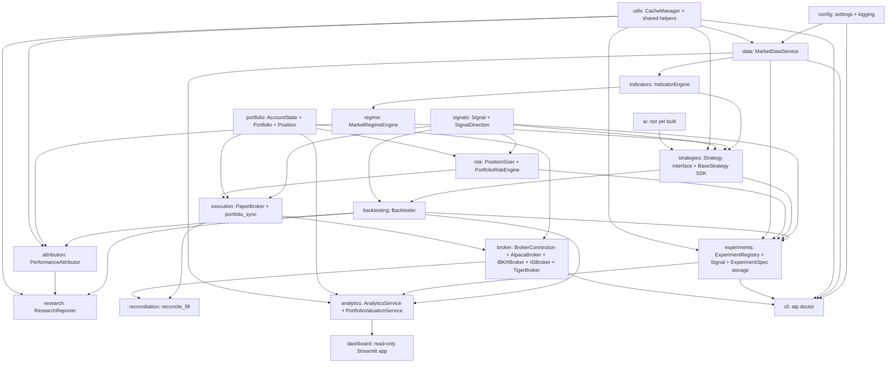

# Architecture

## Organizing principle

This codebase is organized by **capability**, not by strategy. A
strategy-first layout (`strategies/mean_reversion/`, `strategies/momentum/`,
each with its own copy of data-fetching, risk, and execution code) tends
to rot: every strategy reinvents its own version of "get data," "size a
position," and "place an order," and the copies drift apart.

Instead, each capability is a module with one job, and strategies (once
they exist) sit on top of all of them:

`attribution` is not the same thing as `analytics` (built in Sprint 9,
`DECISIONS.md` ADR-0042): `attribution` explains a single completed
backtest (which regime/session it did well or badly in), while
`analytics` computes the standard metrics set (Sharpe, drawdown, win
rate, profit factor, ...) plus portfolio valuation, and is the one
thing `src/dashboard` is allowed to depend on for any calculation.
`attribution`'s regime-bucketing analysis remains its own thing --
`analytics` does not duplicate it, and the dashboard doesn't surface
regime attribution at all this round (a natural future addition, not
built).

**Sprint 7 built portfolio-aware risk; Sprint 9 built analytics and
dashboard.** The Analytics & Dashboard scope originally planned for
Sprint 7 in this file was superseded before that sprint began by a more
pressing requirement: moving from simple per-trade allocation to
genuine, stop-based position sizing plus portfolio-level exposure
constraints (`DECISIONS.md`, ADR-0039). It was re-sequenced, not
abandoned -- Sprint 9 (`DECISIONS.md`, ADR-0042) is where `src/analytics`
and `src/dashboard` were actually built, both now documented in the
module reference below.

`research` is also distinct from the Sprint 9+ `ai` module: `research`
turns one completed backtest's evidence into a human-readable summary
and recommendation (a research artifact for a person to read), while
`ai` (not yet built) will generate trading *signals* consumed by
`strategies` like any other signal source. Neither module makes a
trading decision on its own behalf (ADR-0017) -- `research` explicitly
never will, since its output is prose for a person, not a `Signal`.

`portfolio` holds the neutral `AccountState` domain model and depends
on nothing else in this codebase (`DECISIONS.md`, ADR-0031) --
`broker`, `risk`, and `execution` all depend on it instead of on each
other for account state. This corrected an original dependency-
direction mistake: `AccountState` used to live in `src/risk`, which
meant `src/broker` (foundational connectivity infrastructure) had to
import from `src/risk` (a downstream consumer of account state) just
to describe an account. There is no `broker --> risk` edge, and there
never should be one again -- `tests/test_architecture.py` enforces
this with a static source check, not just a docstring promise.

`risk --> execution` reflects a real dependency: `PaperBroker` consumes
`PositionSizer`'s `SizingDecision` directly to size an opening order
(`DECISIONS.md`, ADR-0022), closing the loop ADR-0021 left open.
Neither `risk` nor `execution` depend on, or get called by,
`backtesting` -- `Backtester` still sizes every trade as a single unit
(ADR-0011), unchanged. `AlpacaBroker` (and every other concrete broker)
returns `src.portfolio.AccountState` directly from `get_account()`, the
same currency `PaperBroker.account_state` already produces
(`DECISIONS.md`, ADR-0023, ADR-0031) -- a live broker and the paper
broker are interchangeable account-state sources from
`PositionSizer`'s point of view. `execution --> broker` is still
aspirational, though: `broker` doesn't call `execution` or vice versa
today -- they're sibling account-state sources, not a dependency chain,
until a future orchestration layer picks one and drives `PositionSizer`
from it. `broker --> cli` reflects `atp doctor`'s Broker Connection
check calling `AlpacaBroker` directly, the same way it already calls
into `data`/`utils`/`experiments`.

`cli` is drawn separately from the main pipeline on purpose: it's a
diagnostic tool that reaches into several capabilities to check their
health, not a capability anything else depends on.

`utils` sits alongside `config` as foundational: `CacheManager` is
generic key/DataFrame persistence with no idea what a "candle" or
"symbol" is, so any future capability that fetches from an external
source (news, options chains, VIX, macro data, earnings, forex) can
depend on it the same way `data` does, without depending on `data`
itself. `utils --> strategies` and `utils --> experiments` (Sprint 6)
follow the same shape: `hashing.py`'s `sha256_hex()`/
`dataframe_fingerprint()` don't know what a "strategy" or a "dataset"
is either, so both `src/strategies` (for `strategy_version`) and
`src/experiments` (for `ExperimentSpec.dataset_fingerprint`) depend on
`utils` for hashing without depending on each other for it.

`strategies --> experiments` and `risk --> experiments` are both new in
Sprint 6, and both exist for exactly one reason: `ExperimentSpec`
(`src/experiments/spec.py`) needs `Strategy`'s type, `strategy_version`,
`get_strategy_class` from `src/strategies`, and `RiskLimits`'s type
from `src/risk`, to describe what an experiment's strategy and risk
configuration actually were. Both edges point the same direction as
every other edge into `experiments` (`backtesting --> experiments`,
`signals --> experiments`) -- `experiments` consumes from upstream
capabilities to build its records, and neither `src/strategies` nor
`src/risk` gained any dependency on `src/experiments` in return
(verified by `tests/test_pipeline_contract.py` composing all of them
together without a cycle).

`ai` feeds into `strategies` as one input among several -- it is not a
parent of the whole system. That's deliberate: an AI-generated signal
should be swappable for a rule-based one without touching risk,
execution, or the dashboard.

`data --> experiments` is new in Pre-Sprint 7 (`DECISIONS.md`,
ADR-0038): `ExperimentSpec.interval` is now typed as `src.data.base
.Interval` rather than a bare string, so `src/experiments` depends on
`src/data` for that one type the same way it already depends on
`src/strategies`/`src/risk` for theirs. `src/data` gained no dependency
on `src/experiments` in return.

**Timeframe-agnostic by design (`DECISIONS.md`, ADR-0038):** the
research and strategy layers -- `data`, `signals`, `strategies`,
`backtesting`, `experiments`, `attribution` -- do not assume daily
bars. The same `Strategy`/`Backtester`/`ExperimentSpec` interfaces
support `SPY/1d`, `SPY/1m`, and anything in between, using full
`pd.Timestamp` precision throughout (no candle timestamp is ever
truncated to a calendar date) and a `Signal`/`Trade` model with no
one-decision-per-day limit. This is architectural readiness for
daily/swing, intraday, and minute-scale research today, with room for a
future advanced execution/data layer to support second-scale strategies
without a rewrite -- **it is not** an implemented live-trading
capability at any of those timescales: there is no tick feed,
order-book simulation, exchange co-location, or sub-millisecond
execution infrastructure, and none is planned as part of this
correction. See ADR-0038 for exactly what was found already correct,
what was fixed, and what remains explicitly future work.

**Explicit capability statement, so this is never overstated:**
minute-level intraday research/trading is the current architectural
target. Tick-level and second-level execution infrastructure is not
implemented. High-frequency trading (HFT) remains explicit future
work, not a supported capability today.

## Module reference

Modules are documented in the order they were built. Each entry lists
purpose, inputs, outputs, and what it deliberately does NOT do (the
boundary is as important as the function).

### `src/config`

**Purpose:** the single source of truth for paths and constants. Every
other module reads configuration from here instead of hardcoding paths,
symbols, or defaults.

- **Inputs:** none (reads its own source, will later read `.env` /
  YAML overrides -- not implemented yet).
- **Outputs:**
  - `settings.py`: `PROJECT_ROOT`, `DATA_DIR`, `LOG_DIR`, `CONFIG_DIR`,
    `WATCHLIST`, `DEFAULT_PERIOD`, `DEFAULT_INTERVAL`.
  - `logging.py`: a configured `loguru.logger` (file sink at
    `logs/trading.log`, rotating at 10 MB / retained 30 days; console
    sink at INFO).
- **Does not:** validate business logic, know about market data, or
  import from any other `src/` package (it's the foundation; nothing
  should depend on it depending on them).

### `src/data`

**Purpose:** "give me trustworthy candles for a symbol" -- the one
abstraction every downstream component (backtests, live trading,
dashboards, AI research) depends on for historical price data. As of
Sprint 8 (`DECISIONS.md`, ADR-0041), "trustworthy" is load-bearing: the
architectural invariant is that no strategy, backtest, or experiment
consumes raw provider data directly -- everything passes through this
package's validated, canonicalized, session-aware boundary first.

- **Inputs:** a ticker symbol, a date range or period string, a candle
  interval, an optional `SessionPolicy`.
- **Outputs:** `get_candles()`/`get_history()` return a
  `pandas.DataFrame` indexed by a timezone-aware, UTC `timestamp`
  `DatetimeIndex`, columns `open, high, low, close, volume` -- sorted
  ascending, no duplicate rows, validated. `get_dataset()` (new)
  returns a full `CandleDataset` (candles plus symbol/interval/
  provider/timezone/session-policy/requested-range/dataset-range/
  content-hash/validation-report). Guaranteed shape regardless of which
  provider is behind it.
- **Key files:**
  - `base.py` -- the `DataProvider` abstract interface and `Interval`
    enum. This is the seam: new data vendors implement this interface
    and nothing else in the codebase needs to change. A provider may
    return either a timezone-naive index (treated as already UTC -- the
    right convention for a date-only daily/weekly/monthly bar) or a
    timezone-aware one in its own vendor convention; `MarketDataService`
    canonicalizes either way.
  - `yfinance_provider.py` -- the only concrete `DataProvider` today,
    backed by Yahoo Finance via the `yfinance` package. No longer
    strips the timezone-aware intraday timestamps yfinance actually
    returns (Sprint 8; it used to).
  - `canonical.py` (Sprint 8) -- `canonicalize_candles()`: pins row
    order, column order, numeric dtype (float64), and timezone (UTC).
    The single choke point everything hashed via
    `src.utils.hashing.dataframe_fingerprint()` and everything cached
    now passes through first, so a cache hit and a fresh fetch of
    identical data always fingerprint identically.
  - `validation.py` (Sprint 8) -- `validate_candles()`: structural
    checks (missing/duplicate/unordered timestamps, naive index,
    missing columns/values, empty symbol) raise
    `StructuralValidationError`; financial-sanity checks (`high <
    max(open, close)`, `low > min(open, close)`, `high < low`, negative
    volume) raise `FinancialSanityError`. Gap detection (given a
    `src.calendar.TradingCalendar`) and zero-volume flags are
    non-fatal, recorded on the returned `ValidationReport` -- not an
    anomaly detector, just the checks `DECISIONS.md` ADR-0006 named.
  - `models.py` (Sprint 8) -- `SessionPolicy` (`REGULAR`/`ALL`),
    `GapReport`, `ValidationReport`, `DatasetIdentity`, `CandleDataset`
    -- the shapes the sections above and `service.py` produce.
  - `service.py` -- `MarketDataService`, the public facade.
    `get_candles(symbol, start, end, interval, session=...)` and
    `get_history(symbol, period, interval, session=...)` keep their
    pre-Sprint-8 signatures (defaults come from `config.settings`);
    `get_dataset(...)` (new) returns the full `CandleDataset`. Owns the
    orchestration: canonicalize -> validate -> cache -> session-filter
    -> return, on every call, cache hit or fresh fetch alike. Caching
    itself is delegated to `CacheManager` (see `src/utils` below and
    `DECISIONS.md`, ADR-0008), now keyed per `(symbol, interval)`
    rather than per exact range -- a request extending past the cached
    span fetches only the new tail (`DECISIONS.md`, ADR-0007, ADR-0041).
  - `exceptions.py` -- `DataProviderError` (the provider failed) vs.
    `NoDataError` (the request was valid but empty), plus (Sprint 8)
    `DataValidationError` and its two subclasses above -- distinct
    cases since callers usually want to handle them differently.
- **Does not:** know about indicators, strategies, or any specific
  vendor beyond what's behind the `DataProvider` it's given. Does not
  read or write cache files directly -- that's `CacheManager`'s job.
  Does not make trading decisions or hold any market opinion. Does not
  model pre-market/after-hours sessions (`SessionPolicy` reserves the
  concept, implements only `REGULAR`/`ALL`) or a general-purpose
  exchange calendar -- that's `src/calendar`'s narrow scope, not this
  package's.
- **Depends on:** `src/config` (for default period/interval),
  `src/utils` (for `CacheManager` and `dataframe_fingerprint()`),
  `src/calendar` (Sprint 8, for session filtering and gap detection).

### `src/calendar`

**Purpose:** a market-session abstraction, so NYSE-hours assumptions
(09:30-16:00 America/New_York, weekends, holidays) live in exactly one
place rather than being scattered through `src/data`'s validation and
gap-detection logic (`DECISIONS.md`, ADR-0041, Sprint 8). A leaf
dependency -- `src/data` depends on it, it depends on nothing else in
this codebase.

- **Inputs:** a `date` (or a `date` range).
- **Outputs:** `is_session(date) -> bool`; `session_open`/
  `session_close(date) -> pd.Timestamp` (UTC); `sessions_between(start,
  end) -> list[date]`; `session_date(timestamp) -> date` (converts a
  UTC instant to the local trading-session date it belongs to).
- **Key files:**
  - `base.py` -- `TradingCalendar(ABC)`, analogous to `src.data.base
    .DataProvider`: every current and future market calendar
    implements this one interface.
  - `nyse.py` -- `NYSECalendar`, the only concrete implementation:
    regular session only (pre-market/after-hours are a documented
    future capability, not built). Holidays come from a small,
    explicit, rule-based table (`_nyse_holidays()`, e.g. "third Monday
    in January", Good Friday via the standard Anonymous Gregorian
    Easter algorithm) computed on demand for any year in the explicit,
    bounded `SUPPORTED_YEARS` (2015-2035) -- not a hardcoded date list,
    and not a calendar-library dependency, a deliberate trade-off given
    the sprint's "don't build a full exchange-calendar platform"
    scope. Does not model NYSE's rare unscheduled closures (a national
    day of mourning, say) -- a documented limitation, not a silent gap.
- **Does not:** know about candles, providers, or validation -- it only
  answers "is this a trading day" and "when does the session
  open/close." Does not model any market besides US equities via NYSE
  hours, or any session besides the regular one.
- **Depends on:** nothing else in `src/` -- same tier as `src/config`
  and `src/utils`.

### `src/utils`

**Purpose:** shared infrastructure used across capabilities -- not
owned by any single one. Today: `CacheManager` and generic content
hashing (`DECISIONS.md`, ADR-0035). Will eventually also hold logging/
config helpers that don't belong to a specific capability.

- **Inputs:** `CacheManager.get(key)` takes a string key;
  `CacheManager.set(key, data)` takes a string key and a
  `pandas.DataFrame`. `hashing.sha256_hex(data)` takes raw `bytes`;
  `hashing.dataframe_fingerprint(df)` takes a `pandas.DataFrame`.
- **Outputs:** `CacheManager.get(key)` returns a `DataFrame` or `None`
  if nothing is cached under that key. Persists to CSV under a
  configurable directory. `dataframe_fingerprint()` returns a
  deterministic hex digest of a DataFrame's actual values, index, and
  column names -- a content identity, not a descriptive one.
- **Key files:**
  - `cache.py` -- `CacheManager`, a generic key -> DataFrame on-disk
    cache. Has no concept of symbols, intervals, or market data at all
    -- that's precisely the point, since news, options chains, VIX,
    macro data, and earnings are all expected to reuse it later
    (`DECISIONS.md`, ADR-0008).
  - `hashing.py` (Sprint 6) -- `sha256_hex()` and
    `dataframe_fingerprint()`. The shared basis for both identity seams
    established in `DECISIONS.md` ADR-0035: strategy version
    (`src/strategies/identity.py`, hashes source code) and dataset
    identity (this module, hashes candle values) both reduce to "hash
    these bytes, deterministically" -- kept here once rather than
    duplicated, the same reasoning `CacheManager` lives here instead of
    inside `src/data`. `dataframe_fingerprint()` itself is unchanged by
    Sprint 8 -- it always hashed whatever DataFrame it was given; what
    changed is that `src.data.canonical.canonicalize_candles()` is now
    the only thing `MarketDataService` ever fingerprints, from both the
    fresh-fetch and cache-hit paths, so "identical canonical content"
    and "identical hash" are actually the same claim now
    (`DECISIONS.md`, ADR-0041).
- **Does not:** know what it's caching, hashing, or why. Does not
  decide *when* to use the cache -- that's each capability's own call
  (e.g. `MarketDataService` decides whether a given request should hit
  the cache; `CacheManager` just serves the read/write). `hashing.py`
  has no idea what a "strategy" or a "candle" is -- exactly what lets
  both `src/strategies` and `src/experiments` depend on it without
  depending on each other.
- **Depends on:** nothing else in `src/` -- it's foundational, same
  tier as `src/config`.

### `src/indicators`

**Purpose:** the only place indicators are calculated. Strategies ask
for an indicator by name instead of computing one themselves, so every
strategy sees the exact same RSI, ATR, etc., computed the same way.
Part of the Sprint 2 research engine (`DECISIONS.md`, ADR-0009).

- **Inputs:** an OHLCV candles DataFrame (the `MarketDataService`
  contract) bound at construction, plus an indicator name and keyword
  parameters per `calculate()` call (e.g. `calculate("RSI", period=14)`).
- **Outputs:** a `pandas.Series` (most indicators) or `DataFrame` (MACD's
  `macd`/`signal`/`histogram` columns), aligned to the input candles'
  index.
- **Key files:**
  - `registry.py` -- the `@register_indicator("NAME")` decorator and
    lookup (`get_indicator`, `available_indicators`). The only
    mechanism for adding a new indicator; nothing else needs to change.
  - `formulas.py` -- the actual pure functions: SMA, EMA, RSI, ATR,
    MACD, VWAP today. MACD calls `exponential_moving_average` directly
    (an implementation detail of MACD), not through the engine.
  - `engine.py` -- `IndicatorEngine`, the public facade. Validates the
    candles DataFrame has the required OHLCV columns at construction,
    then dispatches `calculate(name, **params)` to the registry.
- **Does not:** know about strategies, regimes, or backtesting. Does
  not fetch data itself -- it's handed candles, it doesn't go get them.
  Does not cache results (each `calculate()` call recomputes; caching
  indicator output, if ever needed, is a future concern, not this
  module's job today).
- **Depends on:** `src/data` (only for `REQUIRED_COLUMNS`, to validate
  input shape -- does not depend on `MarketDataService` or any
  provider).

### `src/regime`

**Purpose:** pure rule-based classification of current market
conditions -- not AI. Every strategy will be able to ask "what regime
are we in right now." Part of the Sprint 2 research engine
(`DECISIONS.md`, ADR-0009, ADR-0010).

- **Inputs:** an OHLCV candles DataFrame, plus optional tuning
  parameters per `score()` call (SMA periods, ATR period, lookback).
- **Outputs:** `MarketRegimeEngine.score()` returns a DataFrame aligned
  to the candles' index with six columns -- `trending`, `ranging`,
  `volatile`, `low_volatility`, `risk_on`, `risk_off` -- each a
  continuous score in `[0, 1]` (`risk_on`/`risk_off` are `NaN` today,
  see ADR-0010). `dominant()` collapses each axis to a single label.
- **Key files:**
  - `engine.py` -- `MarketRegimeEngine`. Computes the trend axis from
    two SMAs (via `IndicatorEngine`) and the volatility axis from a
    rolling percentile rank of ATR%; the risk axis is a placeholder.
- **Does not:** use AI/ML of any kind. Does not compute its own
  indicators -- asks `IndicatorEngine` for SMA/ATR like any other
  consumer. Does not know about strategies or backtesting.
- **Depends on:** `src/indicators` (for `IndicatorEngine`).

### `src/signals`

**Purpose:** the Signal Framework -- one of the platform's foundational
contracts (`DECISIONS.md`, ADR-0015). Standardizes what a strategy
actually produces: not an order, not a market event, a decision.

- **Inputs:** none -- `Signal` is a plain data model, constructed
  directly by whatever produces one (a `Strategy`, today; possibly
  other sources later).
- **Outputs:** `Signal` (frozen dataclass: `timestamp`, `symbol`,
  `direction`, `confidence`, `metadata`, `id`) and `SignalDirection`
  (`LONG` / `SHORT` / `FLAT`).
- **Key files:**
  - `models.py` -- `Signal`, `SignalDirection`. `symbol` is a required,
    first-class field (`DECISIONS.md`, ADR-0033) -- not a `metadata`
    workaround -- so a `Signal` is always independently identifiable
    without inspecting an untyped dict. `confidence` is validated to
    `[0.0, 1.0]` at construction; `id` is a `UUID` assigned client-side
    (`uuid4()`), not by a database, so a signal can be referenced before
    it's ever persisted.
- **Does not:** carry a price -- a Signal says what position the
  portfolio should move toward, not at what price to transact (that's
  execution's job, later). Does not know it will eventually be stored
  in `ExperimentRegistry` (ADR-0016) -- persistence is that module's
  concern, not this one's.
- **Depends on:** nothing else in `src/` -- like `src/utils`, it's
  foundational infrastructure other capabilities build on.

### `src/strategies`

**Purpose:** the seam strategies plug into, plus the platform's three
permanent strategies. `EMACrossStrategy` (Sprint 4) and
`RSIMeanReversionStrategy` (Sprint 6, `DECISIONS.md` ADR-0037) are
deliberately opposite trading ideas -- trend following vs. mean
reversion -- chosen specifically to prove the interface below
generalizes rather than having been quietly shaped around one
strategy's needs. Neither is tuned for profitability; both exist to
exercise the platform end to end on a real (if minimal) trading idea.
`AISignalStrategy` (Sprint 10, `DECISIONS.md` ADR-0043) is a third,
structurally different kind of proof: the same `Strategy` interface
satisfied by a strategy whose decision logic comes from a trained
`src.ai` model instead of a hand-written rule, with zero change to the
interface itself.

- **Inputs/outputs:** see `DECISIONS.md`, ADR-0015 for the full
  `Strategy` contract (supersedes ADR-0011).
- **Key files:**
  - `base.py` -- `Strategy` (a `typing.Protocol`: `name`, `prepare()`,
    `generate_signals() -> list[Signal]`).
  - `sdk.py` -- `BaseStrategy` (ADR-0018), an optional `ABC` strategies
    may subclass for `self.indicator(...)`, `self.log`,
    `self.require_columns(...)`, and `self.emit_signal(...)`.
    `__init__(name, symbol)` takes a required `symbol` alongside `name`
    (`DECISIONS.md`, ADR-0033) -- one strategy instance trades one
    instrument at a time, matching `Backtester.run()`'s existing
    single-instrument assumption -- and `emit_signal()` attaches it to
    every `Signal` it constructs, so a strategy author never has to pass
    `symbol` by hand at every call site. `prepare()`/`generate_signals()`
    stay abstract -- the SDK never decides when or how often to emit a
    signal, only removes setup boilerplate. `params` (Sprint 6,
    `DECISIONS.md` ADR-0035) is a new optional property, defaulting to
    `{}`, that a subclass overrides to expose its own tunable
    constructor arguments -- read by `ExperimentSpec.capture()`
    (`src/experiments/spec.py`) to record what an experiment actually
    ran with. A strategy can still implement `Strategy` directly, with
    no base class, exactly as before (`Strategy` the Protocol was not
    changed by either ADR-0033 or ADR-0035).
  - `identity.py` (Sprint 6) -- `strategy_version(cls)`: a SHA-256 hash
    of a strategy class's own Python source
    (`src.utils.hashing.sha256_hex`), used by `ExperimentSpec` as the
    strategy-identity seam (`DECISIONS.md`, ADR-0035). Automatic --
    changing a strategy's implementation changes its version with no
    action from the author -- at the cost of also changing on a purely
    cosmetic edit (a comment, a docstring): a source-identity hash, not
    a semantic-identity one.
  - `registry.py` (Sprint 6) -- `@register_strategy("name")` /
    `get_strategy_class(name)` / `available_strategies()`, the same
    `@register_x` pattern `src/indicators/registry.py` and
    `src/cli/registry.py` already use. `EMACrossStrategy` registers
    itself as `"ema_cross"`, `RSIMeanReversionStrategy` as
    `"rsi_mean_reversion"`. This is what makes
    `ExperimentSpec.reconstruct_strategy()` possible -- look a class up
    by name, rather than every caller needing to import every strategy
    module by hand.
  - `ema_cross.py` (Sprint 4) -- `EMACrossStrategy`, the platform's
    first permanent strategy. Long-only: long while EMA(fast) >
    EMA(slow), flat otherwise (`fast=12, slow=26` default).
  - `rsi_mean_reversion.py` (Sprint 6, ADR-0037) --
    `RSIMeanReversionStrategy`, the platform's second permanent
    strategy. Long-only: enters `LONG` at or below an `oversold` RSI
    threshold (default 30), exits to `FLAT` at or above an
    `overbought` threshold (default 70). The deliberately opposite
    trading idea from `EMACrossStrategy` -- proof the registry/
    `ExperimentSpec` seam genuinely generalizes, not a relabeled
    variant of the first strategy.
  - `ai_signal.py` (Sprint 10, `DECISIONS.md` ADR-0043) --
    `AISignalStrategy`, registered as `"ai_signal"`. Loads an
    already-trained, frozen `src.ai` model by `model_id` at
    construction and never trains it again; `prepare()` builds that
    model's exact feature columns (`src.ai.features.FeatureBuilder`,
    reconstructed from the model's own saved feature spec) and fails
    loudly on any schema mismatch; `generate_signals()` maps the
    model's predicted class and top probability onto the existing
    `Signal`/`SignalDirection`, downgrading to `FLAT` below
    `min_probability`, emitting sparsely (state-change only, same as
    the other two strategies). `params` returns exactly `{"model_id",
    "min_probability"}` -- enough for `ExperimentSpec.
    reconstruct_strategy()` to rebuild an equivalent instance, with the
    rest of the model's provenance reachable via `src.ai.registry.
    ModelRegistry` by that `model_id`.
- **Does not:** compute indicators or regimes itself -- a conforming strategy's `prepare()`
  is expected to call `IndicatorEngine`/`MarketRegimeEngine`. Does not
  emit one `Signal` per candle -- only at genuine decision points.
  `BaseStrategy` does not own the signal-emission loop or pick a
  direction/confidence on a strategy's behalf. Registration
  (`registry.py`) is optional, not required -- an unregistered strategy
  still works everywhere it always did, it just can't be looked up by
  name for `ExperimentSpec` reconstruction until it registers.
- **Depends on:** `src/signals` (for the `Signal` return type);
  `sdk.py` also depends on `src/indicators` (for `IndicatorEngine`) and
  `src/data` (for `REQUIRED_COLUMNS`); `identity.py` depends on
  `src/utils` (for `sha256_hex`); `ai_signal.py` additionally depends
  on `src/ai` (`FeatureBuilder`/`FeatureSpec`, `ModelRegistry`) --
  strictly one-directional, `src/ai` has no dependency back on
  `src/strategies`.

### `src/backtesting`

**Purpose:** the framework, not a strategy. Runs any `Strategy` against
candles: run strategy -> collect trades -> calculate metrics ->
generate report. Part of the Sprint 2 research engine (`DECISIONS.md`,
ADR-0009), updated for the Signal Framework in Sprint 3 (ADR-0015),
extended in Sprint 11 (`DECISIONS.md`, ADR-0044) with a second,
portfolio-aware execution mode sitting alongside the original one, and
further extended in Sprint 12 (`DECISIONS.md`, ADR-0045) so that
portfolio-aware mode's fills are no longer instant and frictionless --
an explicit `ExecutionModel` makes fill timing, slippage, and fees
configurable and deterministic.

- **Inputs:** a `Strategy`, an OHLCV candles DataFrame, and (Sprint 8,
  optional) the `CandleDataset` `candles` came from -- or, for the
  Sprint 11 portfolio-aware path, one `Strategy` and one candles
  DataFrame *per symbol*, plus a `BacktestConfig`.
- **Outputs:** a `BacktestResult` (`strategy_name`, `trades: list[Trade]`,
  `equity_curve: pd.Series`, `metrics: dict`, `signals: list[Signal]`,
  `dataset_identity: DatasetIdentity | None` (Sprint 8, `DECISIONS.md`
  ADR-0041), plus (Sprint 11) `risk_mode: RiskMode`,
  `backtest_config: BacktestConfig | None`,
  `signal_outcomes: list[SignalOutcome] | None`,
  `final_portfolio: Portfolio | None` -- populated by `run_portfolio()`,
  left at their defaults by `run()` -- plus a `.report()` method for a
  human-readable summary).
- **Two execution modes, never mixed (Sprint 11, `DECISIONS.md`
  ADR-0044):** `RiskMode(str, Enum)` -- `LEGACY_UNIT` (the original
  ADR-0011 model, produced by `run()`) and `PORTFOLIO_RISK` (produced
  by `run_portfolio()`) -- is carried on `BacktestConfig` and echoed
  back on `BacktestResult.risk_mode`, so any consumer can tell which
  sizing model produced a given result. Neither method shares state
  with the other.
- **Key files:**
  - `engine.py` -- `Backtester.run(strategy, candles, dataset=None)`.
    Consumes the sparse `list[Signal]` from
    `strategy.generate_signals()`, holds each signal's direction
    from its own bar forward until the next signal, then applies the
    no-lookahead shift once when computing the equity curve. Simplified
    execution model unchanged from ADR-0011: one unit of position size,
    entries/exits at candle close, no costs/slippage. The optional
    `dataset` parameter (Sprint 8) is purely additive -- when supplied,
    `result.dataset_identity` records which symbol/timeframe/content-
    hash/session-convention the backtest actually ran against; every
    existing call site (passing a synthetic or hand-built DataFrame)
    omits it and is unaffected. `run_portfolio(strategies, candles,
    config, datasets=None)` (Sprint 11) is a thin front door delegating
    to `PortfolioBacktestEngine` -- kept as a separate module rather
    than folded into this method (Sprint 11 spec: "don't cram this into
    one 500-line `Backtester` method").
  - `config.py` (Sprint 11) -- `RiskMode`, `BacktestConfig` (frozen
    dataclass: `initial_cash`, `risk_mode`, `risk_limits`,
    `portfolio_risk_limits`, `stop_policy`; `__post_init__` requires a
    `stop_policy` when `risk_mode is PORTFOLIO_RISK` and
    `initial_cash > 0` always).
  - `stop_policy.py` (Sprint 11) -- `StopPolicy` protocol, `StopResult`
    (`available`/`stop_price`/`reason`), and `ATRStopPolicy`
    (period=14, multiple=2.0 defaults) built on the existing
    `IndicatorEngine`. LONG stops below entry, SHORT stops above
    entry; `available=False` (never a bad number) when ATR isn't
    computable yet or is zero. `PortfolioBacktestEngine` always
    truncates history to `.loc[:signal.timestamp]` before calling this,
    so a stop can never see data the signal itself postdates.
  - `portfolio_engine.py` (Sprint 11) -- `PortfolioBacktestEngine`, the
    actual multi-symbol, risk-sized simulation: merges each symbol's
    sparse signals onto one sorted timeline; for each signal in order,
    derives an entry price from that bar's close and a stop from
    `StopPolicy`, then hands both to the *existing, unmodified*
    `PortfolioRiskEngine.decide()` (entries) or `.decide_close()`
    (exits/FLATs) against a real, evolving `Portfolio` -- never a
    stale snapshot. Fills approved intents at the signal bar's close
    (same convention as `run()`), applies fills via `Portfolio`'s own
    `open_position()`/`close_position()`, and marks-to-market for the
    equity curve via a read-only valuation pass that never mutates
    `Position.current_price`. Never recomputes `risk_amount`/
    `risk_quantity`/`capital_quantity`/`allocation_quantity`/
    `portfolio_exposure_quantity`/`symbol_exposure_quantity` itself --
    those come from `PortfolioRiskEngine` exclusively
    (`tests/test_architecture.py` enforces this by source-text scan).
    Contains no `isinstance`/name-based branch for any particular
    strategy, `AISignalStrategy` included.
  - `risk_audit.py` (Sprint 11; extended Sprint 12) -- `SignalOutcome`
    (per-signal accept/reject record; `rejection_reason` reports
    `"STOP_UNAVAILABLE"` when a stop couldn't be computed, without ever
    reaching the risk engine, or `execution_unavailable_reason`'s value
    when Risk approved a trade but Execution couldn't fill it) and
    `RiskAuditSummary`/`summarize_outcomes()` (totals and rejection
    counts by reason) -- "signal generated," "trade approved," and
    "trade rejected" are always distinguishable from the result alone.
  - `execution_model.py` (Sprint 12, `DECISIONS.md` ADR-0045) --
    `ExecutionTiming(str, Enum)` (`SIGNAL_BAR_CLOSE` default,
    `NEXT_BAR_OPEN`), `SlippageModel`/`FeeModel` protocols with
    deterministic `PercentageSlippageModel`/`PercentageFeeModel`
    implementations, `ExecutionConfig` (bundles all three, `.describe()`
    for provenance), and `ExecutionModel.simulate(order, candles) ->
    ExecutionOutcome` -- a pure function reusing `src.execution.models`'
    existing `Fill`/`Order`/`OrderSide` shapes. `NEXT_BAR_OPEN`'s
    reference price only ever reads the next candle's own `open` --
    there is no code path that reads a future bar's high/low/close.
    `NO_EXECUTION_BAR` (no next bar, or the order's timestamp isn't in
    the candle index) is an explicit outcome, never a same-bar-close
    fallback. `INSUFFICIENT_CASH_FOR_FEE` is reported by
    `PortfolioBacktestEngine`'s own `_unaffordable_reason()` check,
    comparing `portfolio.cash + fill.cash_delta` against zero after a
    real fill is produced.
  - `models.py` -- `Trade` (references its opening/closing signals by
    `entry_signal_id`/`exit_signal_id: UUID`, not by embedding the
    `Signal` objects -- see ADR-0015/ADR-0016; gained an optional
    `quantity: float | None` field in Sprint 11, `None` for every
    pre-Sprint-11/`LEGACY_UNIT` trade, real gross P&L -- `qty *
    (exit - entry)` long, `qty * (entry - exit)` short -- when set;
    gained `entry_fill_price`/`exit_fill_price`/`entry_fee`/`exit_fee`
    plus `total_fees`/`slippage_cost`/`net_pnl` properties in Sprint 12
    -- `entry_price`/`exit_price`/`gross_pnl` stay the frictionless
    reference-price economics unchanged, the new fields/properties
    surface the actual, cost-aware economics separately, never mutating
    the reference ones), `BacktestResult` (Sprint 11 fields described
    above).
  - `metrics.py` -- `calculate_metrics()`, `sharpe_ratio()`,
    `max_drawdown()`, `infer_periods_per_year()` (Pre-Sprint 7,
    `DECISIONS.md` ADR-0038), each independently testable.
    `infer_periods_per_year(index)` estimates a Sharpe annualization
    factor from a `DatetimeIndex`'s own median timestamp spacing --
    daily bars infer to the historical `252` default unchanged;
    intraday bars scale up accordingly, correcting what used to be a
    flat, unconditional `252` regardless of actual bar size.
    `calculate_metrics()`/`sharpe_ratio()`'s `periods_per_year` defaults
    to `None` (infer) with an explicit override still accepted.

  Timeframe-agnostic by construction (ADR-0038, extended by ADR-0044):
  nothing in `engine.py`, `portfolio_engine.py`, or `metrics.py` treats
  a row as "one trading day" -- trade extraction, the position series,
  the equity curve, Sharpe annualization, and the Sprint 11 merged
  multi-symbol timeline all derive from `candles`' own timestamps, so
  the identical `Backtester` runs daily, hourly, or 1-minute candles
  unmodified. `Backtester.__init__` accepts an optional
  `periods_per_year` override for callers that want to bypass
  inference.

  `Signal` gaining a required `symbol` field (`DECISIONS.md`, ADR-0033)
  required zero changes here -- `Backtester` passes `Signal` objects
  through into `BacktestResult.signals` untouched, so the new field
  survives automatically; `tests/test_architecture.py` proves the
  symbol (and the signal's UUID identity) survives strategy -> backtest
  -> registry end to end. `Signal` itself still has no quantity or stop
  field -- strategies never control sizing (ADR-0044 decision 3);
  `PortfolioBacktestEngine` derives both externally, per signal.
- **Does not:** model an order book, partial fills, or limit/stop
  orders -- `PORTFOLIO_RISK` mode's `ExecutionModel` (Sprint 12) covers
  fill timing, slippage, and fees only, at the candle level; `LEGACY_UNIT`
  mode (`run()`) still has no cost modeling of any kind, unchanged since
  ADR-0011. Does not decide position sizing in
  `LEGACY_UNIT` mode beyond a single unit, regardless of a signal's
  `confidence`. In `PORTFOLIO_RISK` mode, does not implement any sizing
  formula itself -- composes `src/risk`'s `PortfolioRiskEngine`
  unmodified rather than reimplementing or extending it; no Kelly
  sizing, VaR/CVaR, correlation optimization, or volatility targeting
  was added. Does not support pyramiding, partial closes, or scaling
  into an open position -- a same-symbol operation while already open
  is rejected via `PortfolioRiskEngine`'s existing
  `POSITION_SCALING_NOT_SUPPORTED`/`UNSUPPORTED_POSITION_OPERATION`
  reasons, not new reversal logic. Does not persist results, and does
  not store `Signal` objects itself -- `ExperimentRegistry` owns that
  (ADR-0016).
- **Depends on:** `src/strategies` (for the `Strategy` contract),
  `src/signals` (for `Signal`/`SignalDirection`), `src/data` (Sprint 8,
  only for `CandleDataset`/`DatasetIdentity` -- `Backtester` never
  fetches data itself or imports a provider); in `PORTFOLIO_RISK` mode
  only, `src/risk` (`PortfolioRiskEngine`/`RiskDecision`/
  `PortfolioRiskLimits`/`RiskLimits`) and `src/portfolio`
  (`Portfolio`/`Position`) and `src/execution` (`ApprovedTradeIntent`)
  -- all used exactly as `PaperBroker` already uses them, never
  reimplemented. `LEGACY_UNIT` mode (`run()`) has none of these
  dependencies, unchanged from before Sprint 11.

### `src/attribution`

**Purpose:** explain a completed backtest, not just report its win
rate -- trade counts, average hold time, and which market regime
trades did best/worst in. Sprint 3 Module 3 (`DECISIONS.md`, ADR-0019).
Not the same thing as the planned `src/analytics` (Sprint 7) -- see the
note under the dependency diagram above.

- **Inputs:** a `BacktestResult` and the same candles it was produced
  from (regime is looked up by each trade's `entry_time` against them).
- **Outputs:** an `AttributionReport` (`total_trades`, `winning_trades`,
  `win_rate`, `average_hold`, `regime_breakdown: dict[str, RegimeStats]`,
  `best_regime`, `worst_regime`, plus a `.report()` method).
- **Key files:**
  - `engine.py` -- `PerformanceAttributor.run(result, candles,
    **regime_kwargs)`. Independently recomputes regime via
    `MarketRegimeEngine(candles)` rather than trusting a strategy to
    have tagged `Signal.metadata` with it, so attribution works for
    every backtest regardless of what a given strategy recorded. Buckets
    each trade by the regime at its `entry_time` (joining
    `trend_regime` + `volatility_regime` only -- `risk_regime` is
    excluded since it's always `"unknown"` per ADR-0010). A trade
    entering during the regime engine's indicator warmup period is
    bucketed `"unknown"` and excluded from "Best"/"Worst Regime" rather
    than trusting a misleading NaN-comparison default.
  - `models.py` -- `AttributionReport`, `RegimeStats` dataclasses.
- **Does not:** include a session-of-day breakdown (morning/lunch/
  power hour) yet -- deferred until `DECISIONS.md` ADR-0006 (timezone
  consistency) actually lands, since session buckets are only
  meaningful if candle timestamps are reliably in market-local time,
  which isn't yet guaranteed. Does not persist its output -- an
  `AttributionReport` is in-memory only today; wiring it into
  `ExperimentRegistry` is a natural future step, not built here.
- **Depends on:** `src/backtesting` (for `BacktestResult`/`Trade`),
  `src/regime` (for `MarketRegimeEngine`), `src/utils` (for the shared
  `format_timedelta`, promoted here as of ADR-0020 once `src/research`
  became a second consumer). Zero existing files changed to add this
  module originally -- Extension Cost (ADR-0014) of 0; the later
  `format_timedelta` extraction is accounted for under `src/research`'s
  own Extension Cost instead.

### `src/research`

**Purpose:** turn a completed backtest + attribution report into an
evidence-grounded research summary -- a recommendation for a person to
weigh, never a trading decision (ADR-0017). Sprint 3 Module 4
(`DECISIONS.md`, ADR-0020; renderer-failure transparency added by
ADR-0034). Distinct from the Sprint 9+ `src/ai`
scope -- see the note under the dependency diagram above.

- **Inputs:** a `BacktestResult` and the `AttributionReport` produced
  from it (`PerformanceAttributor.run(result, candles)`).
- **Outputs:** a `ResearchReport` (`findings: ResearchFindings`,
  `narrative: str`, `rendered_by: "fallback" | "claude"`,
  `renderer_error: str | None` -- `None` on the normal fallback path
  (no `ANTHROPIC_API_KEY`/`anthropic` configured), the stringified
  exception when `ClaudeNarrativeRenderer` was attempted and actually
  failed (`DECISIONS.md`, ADR-0034); the deterministic `findings` are
  identical either way).
- **Key files:**
  - `compiler.py` -- `compile_findings(result, attribution) ->
    ResearchFindings`. Fully deterministic: extracts only what the
    platform already computes (trade count, win rate, Sharpe, max
    drawdown, average hold, best/worst regime) as `Finding(label,
    value)` pairs. Produces a single `recommendation` string only when
    the worst regime bucket's average return is actually negative --
    stays silent rather than guessing otherwise. Never mentions
    session-of-day timing, since that axis doesn't exist yet
    (ADR-0006/ADR-0019).
  - `renderers.py` -- `NarrativeRenderer` protocol,
    `FallbackNarrativeRenderer` (template-based, no network, no API
    key), `ClaudeNarrativeRenderer` (calls the Claude API under a
    system prompt that forbids stating any fact not already present in
    `ResearchFindings` -- rephrasing only).
  - `reporter.py` -- `ResearchReporter.run(result, attribution)`. Picks
    `ClaudeNarrativeRenderer` when `ANTHROPIC_API_KEY` is set and
    `anthropic` is importable, `FallbackNarrativeRenderer` otherwise;
    catches any renderer exception (missing dependency, bad
    credentials, network/API failure, malformed response, timeout) and
    falls back to the deterministic renderer rather than losing the
    report or raising -- but now records `str(exc)` into
    `renderer_error` when that happens, so the failure is observable
    rather than silently indistinguishable from "Claude wasn't
    configured" (`DECISIONS.md`, ADR-0034). `run()` never raises merely
    because the optional AI prose failed.
  - `models.py` -- `Finding`, `ResearchFindings`, `ResearchReport`.
- **Does not:** reason about session-of-day timing (deferred pending
  ADR-0006). Does not persist its output -- a `ResearchReport` is
  produced on demand, not saved into `ExperimentRegistry`; a natural
  future step, not built here. Does not require `anthropic` or
  `ANTHROPIC_API_KEY` -- both are optional, and the platform's research
  reports work identically (just with template prose) without either.
- **Depends on:** `src/backtesting` (for `BacktestResult`), `src/attribution`
  (for `AttributionReport`), `src/utils` (for `format_timedelta`).
  Extension Cost (ADR-0014): 4 files changed outside the new package
  itself -- `src/attribution/models.py`, `src/utils/__init__.py`,
  `src/utils/formatting.py` (new), `src/cli/checks.py`. See ADR-0020 for
  why this is proportionate rather than a violation.

### `src/portfolio`

**Purpose:** the neutral account/domain model every capability that
needs to know "how much equity does this account have, how much is
already committed" depends on -- without any of them depending on each
other to get it. Extracted from `src/risk` during the Pre-Sprint 6
architecture review cleanup (`DECISIONS.md`, ADR-0031), the same way
`src/data`'s `DataProvider` interface keeps every data vendor
interchangeable. Sprint 7 (`DECISIONS.md`, ADR-0039) grew this package
from the single summary-numbers `AccountState` into a richer, still
neutral aggregate -- `Portfolio` plus a platform-level `Position` --
without changing `AccountState` at all.

- **Inputs:** none -- both `AccountState` and `Position` are plain data
  models, constructed directly by whatever needs to describe an account
  or a holding (a broker's `get_account()`, `PaperBroker.account_state`,
  `Portfolio.open_position()`, a test).
- **Outputs:** `AccountState` (`equity: float` validated `> 0`,
  `open_exposure: float` validated `>= 0`, defaults to `0.0`).
  `Portfolio` (cash plus open `Position`s; `equity`, `total_exposure`,
  `symbol_exposure(symbol)`, `position_count`, `positions`/
  `closed_positions` as defensive copies, `to_account_state()`).
  `Position` (symbol, side, signed quantity, entry price/timestamp,
  optional stop/current price, `OPEN`/`CLOSED` lifecycle, realized/
  unrealized P&L).
- **Key files:**
  - `models.py` -- `AccountState`, moved here verbatim from
    `src/risk/models.py` -- same fields, same `__post_init__`
    validation, no behavior change. `Portfolio` (Sprint 7, ADR-0039,
    new) -- a regular class, not a dataclass (matches `PaperBroker`'s
    own convention, since it protects a real invariant: its positions
    dict must stay consistent with `cash`). `open_position()`/
    `close_position()` move cash by `-quantity * entry_price`/
    `+quantity * exit_price` uniformly for `LONG` and `SHORT` (signed
    quantity does the work, no branch needed) and raise on
    scaling into an already-held symbol -- `Portfolio` does not support
    that this sprint, matching `PaperBroker`. Both gained an optional
    `fee: float = 0.0` parameter in Sprint 12 (`DECISIONS.md` ADR-0045,
    validated non-negative), debited/credited as a cash movement
    additional to the existing `quantity * price` one -- `Position.
    realized_pnl` stays fee-agnostic; fees are a `Portfolio`-level cash
    effect only, surfaced for reporting via `src.backtesting.models.
    Trade.net_pnl`. `equity`/`total_exposure`
    reuse the same "value at `valuation_price`, falling back to
    `entry_price` when no `current_price` is known" formula
    `PaperBroker.account_state` already uses -- no new mark-to-market
    capability introduced. `to_account_state()` bridges back for any
    caller (e.g. `PositionSizer`) that only needs the two summary
    numbers.
  - `position.py` (Sprint 7, ADR-0039, new) -- `PositionSide`
    (`LONG`/`SHORT`), `PositionLifecycle` (`OPEN`/`CLOSED` only --
    "FLAT" is represented by *absence* from `Portfolio.positions`, not
    a third enum member; see the module's own docstring), `Position`.
    Deliberately distinct from, and does not replace,
    `src.execution.models.Position` (the older, lighter fill-
    bookkeeping record `PaperBroker` already owns) -- see
    `src/execution`'s section below for how the two stay in sync.
- **Does not:** know anything about brokers, risk limits, position
  sizing, or execution -- it is a set of value objects plus one small
  aggregate, nothing more. Does not import from `src/broker`,
  `src/risk`, or `src/execution` -- if it ever did, the whole point of
  extracting it would be defeated; `tests/test_architecture.py` enforces
  this with a static source check, not just this docstring (and the
  check globs every file in the package, so `position.py` is covered
  automatically). Consequently `Portfolio` has no method that accepts an
  `src.execution.models.Fill` directly -- `src.execution.portfolio_sync.
  apply_fill_to_portfolio()` is the small glue living on the allowed
  side of that boundary instead (`execution --> portfolio` already
  exists; the reverse never will). Does not implement partial-fill or
  position-scaling lifecycle states -- `PaperBroker` doesn't support
  those operations, so `Position`/`Portfolio` don't carry states for
  them either.
- **Depends on:** nothing else in `src/` -- like `src/signals` and
  `src/utils`, it's foundational infrastructure other capabilities
  build on, not the other way around. Extension Cost (ADR-0014): the
  original move touched `src/risk/models.py`, `src/risk/engine.py`,
  `src/risk/__init__.py`, `src/broker/base.py` and all four concrete
  brokers, and `src/execution/engine.py` (7 files, all import-path
  updates only, no behavior change). Sprint 7's `Portfolio`/`Position`
  addition was purely additive on top -- two new files inside this
  package, no existing file in it modified.

### `src/risk`

**Purpose:** decide how large a position to take for a signal -- and
whether to take one at all -- given the account's current state.
Sprint 4's `PositionSizer` (`DECISIONS.md`, ADR-0021) answers this from
a fixed allocation fraction; Sprint 7's `PortfolioRiskEngine`
(`DECISIONS.md`, ADR-0039) answers it from a genuine, stop-based risk
budget plus portfolio-level constraints -- a distinct question, in a
distinct class, standalone from the first.

- **Inputs (`PositionSizer`):** a `Signal` (must be `LONG` or `SHORT`),
  an `src.portfolio.AccountState` (`equity`, `open_exposure`), and the
  instrument's current `price`.
- **Outputs (`PositionSizer`):** a `SizingDecision` (`approved`,
  `position_size`, `capital_allocated`, `reason`).
- **Inputs (`PortfolioRiskEngine`, Sprint 7):** a `Signal` (must be
  `LONG` or `SHORT`), an `src.portfolio.Portfolio` (cash, open
  positions, exposure), a proposed `entry_price`, and a proposed
  `stop_price` (must be on the correct side of `entry_price` for the
  signal's direction, and not equal to it).
- **Outputs (`PortfolioRiskEngine`):** a `RiskDecision` -- always,
  never a raised exception for a business-rule rejection (only for a
  `FLAT` signal, which this engine doesn't size at all).
- **Key files:**
  - `engine.py` -- `PositionSizer.size(signal, account, price)`. Sizes
    at a **fixed** fraction of equity
    (`RiskLimits.allocation_per_trade_pct`, default 10% -- renamed from
    `risk_per_trade_pct` by ADR-0032, since it is capital allocation,
    not a maximum-loss guarantee) regardless of `Signal.confidence`.
    Sizes down to whatever portfolio exposure headroom remains
    (`RiskLimits.max_portfolio_exposure_pct`, default 50% of equity)
    rather than rejecting outright when the full allocation doesn't
    fit; only rejects (`approved=False`) when there's no headroom left
    at all. `LONG` and `SHORT` sized identically. Untouched by Sprint 7.
  - `models.py` -- `RiskLimits` (validated percentages, `(0, 1]`;
    `allocation_per_trade_pct`'s docstring states explicitly this is
    capital allocation/exposure, not maximum loss), `SizingDecision` --
    both untouched by Sprint 7. `PortfolioRiskLimits` (Sprint 7, new) --
    `risk_pct_per_trade`, optional `max_symbol_exposure_pct`, optional
    `max_concurrent_positions`, `min_quantity` (default `1`) -- a
    separate class from `RiskLimits`, not new fields added to it, since
    `PortfolioRiskEngine` is constructed with *both*
    (`RiskLimits.allocation_per_trade_pct`/`max_portfolio_exposure_pct`
    are reused for the allocation and total-exposure checks, not
    duplicated). `RejectionReason(str, Enum)` (Sprint 7, new, 13
    members) -- a stable, serializable enum (like `Interval`,
    ADR-0038) used both for why a decision was rejected and, as a
    tuple, which constraint(s) reduced an approved decision's quantity.
    `RiskDecision` (Sprint 7, new, frozen dataclass) -- every
    intermediate quantity (`risk_quantity`, `capital_quantity`,
    `allocation_quantity`, `portfolio_exposure_quantity`,
    `symbol_exposure_quantity`), the final outcome
    (`final_approved_quantity`, `limiting_constraint`,
    `rejection_reason`), and `as_sizing_decision()` to adapt into the
    older `SizingDecision` shape so `PaperBroker` never has to learn
    about `RiskDecision` directly. `AccountState` no longer lives here
    -- see `src/portfolio` above (`DECISIONS.md`, ADR-0031);
    `src/risk/__init__.py` still re-exports it from
    `src.portfolio.models` so existing external imports of
    `src.risk.AccountState` keep working.
  - `portfolio_risk.py` (Sprint 7, new) -- `PortfolioRiskEngine.decide(signal,
    portfolio, entry_price, stop_price) -> RiskDecision`. Two-stage
    model: Stage A computes `risk_quantity =
    floor(equity * risk_pct_per_trade / abs(entry_price - stop_price))`
    -- a hard ceiling nothing in Stage B may ever exceed; Stage B
    computes capital/allocation/total-exposure/symbol-exposure ceilings
    independently from the same proposed trade and takes their `min()`
    against `risk_quantity`. Rejects a call for an already-held symbol
    with `POSITION_SCALING_NOT_SUPPORTED` before any quantity math runs
    (matches `PaperBroker`'s one-position-per-symbol limitation);
    raises `ValueError` on a `FLAT` signal, the same restriction
    `PositionSizer.size()` already has, since closing is never
    risk-gated by this engine (a `FLAT` signal only reduces exposure,
    nothing to constrain). A `SHORT`'s `capital_quantity` is `None`,
    not a fabricated number -- `PaperBroker` models short opens as an
    immediate, uncollateralized cash credit, so there is no capital
    ceiling to compute under that model. See the module's own docstring
    for the full stop-loss-semantics disclaimer (a stop here sizes a
    position, it is not a guaranteed fill price, maximum realized loss,
    or broker stop-order behavior of any kind).
- **Does not (either engine):** implement Kelly criterion sizing, VaR/
  CVaR, correlation-aware exposure, portfolio optimization, factor
  models, volatility targeting, or any ML-based risk model -- all
  explicitly out of scope for Sprint 7 (`DECISIONS.md`, ADR-0039). Does
  not support partial-fill or position-scaling (`PortfolioRiskEngine`
  rejects it explicitly rather than pretending it would work). Is not
  wired into `Backtester` -- `Backtester` still sizes every trade as a
  single unit (ADR-0011), unaffected by either risk engine.
  `PositionSizer` additionally: does not scale size by
  `Signal.confidence`; does not cap the number of concurrent open
  positions (only `PortfolioRiskEngine` does, via
  `max_concurrent_positions`); does not enforce whole-share/lot
  rounding. `PortfolioRiskEngine` additionally: does not model real
  margin for shorts, slippage, or a resting stop order actually
  triggering -- see `portfolio_risk.py`'s module docstring.
- **Close/exit intent (Sprint 7 cleanup, `DECISIONS.md` ADR-0040):**
  `PortfolioRiskEngine.decide_close(signal, portfolio, quantity=None)`
  is the symmetric counterpart to `decide()` for a `FLAT` signal --
  `decide()` still raises on `FLAT`, unchanged; `decide_close()` is
  exclusively the close path (raises on anything else). It is a
  lookup-and-permit operation, never a sizing one: no risk budget, and
  `RiskLimits.max_portfolio_exposure_pct`/`PortfolioRiskLimits.
  max_symbol_exposure_pct` are never consulted, so a close remains
  permitted even when the portfolio is already over either limit. No
  open position -> `RejectionReason.NO_POSITION_TO_CLOSE`; a `quantity`
  other than the position's own full size -> `RejectionReason.
  UNSUPPORTED_POSITION_OPERATION` (`Portfolio`/`PaperBroker` support no
  partial reduction). Like `decide()`, it never submits an order --
  the actual close still goes through `PaperBroker.submit_signal()`
  directly, unchanged.
- **Short-margin representation and the Risk/Execution boundary
  (Sprint 7 cleanup, `DECISIONS.md` ADR-0040):** `CapitalConstraintModel`
  (`MODELED`/`NOT_MODELED`) is a new enum on `RiskDecision.capital_model`
  making a `SHORT`'s unmodeled capital ceiling machine-visible --
  `capital_quantity is None` must always be read alongside it, never
  taken alone as "capital-unlimited." `RiskDecision.to_trade_intent()
  -> ApprovedTradeIntent` formalizes the handoff to Execution and
  enforces, in code, that the quantity Execution receives can never
  exceed what was approved (raises otherwise) -- composing rather than
  duplicating `RiskDecision`'s data. Neither changes what `PaperBroker`
  actually consumes (`as_sizing_decision()`, unchanged).
- **Depends on:** `src/signals` (for `Signal`/`SignalDirection`),
  `src/portfolio` (for `AccountState` and, as of Sprint 7, `Portfolio`).
  Never `src/broker` or `src/execution` --
  `tests/test_architecture.py::test_risk_modules_do_not_import_src_broker_or_src_execution`
  enforces this with a static source check (Sprint 7 hands a structured
  `RiskDecision` back to the caller; it never reaches into execution or
  broker itself), and the reverse edge --
  `test_execution_does_not_duplicate_risk_sizing_logic` (ADR-0040) --
  confirms `src/execution` never imports the risk-computation symbols
  either, only the plain `SizingDecision` shape it has always consumed.
  Extension Cost (ADR-0014): `PositionSizer` was 0 originally; Sprint
  7's `PortfolioRiskEngine` addition was also purely additive -- one new
  file (`portfolio_risk.py`) plus new classes appended to the existing
  `models.py`, nothing in `src/backtesting`, `src/strategies`,
  `src/signals`, or `PositionSizer` itself touched. The ADR-0040
  cleanup was likewise purely additive on top -- `decide_close()`, the
  new enum/dataclass, and `to_trade_intent()` all extend `models.py`/
  `portfolio_risk.py` without changing any existing method or field.

### `src/execution`

**Purpose:** translate a signal (and, for `LONG`/`SHORT`, a
`SizingDecision`) into an `Order`, simulate filling it, and track the
resulting portfolio -- paper execution, before any real broker exists.
Sprint 4 (`DECISIONS.md`, ADR-0022).

- **Inputs:** a `Signal`, a `symbol`, a `fill_price`, and (for
  `LONG`/`SHORT`) an approved `SizingDecision` from `src/risk`.
- **Outputs:** a `Fill` per call to `submit_signal()`; an
  `account_state` property returning a real
  `src.portfolio.AccountState`.
- **Key files:**
  - `engine.py` -- `PaperBroker.submit_signal(signal, symbol,
    fill_price, sizing_decision=None)`. `LONG`/`SHORT` -> `BUY`/`SELL`
    to open (requires an approved `SizingDecision`); `FLAT` -> whichever
    side closes the existing position (no `SizingDecision` needed,
    since `PositionSizer` refuses to size `FLAT` anyway). Fills
    instantly and completely at the given price. Cash accounting is
    uniform by order side (`BUY` pays cash out, `SELL` brings cash in)
    regardless of long/short, which is what makes both directions work
    through the same code path. `account_state` computes `equity` as
    cash plus each position's *signed* value at its own **entry**
    price (correctly netting a short's liability) and `open_exposure`
    as the sum of *unsigned* cost basis, matching what
    `RiskLimits.max_portfolio_exposure_pct` caps -- the module
    docstring and this property's own docstring both now state
    explicitly, in multiple places, that this is entry-price valuation,
    not a realistic live mark-to-market of the portfolio
    (`DECISIONS.md`, ADR-0022, reaffirmed by ADR-0031's cleanup; pinned
    by `tests/test_architecture.py`'s structural tripwire test).
    `submit_signal()` now raises `ValueError` immediately if its
    `symbol` argument disagrees with `signal.symbol` -- checked first,
    before `fill_price` validation or any side effect (Sprint 6,
    `DECISIONS.md` ADR-0036). The separate `symbol` parameter is kept,
    not removed -- this validates agreement between the two rather than
    collapsing them into one, avoiding an interface change to a public
    method with many existing call sites.
  - `models.py` -- `OrderSide` (`BUY`/`SELL`), `Order` (validated
    `quantity > 0`, carries `signal_id`/`timestamp` for traceability),
    `Fill` (`order`, `fill_price`, `cash_delta`, plus `reference_price`/
    `fill_timestamp`/`slippage_amount`/`fee` added in Sprint 12,
    `DECISIONS.md` ADR-0045, all `None`/`0.0` by default so every
    `PaperBroker` call site is unaffected -- this same `Fill` shape is
    also what `src.backtesting.execution_model.ExecutionModel` produces,
    never a second fill model), `Position` (signed `quantity`,
    `entry_price`, `entry_signal_id`).
- **Does not:** mark positions to market -- an open position's
  contribution to `equity` is frozen at its entry price until closed;
  there is no ongoing price feed to mark against (like `PositionSizer`,
  every price is supplied by the caller), and no method exists on
  `PaperBroker` that would let one be supplied (no `mark_to_market`,
  `update_price`, `set_price`, or `revalue`) -- this absence is itself
  asserted by a test, not just described in prose. Does not support
  more than one open position per symbol at a time -- opening a second
  raises rather than averaging into it. Does not model limit orders,
  partial fills, slippage, or commission. Is not wired into
  `Backtester` -- `tests/test_integration_paper_trading.py` and
  `tests/test_pipeline_contract.py` prove it composes with a real
  strategy's signals, but only as tests, not as production wiring.
- **Depends on:** `src/signals` (for `Signal`/`SignalDirection`),
  `src/portfolio` (for `AccountState`, since ADR-0031, and as of Sprint 7
  for `Portfolio`/`Position` via `portfolio_sync.py`), `src/risk` (for
  `SizingDecision`). Extension Cost (ADR-0014): 0 originally -- purely
  additive, nothing in `src/risk`, `src/signals`, `src/backtesting`, or
  `src/strategies` was changed. Sprint 7's `portfolio_sync.py` addition
  was likewise purely additive -- `engine.py`/`models.py` untouched.

  **`portfolio_sync.py`** (Sprint 7, `DECISIONS.md` ADR-0039, new) --
  `apply_fill_to_portfolio(portfolio, fill, stop_price=None) ->
  Position`. `src/portfolio` cannot import `Fill`/`Order` (that would
  cross the dependency-isolation boundary
  `test_portfolio_package_depends_on_nothing_else_in_this_codebase`
  protects), so this small glue function lives here instead, on the
  allowed side of the existing `execution --> portfolio` edge: it reads
  a `Fill` `PaperBroker.submit_signal()` already produced and calls
  `Portfolio.open_position()`/`close_position()` accordingly (inferring
  which the same way `PaperBroker._fill()` does -- no open position for
  this symbol means an open, an existing one means a close).
  `PaperBroker` itself is not modified by this -- a caller that wants
  both a `PaperBroker` simulation and a risk-facing `Portfolio` applies
  the same `Fill` to both, explicitly, via this one function. This is a
  deliberate, documented duplication (`Portfolio` maintains its own
  cash/positions state mirrored from the same fills, rather than either
  wrapping or modifying `PaperBroker`'s tested internals) -- see
  `DECISIONS.md`, ADR-0039.

### `src/broker`

**Purpose:** connect to a real broker/exchange -- authenticate, read
account state, and submit market orders (Alpaca: submit/check/cancel;
IG: submit only, resolved synchronously). Sprint 5 (`DECISIONS.md`,
ADR-0023 connectivity/account state, ADR-0024 order submission, ADR-0025
order cancellation, ADR-0026 second broker, ADR-0028 third broker,
ADR-0029 IG order submission, ADR-0030 fourth broker, ADR-0031
dependency-direction correction moving `AccountState` to
`src/portfolio`).

- **Inputs:** API credentials -- three different shapes across the
  three concrete brokers: `ALPACA_API_KEY`/`ALPACA_API_SECRET` for
  `AlpacaBroker`; none for `IBKRBroker` (an already-established browser
  gateway session); `IG_API_KEY`/`IG_USERNAME`/`IG_PASSWORD` for
  `IGBroker` (exchanged once for session tokens). `OrderRequest`
  (`symbol`, `side`, `quantity`) for order submission; a
  `broker_order_id` for status checks and cancellation.
- **Outputs:** `get_account() -> src.portfolio.AccountState`,
  `submit_order(request) -> BrokerOrder`, `get_order(id) -> BrokerOrder`,
  `cancel_order(id) -> None`.
- **Key files:**
  - `models.py` -- `OrderSide`, `OrderStatus`, `OrderRequest`,
    `BrokerOrder`. Deliberately independent of
    `src.execution.models` -- duplicates the two-value `OrderSide` enum
    rather than importing across the `execution --> broker` dependency
    direction (see the dependency diagram below).
  - `base.py` -- `BrokerConnection(ABC)`, analogous to `src/data`'s
    `DataProvider`: `get_account()`, `submit_order()`, `get_order()`,
    `cancel_order()`. Nothing outside `src/broker` should import a
    specific broker directly -- depend on this interface so swapping
    brokers never touches strategies, risk, or execution. Imports
    `AccountState` from `src.portfolio`, not `src.risk` (`DECISIONS.md`,
    ADR-0031) -- broker is foundational connectivity infrastructure and
    must not depend on risk to describe an account.
    `BrokerConnection`'s docstring now names three distinct reasons a
    concrete broker's method can raise `NotImplementedError`, so a
    reader can tell which applies without guessing: (1) genuinely not
    yet implemented, a real gap pending its own design pass (e.g.
    `IBKRBroker.submit_order`, `TigerBroker.submit_order`); (2)
    intentionally impossible given that broker's own API model, not a
    gap to fill later (e.g. `IGBroker.get_order`/`cancel_order` -- IG
    has no live status endpoint to poll on a resolved market order); (3)
    genuinely unsupported by this interface's shape entirely (no current
    example, but a broker whose model doesn't fit `OrderRequest`/
    `BrokerOrder` at all would land here rather than being forced into
    one of the other two categories). No interface redesign was made to
    accommodate this distinction -- it is a documentation clarification
    of behavior that already existed.
  - `alpaca.py` -- `AlpacaBroker(BrokerConnection)`. Raises
    `BrokerAuthenticationError` immediately in `__init__` if
    credentials are missing, before any network call. Defaults to
    Alpaca's **paper** endpoint (`ALPACA_PAPER_BASE_URL`) -- the live
    endpoint (`ALPACA_LIVE_BASE_URL`) requires an explicit override,
    never a default. All four methods share a `_request()` helper that
    calls Alpaca through an injectable HTTP session (defaults to
    `requests`), maps 401/403 to `BrokerAuthenticationError` and any
    other failure to `BrokerConnectionError`. `get_account()` parses a
    successful response into an `AccountState` (`open_exposure` =
    absolute long + short market value); `submit_order()`/`get_order()`
    parse into a `BrokerOrder`, mapping Alpaca's raw status strings onto
    `OrderStatus` via an explicit table -- an unrecognized status raises
    `BrokerConnectionError` rather than guessing. `cancel_order()` calls
    `DELETE /v2/orders/{id}` (`204 No Content` -- `_request()` accepts a
    `parse_json=False` option for this) and returns `None`, confirming
    only that the broker accepted the cancellation, not that the order
    actually ended up canceled -- callers call `get_order()` afterward
    for the real outcome.
  - `ibkr.py` -- `IBKRBroker(BrokerConnection)`, the platform's second
    concrete broker (`DECISIONS.md`, ADR-0026), against IB's **Client
    Portal Web API** (REST-based -- reuses the same injectable
    `_Session` pattern, not the socket-based TWS API). Takes no
    credential arguments: IB's individual/retail auth is a browser
    session against a locally running Client Portal Gateway, not a
    header-based key/secret pair, so there's nothing to validate at
    construction time -- a call raises `BrokerAuthenticationError` if
    the gateway reports the session isn't authenticated. No separate
    paper/live endpoint the way Alpaca has -- for IB that's determined
    by which account is logged into the gateway, not a URL this code
    picks. `get_account()` resolves the account via `GET
    /iserver/accounts` (`selectedAccount`, or the first listed account)
    then reads `netliquidation`/`grosspositionvalue` from `GET
    /portfolio/{accountId}/summary`. `submit_order`/`get_order`/
    `cancel_order` all raise `NotImplementedError` -- deliberately not a
    `BrokerError`, since this is a known gap in what this module
    supports today, not a broker-side failure.
  - `exceptions.py` -- `BrokerError`, `BrokerAuthenticationError`,
    `BrokerConnectionError`.
  - `ig.py` -- `IGBroker(BrokerConnection)`, the platform's third
    concrete broker (`DECISIONS.md`, ADR-0028), against IG's plain REST
    Trading API (no local gateway process, unlike IB). A third distinct
    credential shape: `IG_API_KEY`/`IG_USERNAME`/`IG_PASSWORD` (env-var
    fallback like Alpaca), exchanged once via `POST /session` for
    `CST`/`X-SECURITY-TOKEN` session tokens, cached for the instance's
    lifetime (no refresh logic yet). `IG_DEMO_BASE_URL`/
    `IG_LIVE_BASE_URL` select environment explicitly, like Alpaca's pair
    (unlike IB). `get_account()` resolves the account (explicit
    `account_id`, IG's own "preferred" account, or the first listed)
    via `GET /accounts`, then maps `balance.balance` -> equity,
    `balance.deposit` (margin committed to open positions) -> open
    exposure -- a documented approximation, since IG's CFD/spread-bet
    products are margined rather than fully paid the way Alpaca's
    equities are. `submit_order()` (`DECISIONS.md`, ADR-0029) places a
    market order and resolves it **synchronously**: `POST
    /positions/otc` returns a `dealReference`, immediately confirmed via
    `GET /confirms/{dealReference}` into a final `BrokerOrder` --
    `FILLED` on `dealStatus == "ACCEPTED"`, `REJECTED` on `"REJECTED"`,
    an unrecognized status raises `BrokerConnectionError`. Order
    `currencyCode` is read from the selected account's own `currency`
    field (via a shared `_get_selected_account()` helper also used by
    `get_account()`), never guessed or hardcoded. `get_order`/
    `cancel_order` still raise `NotImplementedError` -- there is no live
    endpoint to re-query a resolved market order's status, and nothing
    left to cancel once `submit_order()` has returned.
  - `tiger.py` -- `TigerBroker(BrokerConnection)`, the platform's fourth
    concrete broker (`DECISIONS.md`, ADR-0030), the first built by
    wrapping an official vendor SDK (`tigeropen`) instead of talking
    `requests` directly -- Tiger's auth requires RSA-signing every
    request (PKCS#1 private key). The injectable seam is the SDK's
    `TradeClient` object (`_TradeClient` Protocol), not an HTTP session
    the way `alpaca.py`/`ibkr.py`/`ig.py` all use. `tigeropen` is
    imported lazily, only inside `_build_client()`, and is deliberately
    not added to `requirements.txt` (mirrors the `anthropic` precedent
    in `src/research`, ADR-0020). A fourth distinct credential shape:
    `TIGER_ID`/`TIGER_PRIVATE_KEY_PATH`/`TIGER_ACCOUNT` (env-var fallback
    like every other broker). No separate paper/live endpoint -- like
    IB, determined by which `account` value is configured, not a URL.
    `get_account()` calls `get_assets(segment=False, market_value=True)`,
    maps `summary.net_liquidation` -> equity, `summary.gross_position_value`
    (defaulting to `0.0`) -> open exposure, and wraps any client
    exception into `BrokerConnectionError` (a documented, provisional
    limitation -- Tiger's own exception taxonomy wasn't verified in
    depth this round). `submit_order`/`get_order`/`cancel_order` all
    raise `NotImplementedError` -- connectivity and account state only
    this round.
- **Does not:** support limit/stop order types on Alpaca or IG -- market
  orders only. Doesn't support order submission/status/cancellation on
  Interactive Brokers or Tiger Trade at all yet -- IB's needs its own
  design round (contract id lookup, reply/confirmation) and is on hold
  regardless since IB geo-restricts account access for this deployment;
  Tiger's is deliberately deferred pending its own design round, even
  though Tiger's API looks better suited to a real order lifecycle than
  IG's does. IG has no `get_order`/`cancel_order` by design (see
  `ig.py`, above) -- not a gap to be filled later, but a structural
  consequence of IG's order model. `AlpacaBroker.get_account()` is
  confirmed against Alpaca's real paper API; everything else across all
  four brokers remains tested only against a fake HTTP session or fake
  SDK client, the same posture `src/data` already takes toward
  `YFinanceProvider` (there's no `test_yfinance_provider.py` either).
- **Depends on:** `src/portfolio` (for `AccountState`, since ADR-0031
  -- not `src/risk`; broker is foundational infrastructure and must not
  depend on the risk capability that consumes account state). Extension
  Cost (ADR-0014): connectivity slice was 1 (`src/cli/checks.py`); order
  submission and order cancellation were each 0; the second broker
  (`IBKRBroker`) was 1 (`src/broker/__init__.py`, exports); the third
  broker (`IGBroker`) was also 1 (same file); IG order submission was 0;
  the fourth broker (`TigerBroker`) was also 1 (same file, exports +
  docstring) -- all contained within or immediately around `src/broker`
  itself.

### `src/reconciliation`

**Purpose:** compare `PaperBroker`'s simulated fills (`src/execution`)
against what a real broker order actually did (`src/broker`) -- price
slippage, partial fills, dollar cost impact. Sprint 5 (`DECISIONS.md`,
ADR-0027).

- **Inputs:** a `BrokerOrder` (`src.broker.models`, already `FILLED` or
  `PARTIALLY_FILLED`) and a `Fill` (`src.execution.models`) for the
  same logical trade.
- **Outputs:** `reconcile_fill(real_order, simulated_fill) ->
  FillReconciliation`.
- **Key files:**
  - `models.py` -- `FillReconciliation`: side-normalized
    `price_slippage_per_share`/`price_slippage_pct` (positive always
    means the real execution was worse than simulated, regardless of
    `BUY`/`SELL`), `quantity_shortfall` (`simulated_quantity -
    real_filled_quantity`), `cost_impact` (`price_slippage_per_share *
    real_filled_quantity`).
  - `engine.py` -- `reconcile_fill()`. Validates matching symbol and
    side (`OrderSide` is two separate enums between `src.broker` and
    `src.execution` per ADR-0024, so sides are compared by `.value`)
    and that `real_order` has actually filled, raising `ValueError`
    otherwise.
- **Does not:** aggregate reconciliations across multiple trades into a
  summary report -- single-order comparison only this round. Isn't
  wired into any live trading loop -- a caller assembles the
  `Fill`/`BrokerOrder` pair by hand today.
- **Depends on:** both `src/execution` (for `Fill`/`Order`) and
  `src/broker` (for `BrokerOrder`) -- a deliberate, documented exception
  to ADR-0024's rule keeping those two independent of each other, since
  this is a comparison/analysis layer neither of them depends back on
  (the same shape `src/attribution` already has toward `src/backtesting`
  + `src/regime`). Extension Cost (ADR-0014): 0 -- reads existing public
  fields off both, touches neither.

### `src/experiments`

**Purpose:** every backtest run becomes a permanent, queryable record --
what changed, what happened to the metrics, what was decided, and (as
of Sprint 6) what specification actually produced it. The payoff
compounds: hundreds of experiments after a year of use, all queryable.
Part of the Sprint 2 research engine (`DECISIONS.md`, ADR-0009,
ADR-0012); also owns `Signal` storage as of Sprint 3 (ADR-0016) and
`ExperimentSpec` storage as of Sprint 6 (ADR-0035) -- the platform's
reproducibility seam.

- **Inputs:** `log_experiment(changed, metrics_before, metrics_after,
  decision, strategy_name=None, notes="")` -- plain dicts, not
  `BacktestResult` objects (see "Does not," below).
  `save_signals(experiment_id, signals)` separately persists a
  `list[Signal]` under an experiment. `save_spec(experiment_id, spec)`
  separately persists one `ExperimentSpec` under an experiment.
- **Outputs:** `get_experiment(id)` / `list_experiments(decision=...,
  strategy_name=...)` return `Experiment` records (with a
  `.summary()` method for the human-readable "Experiment #18" view).
  `get_signals(experiment_id)` / `get_signal(signal_id)` return
  `Signal` objects. `get_spec(experiment_id)` returns the
  `ExperimentSpec` saved for that experiment, or `None`.
- **Key files:**
  - `registry.py` -- `ExperimentRegistry`, backed by SQLite (stdlib
    `sqlite3`). `changed`/`metrics_before`/`metrics_after` stored as
    JSON text columns; a `signals` table stores `Signal` rows, keyed by
    their own `id` (UUID) and looked up by `experiment_id`, including a
    `symbol` column (`DECISIONS.md`, ADR-0033); a new `experiment_specs`
    table (Sprint 6, ADR-0035) stores one `ExperimentSpec` per
    experiment, `experiment_id` itself as the primary key -- unlike
    `signals`, there's exactly one spec per experiment. Both new-column/
    new-table additions share the same accepted gap: `CREATE TABLE IF
    NOT EXISTS` does not retrofit a pre-existing `experiments.db` file
    created before the migration.
  - `spec.py` (Sprint 6) -- `ExperimentSpec` itself; see `src/experiments/spec.py`
    below the dependency diagram is where the type lives, but the
    registry is where it's persisted. `ExperimentSpec.capture()`,
    `.reconstruct_strategy()`, `.verify_strategy_version()`, and
    `.verify_dataset()` are documented under this module's own section
    further down (see "The experiment specification").
  - `models.py` -- `Experiment` dataclass.
- **Does not:** know about `BacktestResult` or `Trade` -- it stores
  whatever metric dicts it's given, and `Signal`s/`ExperimentSpec`s are
  saved via separate, deliberate calls (`save_signals()`/`save_spec()`),
  not parameters on `log_experiment()`, so that method's signature stays
  untouched. Does not run backtests itself. Does not yet build the
  complete experiment artifact graph (trades/attribution/reports linked
  to an experiment) -- intentionally out of scope for Sprint 6, tracked
  as future work in `ROADMAP.md`'s "Ongoing, not sprint-scoped".
- **Depends on:** `src/signals` (for `Signal`/`SignalDirection`);
  as of Sprint 6, also `src/strategies` and `src/risk` (both only via
  `ExperimentSpec`'s own type -- see "The experiment specification"
  below); as of Pre-Sprint 7, also `src/data` (for the `Interval` type
  -- see below).

**The experiment specification** (`src/experiments/spec.py`, Sprint 6,
`DECISIONS.md` ADR-0035; timeframe typed in Pre-Sprint 7, ADR-0038):
`ExperimentSpec` is an immutable dataclass capturing `strategy_name`,
`strategy_version`, `strategy_params`, `symbol`, `interval` (a typed
`Interval` -- `src/data/base.py`'s pre-existing timeframe enum, not a
bare string; `__post_init__` normalizes a plain string input like
`"1m"` automatically, raising `ValueError` on an unrecognized value),
`dataset_start`/`dataset_end` (from the actual candles used, not the
requested range), `dataset_source`, `dataset_fingerprint`,
`risk_config`, and a currently-always-empty `backtest_config`
placeholder (`Backtester.run()` takes no configuration today,
ADR-0011). `ExperimentSpec.capture(strategy, candles, risk_limits,
symbol=..., interval=..., dataset_source=...)` builds one from a
strategy instance and the candles it ran against -- `interval` accepts
`Interval | str` for convenience; `strategy_version` comes from
`src.strategies.identity.strategy_version`, `dataset_fingerprint` from
`src.utils.hashing.dataframe_fingerprint`, and `strategy_params` from
the strategy's own `params` property (`BaseStrategy`, above) unless
overridden. `reconstruct_strategy()` looks the class back up via
`src.strategies.registry.get_strategy_class` and constructs it with
`symbol=self.symbol, **self.strategy_params` -- the "reconstructed from
its stored definition" requirement. `verify_strategy_version()` and
`verify_dataset(candles)` each return `bool`, not raise -- a `False`
(implementation or data has drifted since capture) is an expected,
meaningful answer, not an error. Depends on `src/strategies` (for
`Strategy`, `strategy_version`, `get_strategy_class`), `src/risk` (for
`RiskLimits`'s type), `src/data` (for `Interval`), and `src/utils` (for
`dataframe_fingerprint`) -- all upstream, so this introduces no cycle;
none of `src/strategies`, `src/risk`, or `src/data` gained any
dependency on `src/experiments` in return. `ExperimentRegistry.save_spec()`/
`_row_to_spec()` (`registry.py`) store/restore `spec.interval.value`/
`Interval(row["interval"])` so the typed value survives a SQLite
round-trip intact -- `SPY/1d` and `SPY/1m` are distinct, unambiguous
experiments, never conflated by an untyped or mistyped interval string.

### `src/cli`

**Purpose:** `atp doctor` -- a full system health check, so a failure
six months from now names which subsystem broke instead of requiring a
guess. See `DECISIONS.md`, ADR-0013.

- **Inputs:** none from the caller -- run as `python -m src.cli doctor`.
- **Outputs:** one printed line per registered check (`✓`/`✗`/`—`) plus
  a summary line, and a process exit code (`0` healthy, `1` if anything
  failed).
- **Key files:**
  - `registry.py` -- `@register_check("Name")` decorator and
    `registered_checks()` lookup, the same pattern as
    `src/indicators/registry.py`. `CheckResult` carries a `CheckStatus`
    of `OK`, `FAIL`, or `NOT_IMPLEMENTED`.
  - `checks.py` -- the individual checks: Python Version, Configuration,
    Market Data (a real, cache-bypassing fetch -- a cache hit shouldn't
    be able to hide a dead provider), Cache (round-trips a throwaway
    key through the real cache directory), Experiments DB (opens the
    real SQLite file and queries it), API Keys (reports whether
    `ANTHROPIC_API_KEY` is set, for `src/research`'s optional
    `ClaudeNarrativeRenderer` -- always `OK` either way, since its
    absence doesn't degrade the platform; see ADR-0020), Broker
    Connection (reports `NOT_IMPLEMENTED` until
    `ALPACA_API_KEY`/`ALPACA_API_SECRET` are set, then a real, live
    `OK`/`FAIL` via `AlpacaBroker().get_account()`; see ADR-0023).
  - `doctor.py` -- runs every registered check, formats the report,
    computes the exit code. A check that raises is treated as that
    check failing, not as `atp doctor` crashing.
  - `__main__.py` -- command dispatch (`python -m src.cli <command>`).
- **Does not:** wire up a real global `atp` shell command yet -- that
  needs the packaging work tracked in `DECISIONS.md` ADR-0004, still
  deferred to pre-1.0. Does not attempt to fix anything it finds broken.
- **Depends on:** `src/config`, `src/data`, `src/utils`, `src/experiments`,
  `src/broker` -- it reaches into each capability's public API to check
  it, the same way any other consumer would.

### `src/analytics`

**Purpose:** turn a backtest or experiment's raw trades/equity curve
into deterministic, decision-useful metrics -- the one thing
`src/dashboard` is allowed to depend on for any calculation. Sprint 9
(`DECISIONS.md`, ADR-0042). "The dashboard is an interface over the
platform; it is not the platform" -- this package is that platform-side
half.

- **Inputs:** a `BacktestResult` (in-memory) or an `(ExperimentRegistry,
  experiment_id)` pair (persisted); a `Portfolio` snapshot plus a
  `symbol -> price | None` lookup, for valuation.
- **Outputs:** a `BacktestAnalytics` (every metric as a `Metric` --
  `value`/`status`/`reason`, `OK` or `UNDEFINED`, never a silent
  `0`/`inf`/`nan` -- plus full identity/provenance); a `ComparisonResult`
  (rows plus material-difference warnings, never a composite score); a
  `PortfolioSnapshot` (cash/market value/realized+unrealized+total P&L/
  exposure, each a `Metric`, plus a per-position breakdown).
- **Key files:**
  - `models.py` -- `Metric`/`MetricStatus`, `BacktestAnalytics`,
    `ComparisonResult`/`ComparisonWarning`, `PositionValuation`/
    `PortfolioSnapshot`. Plain dataclasses, no behavior beyond simple
    constructors (`Metric.of()`/`Metric.undefined()`).
  - `metrics.py` -- pure functions over `list[Trade]` + `pd.Series`
    equity curves: `total_pnl`/`total_return` (read directly off the
    equity curve -- genuine dollar/fractional totals for the whole
    run); `win_rate`/`profit_factor`/`expectancy`/`average_winner`/
    `average_loser`/`largest_winner`/`largest_loser` (computed from
    `Trade.return_pct`, a fraction of entry price, since this
    backtester has no persistent per-trade share count to derive a
    dollar P&L from without inventing one); `max_drawdown()` (built on
    `drawdown_curve()`, the full running-drawdown series, so a caller
    needing the series for a chart never re-derives the formula);
    `sharpe_ratio()`/`volatility()` (reuse
    `src.backtesting.metrics.infer_periods_per_year()`, ADR-0038, for
    timeframe-aware annualization, returning the exact
    `periods_per_year` used alongside the value); `exposure_time()`.
    Sprint 12 (`DECISIONS.md` ADR-0045) added
    `has_execution_cost_detail(trades)` (true only when every trade
    carries both `entry_fill_price`/`exit_fill_price`) plus
    `total_fees_dollars`/`total_slippage_cost_dollars`/
    `net_pnl_after_costs_dollars`, computed directly from `Trade`'s own
    `total_fees`/`slippage_cost`/`net_pnl` properties -- never a
    separately re-derived cost formula.
  - `service.py` -- `AnalyticsService.analyze_backtest()`/
    `analyze_experiment()` (the latter loads trades/equity/spec from
    the registry, degrading to all-`UNDEFINED` metrics for a
    pre-Sprint-9 experiment rather than crashing) and
    `compare_experiments()` (flags, never blocks, a material
    difference in symbol/interval/dataset-fingerprint/strategy-version
    across compared rows).
  - `valuation.py` -- `PortfolioValuationService.value(portfolio,
    price_lookup)`: strictly read-only (never assigns
    `Position.current_price`, never calls a `Portfolio` mutator); when
    any open position lacks a price, the *aggregate* metrics become
    `UNDEFINED` rather than a silently partial sum, while the
    per-position breakdown still shows exactly what was priced.
    `latest_price()`/`default_price_lookup()` are the only places in
    this package (or, downstream, `src.dashboard`) that construct or
    call `MarketDataService` -- the sanctioned chain is Dashboard ->
    Analytics/Portfolio Valuation -> MarketDataService -> Canonical
    Data.
- **Does not:** compute a composite "best strategy" score or ranking.
  Round or format any number for display -- full precision is
  preserved throughout; rounding belongs only in
  `src.dashboard.formatting`. Depend on Streamlit at all -- this
  package must be usable from a CLI, a test, or the dashboard equally
  (`tests/test_architecture.py` enforces this with a static source
  check). Fabricate a market price for a symbol none is available for.
  Mutate a `Portfolio`, `Experiment`, or any other platform state --
  every method here is a pure read.
- **Depends on:** `src/backtesting` (for `Trade`, and
  `infer_periods_per_year()`), `src/experiments` (for
  `ExperimentRegistry`/`ExperimentSpec`), `src/portfolio` (for
  `Portfolio`/`Position`), `src/data` (for `MarketDataService`/
  `Interval`, `valuation.py` only). Extension Cost (ADR-0014): one new
  top-level package; `src/experiments/registry.py` gained four new
  tables/eight new methods and `src/portfolio/models.py` gained
  `Portfolio.reconstruct()` to support it, both purely additive; no
  existing method signature changed.

### `src/dashboard`

**Purpose:** a read-only Streamlit research and paper-portfolio
analytics interface over `src/analytics` -- **not** a production
trading terminal. Sprint 9 (`DECISIONS.md`, ADR-0042).

- **Inputs:** none from a caller -- run as `streamlit run
  src/dashboard/app.py`. Reads whatever `ExperimentRegistry` database
  the platform has been logging experiments into (default
  `data/experiments.db`).
- **Outputs:** four pages rendered in the browser -- Overview (recent
  experiments' key metrics, the most recently run experiment's paper
  portfolio summary), Backtest/Experiment Analysis (identity/
  provenance, every metric, equity/drawdown/cumulative-P&L charts,
  trade P&L distribution, the trade table, the persisted research
  report if any), Strategy Comparison (a side-by-side metrics table,
  a bar-aligned equity comparison, `compare_experiments()`'s warnings
  surfaced directly), Paper Portfolio (cash/equity/unrealized/realized
  P&L/exposure and the open-position breakdown for one experiment's
  own paper-executed `Portfolio`, marked to the current market price).
- **Key files:**
  - `app.py` -- the entrypoint: page routing (a sidebar radio) and the
    experiment/comparison selectors. Deliberately thin -- delegates
    every render to `views.py`.
  - `views.py` -- one `render_*` function per page. Every number comes
    from `AnalyticsService`/`PortfolioValuationService`; the one
    exception is `equity_curve - equity_curve.iloc[0]` for the
    cumulative-P&L chart, a presentation-only re-basing of an
    already-computed series, not a new calculation. `st.cache_data`
    wraps this module's own small data-loading functions only (a
    presentation-layer optimization, e.g. capping the Overview page to
    the most recent 20 experiments) -- never used inside
    `src.analytics` itself. Any unexpected failure in the Paper
    Portfolio path is logged via loguru and shown as a friendly
    message, never a raw traceback.
  - `formatting.py` -- pure, Streamlit-free presentation formatting
    (`format_metric`/`format_number`/`format_interval`/etc.) --
    rounding/display belongs only here.
- **Does not:** compute a metric itself -- no Sharpe, drawdown, win
  rate, or P&L calculation appears anywhere in this package outside
  the one cumulative-P&L re-basing noted above. Submit an order,
  change a risk limit, approve a strategy, or mutate any
  `Portfolio`/`Experiment`/`Strategy` state -- there is no such method
  anywhere in `src/dashboard`, and a smoke test
  (`tests/test_dashboard_smoke.py`) asserts a `Portfolio` is
  byte-for-byte unchanged after a full page render. Import `yfinance`
  or read the market-data cache directly, or construct
  `MarketDataService` itself -- every market price flows through
  `src.analytics.valuation`'s sanctioned chain
  (`tests/test_architecture.py` enforces all of this structurally).
  Show a global, standing paper-trading account -- the Paper Portfolio
  page is scoped to one experiment's own paper-executed `Portfolio` at
  a time (per-experiment, not the `PaperTradingLoop` ADR-0021 already
  defers as future work). Wire in real broker P&L (Alpaca/IBKR/IG/
  Tiger) -- out of scope this sprint. Display any broker API
  key/secret/credential.
- **Depends on:** `src/analytics` (for every calculation) and
  `src/experiments` (for `ExperimentRegistry`, to load past
  experiments and research reports) only. Extension Cost (ADR-0014):
  one new top-level package; nothing outside it was changed to build
  it.

### `src/ai`

**Purpose:** reproducible, leakage-safe machine-learning signal
research -- features, labels, time-aware training/evaluation, model
identity, and artifact persistence. Sprint 10 (`DECISIONS.md`,
ADR-0043). Produces knowledge (a trained, evaluated classifier and its
provenance) for `src/strategies/ai_signal.py` to consume; it has no
idea a `Signal`, an order, a broker, a risk limit, or a `Portfolio`
exists.

- **Inputs:** a canonical `CandleDataset` (`src.data.models`) --
  never `yfinance` directly, never a raw provider fetch
  (`tests/test_architecture.py` enforces this, mirroring the same rule
  already applied to `src/strategies`/`src/backtesting`/
  `src/experiments`, ADR-0041).
- **Outputs:** a `TrainingResult` (model id, artifact hash, feature/
  label/model configuration, train/validation/test ranges, and
  classification-quality metrics for each split) plus a persisted
  model artifact + metadata record, retrievable later by `model_id`.
- **Key files:**
  - `features.py` -- `FeatureSpec`/`FeatureBuilder`: 8 past-only
    columns (1/5/20-bar return, `(EMA12-EMA26)/close`, `RSI(14)`,
    `ATR(14)/close`, normalized MACD histogram,
    `volume / rolling(20) mean`), built on the existing
    `src.indicators.IndicatorEngine` -- never a reimplemented formula.
    `feature_set_id()` is a deterministic hash of the configuration.
  - `labels.py` -- `LabelSpec`/`LabelBuilder`: a 3-class forward-return
    target (`LONG`/`SHORT`/`FLAT`), configurable `horizon_bars`/
    `neutral_threshold`. Deliberately its own class, not a step inside
    `FeatureBuilder` -- a feature describes information available at
    `t`, a label describes an outcome after `t`.
  - `dataset.py` -- `build_training_table()`: aligns `FeatureBuilder`
    and `LabelBuilder` output into one `(X, y)` table, dropping
    warmup/horizon-undefined rows exactly once, in one place.
  - `splitting.py` -- `chronological_split()` (never shuffles; a
    `purge_bars` embargo -- always the label's own `horizon_bars` --
    dropped at each internal boundary so no training label's outcome
    window can reach into validation/test) and `walk_forward_splits()`
    (an expanding-window diagnostic evaluator, not a hyperparameter
    search).
  - `model.py` -- `AIModel` (the interface: `fit`/`predict`/
    `predict_proba`, a schema check that fails loudly on a missing/
    reordered/renamed feature column), `LogisticRegressionModel`
    (`sklearn.pipeline.Pipeline(StandardScaler, LogisticRegression)`,
    scaler fit only on whatever `fit()` receives), and a
    `register_model_type()`/`build_model()` registry mirroring
    `src.strategies.registry`'s own pattern -- a second model
    implementation is "implement it, register it," not a rewrite of
    `MLTrainingService`/`AISignalStrategy`.
  - `identity.py` -- `model_spec_id()`: a deterministic hash of model
    type, hyperparameters, feature/label spec ids, the training
    dataset's own content hash (not a hash of the derived feature
    matrix), training range, and random state.
  - `artifacts.py` -- `ModelArtifactStore`: `joblib` persistence under
    `data/models/{model_id}/model.joblib`, a SHA-256 artifact content
    hash distinct from `model_spec_id()`. Loads only from this
    platform-controlled directory -- no method anywhere accepts an
    arbitrary filesystem path for deserialization.
  - `registry.py` -- `ModelMetadata`/`ModelRegistry`: one JSON metadata
    file per model, alongside its artifact -- deliberately not a
    second SQLite schema bolted onto `ExperimentRegistry`.
  - `evaluation.py` -- `classification_metrics()`: accuracy, balanced
    accuracy, per-class precision/recall, confusion matrix, log loss,
    class-distribution/signal-coverage diagnostics. Answers "how well
    did the model classify outcomes" -- never "how well did the
    trading policy perform" (that's `Backtester` + `AnalyticsService`,
    unchanged).
  - `training.py` -- `MLTrainingService`/`TrainingResult`/
    `WalkForwardFoldResult`: the one application-facing entry point
    wiring features -> labels -> split -> fit -> evaluate -> persist
    together. Not a Streamlit page, not a strategy, not inlined in a
    script.
- **Does not:** size a position, place an order, select a broker,
  touch account/portfolio state, or render anything -- no file in
  `src/ai` imports `src.broker`/`src.execution`/`src.risk`/
  `src.portfolio`/`src.dashboard` (`tests/test_architecture.py`
  enforces this structurally). Use an LLM anywhere in this chain (the
  AI Research Reporter's own separate LLM/fallback narrative path,
  `src/research/`, is a different capability, untouched by this
  sprint). Auto-select a "best" model or compute a composite AI score
  -- model/evaluation evidence is presented, human research decisions
  stay explicit.
- **Depends on:** `src.data` (`CandleDataset`, for training input
  only), `src.indicators` (`IndicatorEngine`, for feature formulas),
  `src.utils.hashing` (`sha256_hex`, for every identity seam). Nothing
  else in this codebase. Extension Cost (ADR-0014): one new top-level
  package (9 files) plus one new strategy adapter
  (`src/strategies/ai_signal.py`); zero changes to `src/backtesting`,
  `src/risk`, `src/execution`, `src/portfolio`, `src/dashboard`,
  `src/analytics`, or `src/experiments` (`ExperimentSpec`'s existing,
  generic `strategy_params` field already carries `model_id`/
  `min_probability` -- no schema change needed).

### `src/ai/agents` -- AI Research Agent (Sprint 13, ADR-0046)

**Purpose:** the platform's first genuine agent: a bounded,
tool-using orchestration loop that pursues a research goal (goal ->
inspect evidence -> hypothesis -> tool call -> observe -> iterate ->
evidence-grounded report), as distinct from `src/research`'s
`ResearchReporter`, which is a deterministic two-stage
`findings -> narrative` renderer with no autonomous tool selection.
The agent is **research-only, structurally**: it has no tool that can
place or approve a trade, mutate risk limits, mutate portfolio state,
train or promote a model, or write a strategy -- these tools simply do
not exist in the registry, so the restriction cannot be bypassed by
prompting.

- **Key files:**
  - `models.py` -- `AgentRunStatus` (`RUNNING`/`COMPLETED`/`FAILED`/
    `BUDGET_EXHAUSTED`), `AgentRun` (the audit record: run_id, goal,
    provider, model, status, tz-aware started_at/finished_at, step
    and tool-call and backtest counts, `system_prompt_version`/
    `tool_schema_version`/`policy_hash` for configuration provenance,
    `tool_calls: list[ToolCallRecord]`, `final_report`, `error`),
    `AgentResearchReport` (summary, observations, hypotheses,
    experiments, evidence, limitations, suggested_next_experiments --
    deliberately no `trade_recommendation` field), `TrialResult`
    (full provenance for one ephemeral research backtest), `ToolCallRecord`,
    `AgentEvidence`.
  - `policy.py` -- `ResearchAgentPolicy`: `max_steps` (default 12) and
    `max_backtests` (default 4), enforced by the runtime, never
    trusted to the model. `__post_init__` raises if any of
    `allow_live_trading`/`allow_portfolio_mutation`/
    `allow_strategy_generation`/`allow_model_training` is `True` --
    the research-only default cannot be misconfigured away.
    `.config_hash()` gives the deterministic hash recorded on every
    `AgentRun`.
  - `provider.py` -- `LLMProvider` (a `Protocol`, vendor-neutral: `
    .generate(system, messages, tools) -> LLMResponse`), `FakeLLMProvider`
    (scripted responses, used for every non-adapter test -- the whole
    agent runtime is proven network-free and vendor-independent
    against this fake), `ProviderError`.
  - `anthropic_provider.py` -- `AnthropicLLMProvider`, the first
    concrete adapter. Mirrors the `ClaudeNarrativeRenderer` pattern in
    `src/research/renderers.py` (ADR-0020): `anthropic` is imported
    lazily inside `.generate()`, never at module level, and is **not**
    a dependency in `requirements.txt`. Missing `ANTHROPIC_API_KEY`
    raises `ProviderError` at construction, before any network call.
    Configuration (`AI_AGENT_PROVIDER`, `AI_AGENT_MODEL`,
    `ANTHROPIC_API_KEY`) comes from environment variables only.
  - `tools.py` -- `AgentTool` protocol, `ToolResult`,
    `validate_arguments()` (a minimal JSON-schema-subset validator --
    every tool call's arguments are validated before execution, so a
    malformed call from the model never reaches a tool body),
    `ToolRegistry` (`execute()` is the one entry point: unknown tool,
    policy-denied tool, and invalid arguments each return a structured
    `ToolResult` error rather than raising or executing), and
    `default_tool_registry()`, which wires up exactly seven tools.
  - `research_tools.py` -- the six read-only tools: `list_experiments`,
    `get_experiment`, `analyze_experiment` (delegates to the existing
    `AnalyticsService`, never recomputes a metric), `compare_experiments`
    (delegates to the existing `compare_experiments()`, preserves its
    rows/warnings, never invents a composite score), `list_strategies`
    (parameter names and docstrings only, never source code),
    `get_model_metadata` (provenance fields only, never a filesystem
    path or the model artifact itself).
  - `backtest_tool.py` -- `RunHistoricalBacktestTool`, the seventh and
    most consequential tool. Validates strategy/symbol/date-range/
    execution-timing inputs (rejecting a future end date, an
    oversized date range, or a malformed symbol) before delegating to
    `src/research/trial_service.py`. It does not implement a second
    backtest pipeline and does not shell out to
    `scripts/run_experiment.py`.
  - `agent.py` -- `ResearchAgent`, the bounded loop itself. Terminates
    on a final answer, `max_steps`, `max_backtests`, or a fatal
    provider error, each mapped to a distinct `AgentRunStatus`. Only
    goal, tool calls/arguments/results, and the final answer are
    persisted -- the model's private reasoning tokens never are.
  - `session.py` -- `AgentSession`, short-term in-memory state for one
    run (messages, tool results, trial provenance, evidence, step and
    backtest counters). Explicitly no long-term memory, vector store,
    embeddings, or RAG in this sprint.
  - `prompts.py` -- the versioned system prompt
    (`SYSTEM_PROMPT_VERSION`), which instructs the model to use tools
    rather than invent facts, label observations separately from
    hypotheses, never claim causality from a single backtest, never
    tune against held-out data, and treat tool output as data, never
    as instructions (the model's defense against prompt injection
    carried inside a tool result).
  - `store.py` -- `AgentRunStore`, JSON persistence of `AgentRun` under
    `data/agent_runs/` (already covered by the repo's wholesale
    `data/*` gitignore rule).
- **Depends on:** `src.experiments` (`ExperimentRegistry`, read-only),
  `src.analytics` (`AnalyticsService`, `compare_experiments`),
  `src.strategies` (registry metadata only), `src.ai.registry`
  (`ModelRegistry`, metadata only), `src.research.trial_service`
  (`ResearchTrialService`, for the one tool that runs a real
  backtest). Never imports `src.broker`, `src.execution.engine`,
  `src.data`'s concrete providers, or any shell/subprocess/filesystem
  module (`tests/test_architecture.py` enforces this structurally, the
  same pattern as the `src.ai` boundary above). `src.research`'s
  pre-existing `ResearchReporter` never depends on this package, in
  either direction.
- **New generic infrastructure, not agent-specific:**
  `src/research/trial_service.py` -- `ResearchTrialService.run_trial()`
  wires `MarketDataService -> Strategy -> PortfolioBacktestEngine ->
  PortfolioRiskEngine -> ExecutionModel -> Portfolio -> AnalyticsService`
  for one ephemeral research trial, producing a `trial_id` that is
  visible for the session but not automatically written to
  `ExperimentRegistry`. Deliberately placed outside `src/ai/agents` so
  a CLI command, the dashboard, or a future API can reuse it without
  depending on the agent runtime.
- **CLI:** `python -m src.cli research-agent --goal "..."` (optionally
  `--max-steps`/`--max-backtests`) in `src/cli/research_agent.py`,
  dispatched from `src/cli/__main__.py`'s `ARGV_COMMANDS` table
  alongside the existing zero-argument `doctor` command.

### `src/ai/agents/strategy_dev` -- AI Strategy Development Agent (Sprint 14, ADR-0047)

**Purpose:** the next capability up the trust ladder from
`src/ai/agents`' read-only `ResearchAgent` -- an agent that can write,
test, and iterate on new candidate trading strategies of its own
design. The boundary this package exists to enforce, in code rather
than in the prompt: an AI may **CREATE**/**TEST**/**ITERATE**/**REPORT**
on a candidate strategy; it may never **PROMOTE** one, **MODIFY** the
production `src.strategies.registry.StrategyRegistry`, or place a
trade. Every design decision below traces back to making that boundary
hold even against a fully adversarial LLM generating arbitrary Python,
not just a well-behaved one.

- **Key files:**
  - `models.py` -- `CandidateStrategy` (the candidate's full record:
    spec, source hash, lifecycle status, every stage's
    `CandidateEvaluation`, lineage back to a parent candidate if
    revised), `CandidateStrategySpec` (research question, hypothesis,
    entry/exit logic description, parameters, symbol/interval --
    captured before code is written, so a candidate's stated intent
    and its actual behavior can be compared), `CandidateEvaluation`
    (per-stage backtest results: `dev`/`validation`/`final_test`),
    `CandidateStrategyStatus` (the lifecycle enum), `DevAgentRun`/
    `DevResearchReport` (the audit and reporting record, mirroring
    `src.ai.agents.models.AgentRun`/`AgentResearchReport`).
  - `workspace.py` -- `CandidateWorkspace` (one directory per candidate
    under `data/candidates/`, already covered by the repo's wholesale
    `data/*` gitignore rule; `write_source()` refuses to ever overwrite
    an existing candidate's source file, at any status), `CandidateRegistry`
    (the storage layer: persists `CandidateStrategy` records and
    enforces the lifecycle state machine -- `DRAFT -> VALIDATED ->
    DEV_BACKTESTED -> REVISED` (loops back to `VALIDATED`) `-> FROZEN
    -> OUT_OF_SAMPLE_TESTED -> REVIEW_REQUIRED -> PROMOTED | REJECTED |
    ABANDONED`, raising `InvalidTransitionError` on any other edge, and
    `CandidateImmutableError` if `record_evaluation(stage="final_test",
    ...)` is called more than once or before `FROZEN` -- independently
    of whatever the tool layer already checked).
  - `safety.py` -- `validate_candidate_source()`, a static AST-only
    validator that runs before any candidate code ever executes.
    Rejects: any import outside an explicit, exact-match
    `ALLOWED_PLATFORM_MODULES` set (`src.strategies.sdk`/
    `src.strategies.base`/`src.signals.models`/`src.indicators.engine`
    plus a short stdlib allowlist -- a prefix match is not enough,
    `import src.strategies.registry` is rejected even though the SDK
    modules are allowed); any relative import; any dynamic-execution
    construct (`eval`/`exec`/`compile`/`__import__`/`getattr`/
    `setattr`/`delattr`/`globals`/`locals`/`vars`/`open`/`input`); any
    sandbox-escape gadget attribute (`__subclasses__`/`__bases__`/
    `__mro__`/`__globals__`/`__builtins__`/`__code__`/`__closure__`/
    `__reduce__`/`__reduce_ex__`/`__dict__`); any reference to
    `register_strategy`/the production registry by name; oversized
    source; and malformed class shape (not exactly one class, missing
    the required base, multiple inheritance, missing a required
    method). All violations found are reported together.
  - `runner.py` + `_harness.py` -- the only place already-validated
    candidate code actually executes. `run_candidate()` launches
    `_harness.py` in a fresh subprocess with a sanitized,
    entirely-replaced (not filtered) environment (`PATH`+`PYTHONPATH`
    only -- the parent's `ANTHROPIC_API_KEY` and everything else is
    structurally absent), a hard `timeout` (default 30s,
    `subprocess.TimeoutExpired` becomes `RunnerResult(timed_out=True)`,
    never left to hang), and candles crossing the process boundary as
    plain JSON, never pickle. `_harness.py` catches every exception
    from candidate code and reports `f"{type(exc).__name__}: {exc}"`,
    never a raw traceback or a crash. Explicit defense-in-depth, not a
    hardened sandbox -- the subprocess still shares the host's
    filesystem and network stack; real containment comes from
    `safety.py`'s static import denial running first.
    `PrecomputedSignalStrategy` wraps a candidate's already-produced
    `list[Signal]` as an ordinary `Strategy`, so
    `PortfolioBacktestEngine` never needs to know a candidate exists.
  - `policy.py` -- `StrategyDevelopmentAgentPolicy`: code-enforced
    `max_candidates`/`max_candidate_revisions`/
    `max_validation_backtests`/`max_final_test_evaluations`/`max_steps`
    budgets, with every dangerous capability (live trading, portfolio/
    risk mutation, direct promotion, production registry writes) hard-
    denied at construction, the same pattern `ResearchAgentPolicy`
    established in Sprint 13.
  - `tools.py` -- the fourteen-tool candidate surface (create, inspect,
    revise, validate, run a dev/validation/final-test backtest,
    freeze, compare to baseline, get report, list candidates, and a
    handful of read helpers). No filesystem or shell tool exists. No
    tool calls `CandidateRegistry.promote()` -- promotion has no path
    reachable from this registry at all.
  - `dev_agent.py` -- `StrategyDevelopmentAgent`, the bounded
    create -> validate -> test -> revise -> freeze -> final-test ->
    report loop. Reuses Sprint 13's `LLMProvider` protocol and
    `FakeLLMProvider` unmodified -- no second provider abstraction.
- **Depends on:** `src.strategies.sdk`/`src.strategies.base` (what
  candidate code itself is allowed to import), `src.signals.models`,
  `src.research.trial_service.ResearchTrialService` (reused unmodified
  for running a candidate's backtests, exactly as Sprint 13 built it),
  `src.ai.agents.provider`/`src.ai.agents.models` (the `LLMProvider`
  abstraction, reused rather than duplicated). Never imports
  `src.broker`, `src.execution.engine`, `src.strategies.registry`, or
  `src.cli.strategy_promote` (`tests/test_architecture.py` enforces
  every one of these boundaries structurally). `src.backtesting.engine`/
  `src.backtesting.portfolio_engine` have zero dependency on, or
  special-case branching for, this package in either direction.
- **Human-only promotion, deliberately outside this package:**
  `src/cli/strategy_promote.py` -- `python -m src.cli strategy-promote
  --candidate-id ...`. Prints full evidence (status, hashes, every
  stage's evaluation, agent-run provenance, optional full source),
  requires interactive `y/N` confirmation (or `--yes`), and refuses
  outright unless the candidate's status is `REVIEW_REQUIRED` with a
  recorded final-test evaluation. Promoting only marks the candidate
  `PROMOTED` in `CandidateRegistry` -- it does not touch
  `StrategyRegistry`, deploy anything, or place a trade. This file has
  no incoming import edge from `src.ai.agents.strategy_dev` anywhere in
  the source tree, and is the only caller of `CandidateRegistry.promote()`
  besides the registry's own tests.
- **CLI:** `python -m src.cli strategy-dev --goal "..."` (optionally
  budget overrides) in `src/cli/strategy_dev.py`. Both this and
  `strategy-promote` are wired into `src/cli/__main__.py`'s
  `ARGV_COMMANDS` via lazy per-command import closures, so importing
  either command (or `research-agent`) never forces the others'
  dependency chains to load -- `src.ai.agents.strategy_dev.__init__`
  itself resolves its public names lazily (PEP 562 `__getattr__`) for
  the same reason: the promotion CLI has no need for
  `ResearchTrialService`/`ModelRegistry`/`joblib` and must not be made
  to import them just by being in the same package.

### `src/strategies/ema_cross_vol_filter.py` -- production registration of a promoted candidate (Sprint 14, ADR-0048)

The platform's third permanent strategy, and the first ever produced
by `src.ai.agents.strategy_dev` rather than hand-written from scratch.
Demonstrates the deliberately-deferred second half of ADR-0047's
promotion story: what it actually looks like for a `PROMOTED` candidate
to become a real, runnable strategy.

- **Written and registered by a human, not by any tool.** A human read
  `strategy-promote`'s full evidence printout for
  `candidate_id: 241a3b657ba846169476e8aa374235a1`, then wrote this
  file. Its `prepare()`/`generate_signals()` bodies are byte-for-byte
  the candidate's own evaluated logic; only a docstring (recording full
  lineage: `candidate_id`/`source_hash`/`spec_hash`/`agent_run_id`/
  `promoted_at`), type hints, and a `params` property were added.
- **Registered exactly like `EMACrossStrategy`/`RSIMeanReversionStrategy`,
  no new mechanism.** `@register_strategy("ema_cross_vol_filter")` on
  the class, imported in `src/strategies/__init__.py` -- the same
  import-time side effect (ADR-0035) every permanent strategy has always
  relied on. `src/strategies/registry.py` itself needed zero changes.
- **Proven indistinguishable from a hand-written strategy, not just
  present.** `tests/test_ema_cross_vol_filter_strategy.py` closes with
  a dedicated proof that `get_strategy_class("ema_cross_vol_filter")`
  resolves to the class and reconstructs an equivalent instance from
  `params` alone; `tests/test_run_experiment_script.py::
  test_run_experiment_with_promoted_candidate_strategy` runs it through
  the real `run_experiment()` -> `Backtester` -> `PerformanceAttributor`
  -> `ResearchReporter` -> `ExperimentRegistry` path by name alone (no
  `PrecomputedSignalStrategy`, no candidate runner anywhere in this
  path) and confirms `ExperimentSpec.reconstruct_strategy()` round-trips
  it from the persisted spec.
- **The architecture boundary was extended, not waived.**
  `tests/test_architecture.py` gained
  `test_promoted_candidate_strategy_required_no_changes_to_core_pipeline_modules`
  (the existing grep-the-committed-source pattern, now covering this
  strategy) and `test_strategy_dev_agent_package_has_no_reference_to_the_promoted_strategy`
  -- direct proof that `src/ai/agents/strategy_dev/*.py` never mentions
  the promoted strategy by name or class, confirming production
  registration happened entirely outside the agent package.
- **What this doesn't claim:** the strategy's own docstring states the
  promotion-time evidence was small-sample, assumed zero fees/slippage,
  and was never benchmarked against `ema_cross`. Registering it makes
  it discoverable for further research, not a claim that it's ready to
  trade.

## Testing philosophy

Unit tests never touch the network. `tests/test_market_data.py` uses a
`FakeProvider` (a `DataProvider` double) so the whole `MarketDataService`
contract -- caching, validation, error propagation, period parsing -- is
verified without depending on Yahoo Finance being up. A separate,
explicitly-marked integration suite (not written yet) will cover the
real `YFinanceProvider` against the live API.

## `scripts/`

**Purpose:** standalone worked examples, deliberately outside `src/` --
not part of the installable package's public API, and not a permanent
orchestration layer (`DECISIONS.md`, ADR-0021 already flags a future
"PaperTradingLoop" as deferred, not this). A script here can wire the
platform's modules together end to end for a person to actually run,
without the platform committing to that wiring as a stable interface.

- **Key files:**
  - `run_experiment.py` (Sprint 6, ADR-0037; timeframe-agnostic since
    Pre-Sprint 7, ADR-0038) -- wires one experiment through the entire
    pipeline: Strategy -> Backtest -> Risk -> Execution -> Attribution
    -> Research Report -> Experiment Registry (including
    `ExperimentSpec`). `run_experiment(strategy_name, symbol, candles,
    interval=..., ...)` is a plain, network-free function -- directly
    unit tested (`tests/test_run_experiment_script.py`) against both
    registered strategies. `main()` is a thin argparse CLI wrapper and
    the only code path that touches the network
    (`MarketDataService().get_history(...)`, imported lazily inside
    `main()` itself). `--interval` (default `"1d"`, choices constrained
    to `Interval`'s own values) is threaded through to *both* the actual
    candle fetch and the recorded `ExperimentSpec`, so the two can never
    silently disagree -- a real gap ADR-0038 found and closed (`main()`
    previously fetched via `MarketDataService`'s own intraday-capable
    default while unconditionally recording `interval="1d"` regardless).
    Run as `python scripts/run_experiment.py --symbol SPY --strategy
    ema_cross --interval 1m --period 5d` for a minute-scale run, or omit
    `--interval` for the daily default.
- **Depends on:** every pipeline capability it wires together --
  `src/strategies`, `src/backtesting`, `src/risk`, `src/execution`,
  `src/attribution`, `src/research`, `src/experiments`, `src/data` (for
  `Interval`, and inside `main()` for `MarketDataService`). Nothing in
  `src/` depends on `scripts/` -- dependency direction is strictly
  one-way, the same as `tests/`.
